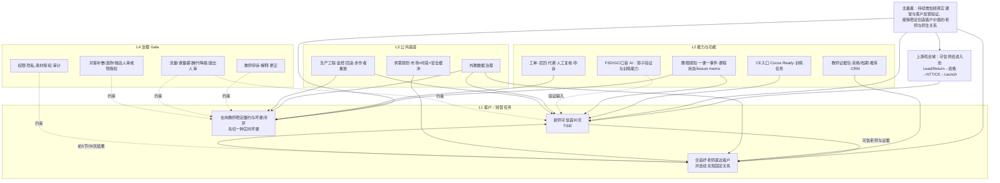

# 平铺事项脉络图与原子小队决策包 v0

## 先给 Leon 的建议

明天不要对一张长清单逐项投票，而要做四步：

1. 先共同确认一条经营飞轮、三条客户结果链和一个上游机会域；
2. 把所有便利贴分别放进“客户任务／能力功能／公共底座／治理 Gate”；
3. 只对能写出客户结果、唯一 DRI、真实投入和关闭时间的纵切立队；
4. 其余事项挂入已立队的能力清单或机会池，不允许通过“改名为原子小队”获得资源。

基于当前证据，建议形成：

- **一条总图**：可信供给进入池 → 教师生产与验证 → 合适好老师直达客户并连续兑现 → 课堂／客户结果回流；鹰眼贯穿全链路感知。
- **两个优先点火候选**：`新师可信首30天（TIDE）`、`在岗教师稳定履约与坏课闭环`。后者先只选一个可判定的实时坏课场景，不把“坏课”当全量平台工程；群内已宣称“课中缺席新约熔断”上线，须先纳入状态与权限审计，不能当作已验收完成。
- **一个条件点火候选**：`合适好老师直达客户，并建立可连续兑现的固定师生关系`，条件是王韬或其他候选人明确接受唯一 DRI 与投入合同，并冻结 MVP 入口、供给状态与结果分母。
- **一个第二层 enablement 候选**：`外教数据治理`，只为已选客户任务提供可读回的数据合同。
- **两个不点火的池**：`可信供给进入池（Lead／Return→Launch）`是上游机会域；`FSD／GC／口音 AI`是验证／诊断能力池。它们都不能因需求很大就自动成队。
- **不单独立队**：鹰眼平台、老师包装、Cocos／GC 培训、CE Demo 审核、自动课况、lesson memo、违规工单、Teacher App、My Page、招聘 API、AI 工程师到岗、评分页面。

这不是最终组队决定；当前群已补齐海璇、王韬、Sophia、Tammy、Jennifer 与慧茹的新增输入，但 live 基线、成员带宽、唯一 DRI 和权限合同仍待明日拍定。

## 1. 从长清单变成一张脉络图



### 关键去重

1. **直通车、好老师直达客户、老师产品化／包装**是一件客户任务的业务入口、结果名和能力名，不能拆成三支队。
2. **鹰眼、课程状态、工单、匹配、坏课**在战略上是一条“感知 → 判断 → 行动 → 客户判卷”的质量闭环；鹰眼本身不是客户任务，组队必须从中切一个窄纵切。
3. **坏课**是“客户在已预约课堂中没有得到完整交付”的结果名，不等于一口吞掉全部缺席、设备、Cocos、造假、投诉和差评。首期必须只选一个可判定实时场景，跑通事实、救援、人工复核、客户恢复与申诉。
4. **Cocos／GC Ready、CE Demo、自动课况、lesson memo、违规工单、Teacher App**分别是入口 Gate、事实能力、动作模块或共享工作台，先挂任务，不单占一支队。
5. **可信供给进入池**把 Tammy／海璇的招聘—Return—Launch 事项收进同一上游机会域；没有收窄客户结果、唯一 DRI 和周期前，不打包为“招聘队”。
6. **FSD、GC、口音 AI**当前是验证／诊断能力：FSD 仍是 Shadow Mode 讨论稿，GC 仅 `Diagnosis-ready`，口音 AI 缺算法 DRI；都不因“有需求”即立队。
7. **数据治理**可以有独立的第二层 enablement 队，但它的完成定义是服务客户任务的真实回放，不是建表数量。

## 2. 今日事项归位表

| 输入人／事项 | 归属 | 关系 | 组队处理 |
|---|---|---|---|
| Leon：TIDE 新老师训练营 | 新师可信首30天 | 主任务 | 优先点火候选 |
| Leon：鹰眼全量感知 | 全链路感知 | 公共能力 | 不以平台名立巨型队 |
| Leon：直通车 | 好老师直达客户 | 客户入口／履约机制 | 与产品化合并 |
| Leon：老师包装外在化 | 好老师直达客户 | 产品化能力 | 与直通车合并 |
| Leon：外教数据治理 | 第二层 enablement | 公共底座 | 条件独立组队 |
| Leon：Cocos 全量培训 | 教师交付能力 | 能力战线 | 不以培训本身立队 |
| 慧茹：自动课况／lesson memo | 鹰眼与信息回流 | 功能 | 挂具体纵切 |
| 慧茹：违规工单／投诉核验／申诉 | 质量治理 | 动作 + Gate | 挂课中缺席或后续坏课纵切 |
| 慧茹：坏课方案／课中缺席两小时熔断 | 在岗教师稳定履约与坏课闭环 | 优先级信号 + 候选规则；群内称一项新约熔断已上线 | 先做生产读回；再选一个事件场景，R1–R4 不能直接自动生效 |
| 慧茹：设备网络控制／课后降级 | 坏课实时救课与课后治理 | 实时修复 + 权益风险 | 接入同一事件合同；降级／停排／下线先冻人审边界 |
| 慧茹：Cocos 长期不合格／短期波动 | 可交付状态 | 信号与规则 | 挂 TIDE／课堂稳定 |
| 慧茹：CE Demo 录后审核 | 教师生产入口 | Gate | 挂 TIDE |
| 慧茹／海璇：Teacher App、My Page、课表 | 教师工作台／Workforce | 多个共享能力 | 按请假、触达、排班、工资展示分别挂能力 owner；不组 App 队 |
| 海璇：招聘、设备检测、Return、证级 | 可信供给进入池／TIDE 输入 | 上游供给与资格字典 | 留机会域；设备检测并入 AC，证级只作推荐输入 |
| 海璇：包装、标签、体验课直约、喜欢／屏蔽、求课 | 合适好老师直达客户 | 产品化／匹配／固定关系 | 与王韬 6+6 合并，不另建包装或匹配队 |
| 海璇：坏课、课程状态、Cocos／GC、自动换固定老师 | 坏课闭环 + 共享事实 + 动态资格 | 依赖与权益 Gate | 课程状态作底座；换师／降权／资格移除不可绕过人工 Gate |
| 王韬：CC 直约 6 项 + 固定外教 6 项 | 合适好老师直达客户 | `资格可售 → 直约 → 固定关系连续履约` | 条件点火候选；先冻结排序、入口、状态和异常恢复合同 |
| Sophia：FSD／GC／菲律宾口音 AI | 教学质量 Eval／训练能力 | 影子验证／诊断 | 暂不独立组队；FSD 先跑 Pilot，GC 不宣称培训有效，口音 AI 先补算法 DRI |
| Tammy：招聘到 Launch 13 项 | 可信供给进入池 | 上游机会域 | 不打包立“招聘队”；未来仅以收窄的 Lead／Return→稳定履约结果立队 |
| Jennifer：坏课定义、AC 响应、工单／课程事实 | 坏课闭环 + 事实底座 | 关键依赖 | 先服务一个坏课纵切，不承诺重建全量工单或全量教师信息平台 |
| Jennifer：学生进步、前后测、按级别匹配 | 学习效果机会域 + 好老师直达客户 | 新客户价值线索 | 学习效果另入机会池；级别匹配作为直通车的候选资格字段 |

## 3. 立队前的统一准入闸

任何候选必须同时通过以下 10 项；不满足就留机会池：

| # | 必答决策 | 通过标准 |
|---|---|---|
| 1 | 客户任务 | 能说清要改变哪一种客户／经营状态，不是交付一个页面或模型 |
| 2 | 关键假设 | 写出可被证伪的因果假设 |
| 3 | 结果与分母 | 冻结主结果、领先指标、护栏、观察窗、基线／对照与分母 |
| 4 | 最小范围 | 明确首个市场、cohort、渠道／时段和不做什么 |
| 5 | 唯一 DRI | 1 人；公司规则要求任务第一优先级、100% 投入 |
| 6 | 核心成员 | 2–4 人；每人不低于 70%，按能力拼图而非部门凑人 |
| 7 | 权限／资源 | 数据、系统、运营动作与升级路径明确；越权项写成人工 Gate |
| 8 | 阶段与关闭 | 通常 6–12 周，写阶段里程碑、最晚关闭时间、双周复盘 |
| 9 | 双重交付 | 同时验客户／经营结果与可复用组织／系统资产 |
| 10 | 退场 | 预先写 Scale／Iterate／Stop；成功或失败复盘后解散／重组 |

## 4. 候选小队 A｜新师可信首 30 天（TIDE）

> 依据 FT-DEC-011／012 中 Leon 已拍的方向起草；两张本地卡状态仍为`候选`。以下是明日正式组队所需的执行合同，不代表公司已立项或已配资源。

### 4.1 决策摘要

| 字段 | 草稿 |
|---|---|
| 客户问题 | 新老师进入供给池后，客户无法持续获得稳定、可信、能进步的教学交付；内部一次性评分不能代表真实课堂价值 |
| 关键假设 | 若把真实数据、五维判断、任务／训练、教师触达、人工确认和课堂结果回流接成生产闭环，新老师 30 天有效供给与稳定履约会改善 |
| 客户／经营结果 | 候选北极星：`30天经真实课堂验证的有效供给老师数／率`；最终定义、分母与基线待冻结 |
| 首期范围 | 全部新老师进入评价体系；生产动作先在明确 cohort 灰度，不自动扩到存量成熟老师 |
| 当前阶段 | 八月 P0；8/17 仅是扩量就绪 Gate，非上线承诺 |
| 唯一 DRI | `TBD，明日必须拍`。Jennifer／Leon 是双主帅与 Sponsor，不自动等同日常唯一 DRI |
| 核心能力席位 | 教师运营／训练、AI／数据工程、产品／生产工程、数据合规或体验守门；最终 2–4 人 |
| 建议周期 | 6–12 周；8/17 readiness、8 月生产试点、通过 Gate 后再进入 9 月全新师范围 |
| 双重交付 | 真实 cohort 的客户／供给结果 + 可重放的数据合同、评分字典、任务／触达闭环、告警回滚与运行手册 |

### 4.2 阶段收据

**Gate 0｜8/17 扩量就绪，不叫上线**

- 每个字段有用途、分母、owner、刷新、权限和缺失处理；
- 收藏、硬件质量等冲突分值被裁决成唯一版本；
- 真实数据连续刷新，失败可见，有补数／重试；
- 至少一个非作者能重放输入并得到同一判断；
- 生产动作有灰度上限、人工接管和回滚；
- 验收 owner 具名签收。

**Gate 1｜八月生产试点**

- 对真实 cohort 跑通 `感知 → 判断 → 任务／训练 → 触达 → 确认 → 后续课堂结果`；
- 记录规则版本、异常、人工改判与老师申诉；
- 页面、一次性导数和 mock 不计入。

**Gate 2｜九月扩量**

- 只有 Gate 1 的稳定性、客户／供给结果与护栏通过，才向全部新老师铺开；
- 写明存量老师仍不在自动外推范围。

### 4.3 红线

- 分数不自动触发流量、课量、薪酬、升降级、暂停或退出；
- TIDE 不以内部积分上涨替代客户事实；
- 评分字典未冻结、数据不可连续回放时，停止放量。

## 5. 候选小队 B｜在岗教师稳定履约与坏课闭环

> **建议 Phase 1 名称：**`一种实时坏课的客户保护`。蔡林说“坏课这个事情吃透，这个月就可以结束了”，是最强优先级信号；但它没有替代唯一 DRI、范围、权限和收据合同。

**当前增量：**慧茹在 19:31 的群内截图称“老师当天第一节 noti 后，新约直接熔断”已“上线”，并关联当天已约课确认、My Page 弹窗、自动外呼、当日代课与两小时内突发约课。截图只能证明群内的上线宣称，不能证明系统真实生效、覆盖范围、客户处理、回滚和申诉。小队第一件事不是再造规则，而是把这项既有动作纳入同一状态合同并完成 live readback。

### 5.1 为什么它应当从“鹰眼平台”里切出来

它的客户任务不是“建一个鹰眼／Agent／工单系统”，而是：

> **当一节已预约课出现可确认的老师侧异常时，学生能在承诺窗口内获得完整交付或被真实保护，且异常、归因、恢复与申诉可复核。**

慧茹的方案已经提供共同骨架：`一课一事件 → 实时救课 → 课后归因／整改 → 观察与复测`；Jennifer补充了课程状态、AC 主动响应与客户—老师—客户闭环的必要性。它们让“坏课”成为客户结果，而非一串技术 feature。

首期仍必须窄切：`一个市场 × 渠道 × 时段 cohort × 一个可判定事件类别 × 一种客户保护动作`。启动会要在**缺席**与**听／看不见、CPU／网络**之间选一个事实场景；另一个留为同一小队的下一阶段或由 7 天影子结果决定是否拆出。

### 5.2 决策摘要

| 字段 | 草稿 |
|---|---|
| 客户问题 | 已预约课堂发生老师侧缺席或异常时，学生可能没有得到完整交付；恢复慢、归因不清、后续整改与复发不可读回 |
| 关键假设 | 若把统一事件事实、实时救援、人工核验、客户恢复、老师整改／申诉接成一个责任闭环，就能降低“确认坏课后未被及时保护”的课程比例，并缩短恢复时间 |
| 主结果 | `指定 cohort 中，经确认出现指定坏课且未在约定恢复窗口内得到完整交付或客户保障的课程率`；分子、分母、恢复窗口与归因规则待从数据正本冻结 |
| 领先指标 | 检出准确率／漏报率／发现延迟、人工核验时长、救援或替补成功率、学生实际完课率、恢复时长、同因复发率 |
| 护栏 | 错判率、误触达、替补不适配、客户投诉／退费、老师申诉推翻率、人工负担、平台／学员侧问题被误归因 |
| 首期范围 | 一个 cohort；只选缺席或一种技术异常；全量感知可影子跑，生产动作只开一种可回滚的客户保护／人工升级 |
| 唯一 DRI | `TBD`。慧茹、蔡林、牛琪、叶峰等均有输入／协同信号，但没有一人已被读回为结果唯一 DRI |
| 核心能力席位 | 课堂运营／客户保护、工程／实时事件、代课供给／排课、规则与权益；最终 2–4 人 |
| 建议周期 | 先 7 天影子运行；完整小队按 6–12 周合同，双周验收 |
| 双重交付 | 客户受损与恢复结果 + `一课一事件`状态机、事实合同、工单／代课规则、动作日志、申诉、重放与异常恢复资产 |

### 5.3 两阶段生产合同

**阶段 0｜对已宣称上线的“新约熔断”做生产读回**

- 读回触发条件（截图中的 `noti` 究竟代表什么）、老师／市场／课程范围、当日新约与已约课程的处理、代课与两小时内突发约课的边界；
- 核对事件日志、人工例外、客户保护、教师申诉、回滚开关及影响指标；
- 若读回不成立，它留在候选动作池；若已生效，后续只在同一坏课闭环中验收其客户结果，不能以“上线”替代完成。

**阶段一｜7 天影子运行：先把事实做对**

- 每节课产出可追溯的事件、归因候选、规则版本、置信度和恢复结果；课程状态与 lesson memo 不混为同一事实；
- 对选定场景做两周内可延续的阈值校准，记录误报、漏报与人工改判；非作者能重放；
- 风险对象只进入复核／救援队列；不自动减流、停排、扣薪、评级、下线或对客补偿；
- 用业务系统重建当前基线。会上“约 1.5 万节／目标降 30%”只作核验线索。

**阶段二｜一种可回滚的客户保护动作**

- 开放一种已经预授权或人工确认的动作，例如人工升级、召回、代课或恢复安排；
- 动作上限、停止线、人工接管和回滚提前冻结；对客消息、补课／退款不能被技术链路自动越权触发；
- 实时救课与离线长期治理分开：前者只保护当堂客户，后者才在人工审计后形成整改、观察和建议。

### 5.4 对慧茹 R0–R4 方案的处理

R0–R4 可作为后续治理假设和讨论材料，**不能直接视为生产规则**：其中的降曝光、暂停预约、停排、下线、客户补救／退款均触发教师或客户权益。当前小队只需验证：事件定义、救援效果、人工复核、申诉与恢复。任何长期负向动作都须另有明确标准、owner、人审、回滚和审计。

### 5.5 与鹰眼总图的关系

- 坏课闭环是鹰眼的第一个可验收客户纵切，不等于鹰眼全部范围；
- 成功后沉淀的事实合同、规则版本、工单、重放和权益 Gate 可复用于缺席、设备网络、Cocos／GC 动态资格与其他坏课场景；
- 鹰眼的长期评价线仍与即时干预线解耦，不能用一次异常给老师定性。

## 6. 候选小队 C｜合适好老师直达客户，并建立可连续兑现的固定师生关系

### 6.1 决策摘要

| 字段 | 草稿 |
|---|---|
| 客户问题 | 即使内部识别出好老师，客户仍可能看不懂、选不到、约不上，或体验喜欢后无法连续跟随；不合资格、无档期、已被拉黑的老师也可能被错误展示或排课 |
| 关键假设 | 若只让满足真实资格与容量条件的老师进入直通车，并把展示、选择、求课、预约、教材确认、固定关系与异常恢复串起来，就能增加 30 天有效师生关系 |
| 主结果 | 候选：`30天有效师生关系数／率`；必须冻结“获得真实选择机会”的曝光分母 |
| 领先指标 | 合格展示→选择→求课→接受→预约→完课漏斗；第一节固定完课率、4 周兑现率、直接改期成功率、异常替补／换师恢复 |
| 护栏 | 退费、投诉、拉黑违反率、老师过载、素材失真、档期无法兑现、排序样本偏差、曝光公平性、对照组污染 |
| 首期范围 | 当前 draft 建议国内新客先跑；约 100 名候选老师、20–30 名 CC 只是待拍规模，海外是第二市场复用验证，不另立“包装队” |
| 唯一 DRI | `王韬是当前最强候选信号，仍需本人和组织现场确认`：是否接受唯一 DRI、100% 第一优先级和阶段结果合同 |
| 核心能力席位 | 供给／生命周期、产品／推荐／CRM、前线 CC／市场、数据判卷；最终 2–4 人 |
| 建议周期 | 6–12 周；先冻结供给与分母，再跑真实新客 MVP |
| 双重交付 | 有效师生关系结果 + 供给状态合同、教师产品模板、展示→选择→预约→固定→交付账本、异常恢复规则 |

### 6.2 最小可售教师单元与四组状态

`经真实验证的老师 × 儿童／课程适配理由 × 可信证据 × 真实档期 × 连续交付承诺 × 异常恢复`

缺任何一项，包装都可能变成“好看但买不到／上不稳”的信息装饰。

王韬的 6 + 6 可以压缩成以下四组状态，而非 12 个独立项目：

| 状态 | 最少包含什么 | 不能跳过的 Gate |
|---|---|---|
| 教师资格可售 | 教资／级别、GC/Cocos、AC、课程适配、真实档期、容量、屏蔽状态 | 每个字段有 owner、刷新时效、失败状态；证级不自动替代权益判断 |
| CC 直约 | 合格展示 → 选择 → 求课 → 接受 → 预约 → 教材确认 → 完课 | 新／旧入口、剑桥路由、代课页 AC 状态等先锁一个 MVP；不以截图或入口上线验收 |
| 固定关系 | 绑定 → 第一节固定完课 → 4 周承诺窗口 → 改期／关闭 | “4 周从第一节固定完课起算”仍需业务正式冻结；客户拉黑必须成为排课硬约束 |
| 异常恢复 | 请假、设备网络、资格掉落、代课、固定老师替换、客户恢复 | 自动换人／资格移除／降权必须区分可逆产品动作与人工审核的权益动作 |

### 6.3 六个 Gate

1. **合同 Gate**：对象、市场、客户承诺、结果分母、MVP 入口冻结。
2. **真实供给 Gate**：老师授权、真实档期、连续性和安全缓冲可兑现。
3. **前线使用 Gate**：CC／系统能理解、检索、推荐，且不依赖作者口头解释。
4. **客户与交付 Gate**：客户真实选择、预约、前5节／30天履约与异常恢复可读回。
5. **排序 Gate**：按完课转化率排序必须有最小样本、曝光／渠道／新老老师校正、对照和回退，不能把裸转化率写成教师质量。
6. **关系与排课 Gate**：拉黑、档期、请假、GC/Cocos／AC 状态以及固定老师异常替换能在排课处强制执行并留下审计。

### 6.4 不做什么

- 不另组“老师包装队”；
- 不把 Cocos 全量培训、招聘全链路或长期匹配系统全部吞进来；
- 不重做完整 Teacher App、全量工单或所有坏课治理；它们只是输入／输出合同；
- 不因曝光后指标上升就宣称老师变好，必须做对照与曝光校正；
- 未完成老师素材授权、隐私、撤回与档期核验，不对客户开放。

### 6.5 上游机会域｜可信供给进入池（暂不立队）

Tammy 与海璇的新增内容可以归为一条上游链：

> `Lead 登录注册 → Prescreen 资料／资格 → 高质量招聘或 Return 分流 → NTT／CE／Onboarding → Launch → Workforce 产能、请假与替补`。

它是 TIDE 与直通车的前置条件，不是“13 项招聘需求 = 1 支队”。若资源允许，未来只可从中切出一个可验收客户／经营结果，例如：`某类高质量 Lead 在 X 天内成为可稳定履约教师`，或 `Return 老师仅补必要 Gate 后恢复有效供给`。设备检测应并入 AC；PRC、TESOL、SI/SIV、CE 是资格与生产 Gate；招聘触达、Teacher Admin API、招聘运营 AI 是能力模块。

### 6.6 质量 Eval／训练能力池｜FSD、GC 与口音 AI（暂不立队）

- **FSD Phase 0**：当前是历史体验课 Shadow Mode 的讨论草案；先验证 AI 是否能给出独立、可复核的“目标语言有效操练”证据。5–10 Pilot、100 样本、独立盲标、数据／隐私和 Go／Adjust／Stop 收据未完成。
- **GC**：现有材料为 `Diagnosis-ready`、不是 `Validation-ready`；课堂复盘和自愿问卷能识别摩擦，不能证明培训有效，更不能关联为单个老师的因果评价。
- **菲律宾口音 AI**：8/10 已确认李洋不能单独承担、需要算法同学；算法 DRI、人工金标准、样本、成本、公平性与影子运行都未闭合。

三项都可以服务 TIDE 或后续客户任务，但今天只应把它们放进验证／诊断机会池；不得将其结果直接用于招聘淘汰、限流、评级或教师权益动作。

## 7. 第二层 enablement 候选｜外教数据治理

它不是与三个客户任务并列争夺优先级的“第四个业务项目”，而是为已点火小队提供生产燃料的服务单元。

| 字段 | 草稿 |
|---|---|
| 服务对象 | 首先服务 TIDE readiness 与坏课 Phase 1；是否同时支持直通车由带宽决定 |
| 结果 | 非作者可用真实数据稳定重放任务；数据中断、缺失、越权与口径漂移可见并可恢复 |
| DRI | `TBD` |
| 核心能力 | 数据 owner／工程、业务口径 owner、权限／合规、消费方代表；最终 2–4 人 |
| 最小收据 | 字段用途、分母、owner、区域权限、刷新、失败重试、回滚、真实回放 |
| 退出 | 服务任务稳定进入职能／平台 SLA 后解散或转为常规能力，不永久化为协调层 |

## 8. 当前组队准备度

| 候选 | 客户任务 | 最小纵切 | 唯一 DRI | 指标／基线 | 生产与权益 Gate | 建议状态 |
|---|---|---|---|---|---|---|
| 新师可信首30天 | 清楚 | 基本清楚 | 未闭合 | 评分冲突、基线待冻 | 生产 Gate明确但收据未齐 | `优先补齐后点火` |
| 在岗教师稳定履约与坏课闭环 | 清楚 | 须在缺席 vs 技术异常中选一条 Phase 1；已有“新约熔断上线”宣称待核 | 多人信号，未唯一 | live 基线与已上线动作效果待核 | 先做生产读回；R1–R4、补偿、触达等负向／权益动作禁开 | `优先补齐后点火` |
| 合适好老师直达客户并连续兑现 | 清楚 | CC 直约 + 固定关系 draft 已有 | 王韬强信号，待承诺 | 曝光分母、排序和 MVP 入口待冻 | 授权、资格、容量、拉黑、异常恢复 Gate 待闭 | `条件点火` |
| 外教数据治理 | 服务对象清楚 | 收据清楚 | 未闭合 | 以消费方回放判卷 | 权限与区域合同待闭 | `第二层 enablement` |
| 可信供给进入池 | 上游价值清楚 | 未收窄 | 未闭合 | Lead／Return→Launch 基线待核 | 资格、产能、招聘触达、数据权限待闭 | `机会域，不点火` |
| FSD／GC／口音 AI | 间接客户价值 | FSD 仅 Shadow Mode；GC/口音更早期 | 算法／业务 DRI 未闭合 | 无可用效果基线 | 数据、盲标、公平性、教师权益 Gate 待闭 | `验证／诊断池，不点火` |
| 鹰眼全平台 | 过宽 | 不清楚 | 未闭合 | 多结果混合 | 权益风险高 | `禁止以巨型队点火` |
| Cocos／GC 全量培训 | 不是客户结果 | Ready 标准未定 | 未闭合 | 培训人数不能判卷 | 当前 GC 与历史 Cocos 标准存在漂移，资格与权益边界待定 | `能力战线，不单立队` |

## 9. 明天必须拍的决策清单

### D1｜确认总图

- 是否同意“三条结果链 + 一个上游机会域”：TIDE 生产老师；坏课闭环守住已预约课堂；产品化／直通车把合适老师送到客户并连续兑现；可信供给进入池作为前置机会域；鹰眼横贯感知，数据治理托底？
- 海璇、王韬、Sophia、Tammy、Jennifer 的事项放入哪一层？除了三条结果链，是否真的出现了新的、已具备组队条件的客户任务？

### D2｜限制同时点火的任务数

- 先看真实人力合同，再决定 WIP；不要先宣布 N 支队再找人。
- 当前推荐顺序：TIDE 与坏课 Phase 1 作为最强候选；条件成熟后再点火“合适好老师直达客户并连续兑现”；数据治理按服务合同配套。可信供给、FSD／GC／口音 AI 留机会池。
- 坏课队启动前只选一个首期事实场景：`缺席`或`听／看不见、CPU／网络`，不能两类都写进第一张 7 天收据。
- 先对群内已宣称上线的“第一节 noti 后新约熔断”做 24 小时生产读回；它若已生效，纳入坏课队的现有动作审计，不另开“熔断功能队”。

### D3｜每支队只认一个 DRI

- TIDE：谁是日常唯一 DRI？双主帅只做 Sponsor 还是其中一人真 100% 下场？
- 坏课：谁对客户结果唯一负责？不要把慧茹、蔡林、牛琪、叶峰的输入／协同名单误写成 DRI。
- 合适好老师直达客户：王韬是否接受唯一 DRI 与 100% 第一优先级？
- 数据治理：谁对字段、稳定供给和真实回放负责？
- FSD／GC／口音 AI：只指定研究／评估 owner，不在尚未通过准入闸时虚设小队 DRI。

### D4｜确认核心成员与投入

每支队现场只填 2–4 名核心成员，并逐人读回：能力席位、70% 以上投入、原职能工作怎么卸载。没有卸载合同，就不算真实投入。

### D5｜冻结第一张结果卡

每支队只冻结：一个主结果、2–4 个领先指标、3–5 个护栏、一个 cohort、一个观察窗、一个最晚关闭时间。

### D6｜冻结权限边界

- 哪些动作小队可自主执行？
- 哪些需要业务／生产 owner审批？
- 哪些永远在人类 Gate 后：老师减流、薪酬、正式评级、暂停、退出、自动换固定老师、资格移除、对客补偿／退款与处罚性沟通。
- 对已宣称上线的新约熔断：谁是规则 owner、如何人工例外、如何回滚、如何处理已约客户与教师申诉？未读回前不扩大规则。

### D7｜明确退出

- 达成：验收客户结果 + 资产，自动解散／转职能运行；
- 未达成：按假设被证伪、数据不可得、资源不到位或护栏触发分类复盘，再解散／重组；
- 不允许“因为事情重要”无限续期。

## 10. 90 分钟会议建议流程

| 时间 | 动作 | 产出 |
|---|---|---|
| 0–10 分钟 | Leon讲清北极星与原子小队硬规则 | 共同判卷，不再按部门列清单 |
| 10–25 分钟 | 把所有便利贴归入四层 | 一张去重后的总图；补入海璇、王韬、Sophia、Tammy、Jennifer 与慧茹的新项 |
| 25–40 分钟 | 用四问筛客户任务 | 客户问题、关键假设、DRI候选、1–3月成败事实 |
| 40–65 分钟 | 给候选填 10 项准入闸 | 每队决策卡；缺口公开，不靠口头承诺 |
| 65–80 分钟 | 按真实带宽决定点火顺序 | active／conditional／opportunity pool 三栏 |
| 80–90 分钟 | 每个 DRI 逐字读回 | 结果、投入、权限、第一张收据、关闭日 |

## 11. 可直接复制的单队决策卡

```markdown
# 原子小队：<客户任务名>

- 客户状态：
- 关键假设：
- 主结果／分子／分母／观察窗：
- 领先指标：
- 护栏：
- 最小 cohort 与不做什么：
- 唯一 DRI（100%）：
- 核心成员 2–4 名（每人 ≥70%）及能力席位：
- 自主权限：
- 人工／生产／权益 Gate：
- 6–12 周里程碑与最晚关闭日：
- 第一张 7 天收据：
- 客户／经营结果验收：
- 组织／系统资产验收：
- Scale／Iterate／Stop 条件：
- 解散／回归职能安排：
```

## 12. 明日会后只需形成四件制品

1. **一张战役脉络图**：只保留客户任务、依赖、公共底座与 Gate。
2. **一张机会池状态表**：`active / conditional / opportunity / absorbed`。
3. **每支 active 小队一页决策卡**：不得缺唯一 DRI、真实投入、结果分母和关闭日。
4. **一张依赖与升级表**：需要谁在什么时间交付哪一张收据，未交付触发什么停止／升级。

不需要再生成一份很长的会议纪要来替代上述决策。

---

## 证据与边界

本包依据 2026-08-10「外教战役黑板」群内可见消息（截至 19:36:35）、群内今日分享的[《51Talk 原子小队立项机制》](https://alidocs.dingtalk.com/i/nodes/ndMj49yWjXK9ykGpuR6KQBdXJ3pmz5aA?corpId=dingc41f95d4e55e5b6ff2c783f7214b6d69)、慧茹的[《外教坏课治理完整运营方案》](https://alidocs.dingtalk.com/i/nodes/DnRL6jAJMGMqOY4eSqGD15RYWyMoPYe1)、Sophia 的 FSD／GC 受控资料索引、Leon-work 当前决策卡与 8/7 最新项目纪要，以及 GBrain 三条只读召回交叉形成。详细证据、查询、时效风险与覆盖缺口见[[journal/2026/08/2026-08-10/tasks/外教战役黑板决策包/00_外教战役扎实背景底稿|背景底稿]]。

**状态仍为草稿**：未形成任何任命、资源承诺、KPI、人事评价、教师规则、生产发布或对外消息。
