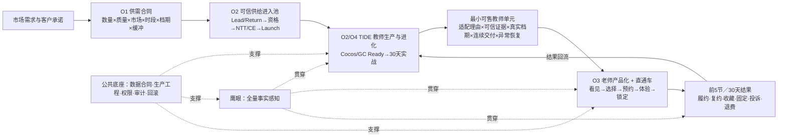

# 外教战役扎实背景底稿

## 一句话结论

群里的事项不是一串平级项目，而是同一条经营飞轮上的不同层级：

> **需求与客户承诺 → 教师生产与真实验证 → 可售供给 → 客户看见、选择、约到并连续使用 → 课堂与经营结果回流 → 再训练、再匹配、再治理。**

其中：

- **TIDE／新师训练营**负责“生产并持续进化好老师”；
- **老师产品化 + 直通车**负责“把可信老师送到客户并形成连续关系”；
- **鹰眼**负责贯穿全链路的事实感知，不是独立客户结果；
- **课中缺席、设备网络、违规工单等**是从鹰眼能力中切出的可验收纵切；
- **数据治理、生产工程、权限与申诉**是公共底座和 Gate；
- **Cocos 培训、CE Demo 审核、自动课况／备忘录**是能力模块或入口 Gate，不能仅凭“有一件事要做”就各自组队。

## 1. 本底稿回答什么、不回答什么

### 回答

1. Leon、慧茹已经抛出的事项在同一价值链上的位置。
2. 海璇已被当前材料验证的责任背景，以及尚未拿到的新增输入。
3. TIDE、鹰眼、直通车、老师产品化、Cocos、数据治理之间的依赖和边界。
4. 明天哪些事实可以拿来决策，哪些仍必须现场补齐。

### 不回答

1. 不替 Leon 任命 DRI 或承诺成员投入比例。
2. 不把会议数字、历史 owner、GBrain 旧投影当成当前生产事实。
3. 不授权任何分数自动影响老师流量、课量、薪酬、升降级、暂停或退出。
4. 不宣称 TIDE、鹰眼或任何链路已经 ready／上线。

## 2. 证据优先级与本轮覆盖

### 证据优先级

1. **当前公司正本**：群里今日原文、公司今日发布的《51Talk 原子小队立项机制》、业务系统实时读回。
2. **Leon-work 当前正本**：现行决策卡、战线概览、8 月 7 日最新项目纪要。
3. **GBrain 长期背景**：历史决策、系统结构、风险先例；与当前正本冲突时退回背景层。
4. **旧会议数字／历史草稿**：只作待核线索，不作组队基线。

### 覆盖状态

| 来源 | 覆盖 | 截止与说明 |
|---|---|---|
| 钉钉群「外教战役黑板」 | `complete` | 已读建群至 2026-08-10 19:36:35 的全部可见消息；13:48:48 后新增 25 条（含表情），`hasMore=false` |
| Leon 今日发言 | `complete` | 已覆盖建群目的、明日会议、六项输入、原子小队意图及“明天一起筛”；后者是继续收集，不是全部立项授权 |
| 袁慧茹／Katherine 今日发言与《外教坏课治理完整运营方案》 | `complete` | 已覆盖八项结构化输入、19:24 的坏课补充及其全文；方案是待决蓝图，不能直接变成生产规则 |
| 曹海璇／Shayne 今日新增清单 | `complete` | 已覆盖招聘、包装、匹配、证级、体验课直约、GC/Cocos治理、Teacher App、My Page／课表八类 |
| 王韬今日新增清单 | `complete` | 已覆盖 CC 直约 6 项与固定外教 6 项 |
| Sophia 今日新增清单与链接 | `partial` | 群消息完整；已读 FSD／GC 目录、README、资产索引和关键决策页，未读取受控原始课堂／问卷数据 |
| Tammy 今日“黑板简版” | `complete` | 已覆盖招聘到 Launch、Return、Workforce、SI/SIV、TESOL、PRC、触达与招聘运营 AI 化 13 项 |
| Jennifer 今日 11 项输入 | `complete` | 已覆盖学习结果、坏课定义／工单、级别匹配、教师沟通、课程事实、My Page 与招聘系统等；仅作需求归位，未见正式任务合同 |
| 蔡林鹰眼架构图与 19:27 优先级反馈 | `complete` | 已下载并视觉核验；只用作架构蓝图，不作为系统已实现证据；“坏课这个事情吃透”是优先级信号，不是 DRI／权限授权 |
| 慧茹 19:31 课中缺席熔断截图 | `partial` | 视觉核验到群内“上线了”的截图和规则文字；尚未做业务系统 live readback，不能确认真实触发范围、回滚、申诉或客户影响 |
| 「师资匹配系统问题跟进表」 | `complete` | 已读 3 个工作表全部非空范围；它是功能 backlog 与状态表，不是新的客户任务清单 |
| 公司《51Talk 原子小队立项机制》 | `complete` | 已只读下载并全文提取；以今日群内分享版本为准 |
| GBrain TOC／AI 改革部／客户体验背景 | `complete` | 三条并行召回，详见 §9；只读、零写入 |
| Leon-work 当前正本 | `complete` | 核对 H2 总纲、FT-DEC-010/011/012、TIDE/产品化概览、7/28 标准卡、8/4 与 8/7 纪要 |
| 当前生产数据与 8/10 实时状态 | `unknown` | 未接入业务系统 live readback；缺席量、覆盖率、转化率、接口状态均不能当当前基线 |

## 3. 今日群聊原始输入

### Leon 的六项输入

| 原始叫法 | 在价值链中的位置 | 初步判断 |
|---|---|---|
| TIDE 新老师训练营 | 教师生产与 30 天真实验证 | 八月 P0 客户任务候选 |
| 鹰眼：全量老师、全课、全要素实时感知 | 全生命周期事实感知层 | 战役级能力，不宜直接以平台名组一个巨型队 |
| 直通车 | 客户看见、选择、预约和连续使用 | 与老师产品化合成同一客户任务 |
| 老师包装外在化：国内一期、海外二期 | 把老师证据编译成客户看得懂的可售单元 | 直通车中的产品化能力；不是两支地区队 |
| 外教数据治理 | 所有闭环的公共燃料与生产合同 | 可做独立 enablement 小队，但不与客户结果队混为同一类 |
| Cocos 全量老师培训 | 教师操作就绪与课程交付能力 | 能力战线；必须有 Ready 标准与真实课证据，不能以培训完成人数验收 |

Leon 对组织方式的原意也很清楚：今天与明天先把需求拍全，再围绕八月客户价值选择任务；运营、产品、工程同时到场，组队执行，验收结果与资产后解散／重组，而不是继续做部门接力排期。

### 慧茹的八项输入

| 原始叫法 | 正确归位 | 是否单独组队 |
|---|---|---|
| Eagle Eye 全域监控、全老师／全课可见、任务与干预 | 鹰眼的总能力图 | 不直接用能力名组巨型队；从中切客户纵切 |
| 自动课况 + lesson memo | 感知后的事实整理与信息回流 | 功能模块，挂具体闭环 |
| 违规工单、AI 核验投诉／不良行为、申诉 | 异常信息流 + 人工治理闭环 | 可挂首个质量纵切；申诉是硬 Gate |
| 课中缺席两小时滚动熔断 | 坏课客户保护的一种动作候选 | 必须先有可审计的事件定义、影子校准和人工接管；不能跳过事实直接熔断 |
| 设备／网络控制与课后降级 | 坏课实时救课与课后治理 | 实时修复可先验证；“降级／停排／下线”属于老师权益动作，必须人审 |
| Cocos 合规：长期不合格 vs 短期波动 | 可交付状态信号 | 不能直接等同教师总评价；挂训练／课堂稳定闭环 |
| CE Demo 录后审核 | 招聘入口质量 Gate | 挂教师生产链，不单独组队 |
| Teacher App：请假、触达、转介绍、工资展示 | 教师自助与运营触达能力 | 合并海璇同类输入，作为教师生命周期平台能力，不单独立队 |

### 海璇的八类输入：不是八支队

| 海璇原始分类 | 去重后的归位 | 判断 |
|---|---|---|
| 招聘：设备检测并入 AC、招聘流程改造 | `可信供给进入池`上游机会域 | 可切“高质量 Lead 快速到 Launch”等纵切；整条招聘流程不能一次吞下 |
| 包装：教资展示、海报、优先曝光、上过课老师喜欢／屏蔽、课程状态 | `好老师直达客户` + 鹰眼事实层 | 教资／标签／海报归产品化；喜欢／屏蔽归关系记忆；课程状态归事件事实 |
| 匹配：求课触达、坏课治理、约课系统、学员视角标签 | `好老师直达客户` + `课堂稳定` | 求课／标签归匹配；坏课是既有纵切；系统跟进表只是 backlog |
| 外教证级体系 | 教师能力／资格字典 | 可作为推荐输入；不得由总分自动影响老师权益 |
| 体验课直约老师 | `好老师直达客户` | 与王韬 CC 直约合并 |
| GC/Cocos 合规治理 | 可交付资格 + 异常恢复 | 自动移除、降权、换固定老师触碰教师与客户权益 Gate |
| Teacher App | 教师自助／触达平台 | 与慧茹输入合并，不另造项目 |
| My Page、外教课表 | 教师运营产品底座 | 以降低迟到、缺席、早退、设备网络问题等真实结果判卷 |

海璇的新清单与 8 月 7 日 C1 教师质量管理背景相互印证，但仍不是新的正式任命。老师产品化旧稿中的历史责任信号也不能覆盖 FT-DEC-012 中王韬的当前执行责任。

### 王韬的 6 + 6：把“好老师直达客户”补成产品闭环

王韬的输入不是 12 个项目，而是三段：

1. **资格可售**：GC/Cocos 资格、AC 状态、教材适配、剑桥入口、真实档期。
2. **CC 直约**：排序、选师、约课、教材确认与体验课代课。
3. **固定关系连续履约**：从第一节固定完课起算 4 周、展示可固定日期、求课提醒与留言、直接改期、拉黑后禁止排课。

这使“好老师直达客户”的客户任务更具体：不只要客户看见和预约，还要把体验时喜欢的老师稳定兑现为连续固定关系。

`按完课转化率默认排序`不能直接拍成规则：转化同时受样本量、渠道、客户、曝光位置和新老老师冷启动影响，必须先做最小样本、曝光校正、对照和回退。

### Sophia：三条都属于质量研发／诊断轨，不自动新增小队

- **FSD Phase 0**：历史体验课 Shadow Mode；先 5–10 节试跑，再决定是否锁 100 样本。只验证 AI 能否围绕“目标语言有效操练”提供独立、可复核证据并映射训练／复测，不触达老师、不建生产系统、不影响教师权益。它是能力预检，不是客户结果小队。
- **GC 教师课堂准备度与教学落地改善**：当前资料明确为 `Diagnosis-ready`、尚未 `Validation-ready`。现有课堂核查和 132 份自愿问卷能帮助定位摩擦，但不能证明培训效果；质检与问卷也不能按教师个体关联。
- **菲律宾口音 AI**：Sophia愿意参与，但蔡林明确指出需要算法同学、李洋无法单独承担，并建议按月攻关。当前应作为影子研发轨，算法 DRI、金标准、样本、成本和 Go／Stop 尚未闭合。

### Tammy：新增的是“招聘到 Launch”的上游机会域

Tammy 的 13 项可以收束成一条供给生产链：

> `Lead 登录注册 → Prescreen 资料与资格 → 快速招聘／Return 分流 → NTT／CE／Onboarding → Launch → Workforce 产能与持续触达`。

SI/SIV、TESOL、PRC、设备检测、招聘触达和招聘运营 AI 都是这条链上的 Gate 或能力；教师包装仍接到“好老师直达客户”。这条链可以进入机会池，但不能把 13 项打包成一支巨型招聘队。若要立队，应收窄成例如“某类高质量 Lead 在 X 天内成为可稳定履约教师”或“Return 老师只补必要任务后恢复有效供给”。

### 蔡林架构图：鹰眼的系统蓝图，不是完成证据

图中形成了完整架构：`课堂实时事件流 → 蜂巢 Manager Agent → 出勤／设备网络／课堂行为感知 → 实时提醒／课堂救援／学生保护 → 教师治理 → 人工复核与审计 → CRM／排课／薪酬／工单 → 效果评估回流`。

它确认了“感知—行动—治理—判卷”是一条闭环，也再次说明：平台图、Agent 数量和连线不等于系统已经生产可用；每个生产动作仍须由窄纵切验证。

### 慧茹《外教坏课治理完整运营方案》与蔡林的优先级信号

这份方案给出了很有价值的**闭环骨架**：

> `一课一事件 → 区分教师／学员／平台归因 → 实时救课 → 课后客户补救与老师整改 → 复测／观察 → 结果回流`。

其中值得保留为本月小队收据的是：实时流与离线结果分责、完整交付不等于“点击完课”、同一节课多标签但坏课率去重、以及两周影子校准阈值。蔡林随后说“坏课这一个事情吃透，这个月就可以结束了”，把它从一般候选提升为**本月最强的优先级信号**。

但它仍是待决方案，不是可直接上线的规则：

- 文中听／看不见、CPU、网络、迟到、缺席等阈值多处标为待定或实验参数；必须先用影子数据冻结事实定义和误报边界。
- R1–R4 中的降曝光、暂停新增预约、停排、下线，以及对客补课／退款／触达，都影响老师或客户权益；当前只能是**人工复核后的候选动作**，不能被写成自动生效。
- “坏课”可以是一支结果小队的客户任务，但首期不能同时重建所有缺席、设备、Cocos、造假、投诉、差评和 AI 质检链路。启动时只选一个可判定的实时场景和一种客户保护动作，先用同一事件合同跑通。

建议把它写成：`在岗教师稳定履约与坏课闭环（Phase 1：一个可判定的实时坏课场景）`；首张 7 天收据是 `事件事实 → 可回放证据 → 人工核验 → 救援／替补或预授权客户保护 → 实际完课／补救结果 → 申诉与复测`，而不是“R0–R4 已自动执行”。

**19:31 新证据需单独处理。**慧茹截图中写明“老师当天第一节 noti 后，新约直接熔断”，并标注“上线了”；图中同时提到当天已约课确认、My Page 弹窗、自动外呼（仍需 Noel 支持），以及当日不进入代课／两小时内突发约课的候选规则。这说明一个具体的生产动作可能已在推进或已上线，不能再把坏课卡写成纯从零建设。

但当前只有群内文字和截图，尚无业务系统 readback。因此它的状态应为：`群内宣称已上线，生产事实待核`。在任何扩展前，至少要读回：触发事件的正式定义、适用老师／市场／课程范围、已有预约如何处理、客户保护方式、人工例外、日志、申诉、回滚、对代课池和新约的影响。它影响新约与可排课性，属于需要明确 owner 与权益 Gate 的动作；不能以“俩小时搞定”替代验收。

### Jennifer 的 11 项：四个域，不是 11 支小队

| Jennifer 的需求簇 | 正确归位 | 当前处理 |
|---|---|---|
| 学员进步条、前后口语测试 | 客户学习效果／学习产品机会域 | 直接面向客户价值，但未具备 owner、测量有效性、学生侧集成与隐私合同；不塞进八月 TIDE／坏课首期 |
| 坏课定义、AC 主动响应、客户—老师—客户工单、实时老师信息 | `在岗教师稳定履约与坏课闭环`的事实与恢复能力 | 作为统一事件、证据、工单与人工接管的输入；首期不承诺重建全量工单系统或“所有信息一屏” |
| 按学生级别的教师经验／专长匹配 | `好老师直达客户` | 是教师资格与适配证据的候选字段；需单独定义级别口径、样本量、曝光校正和推荐公平性 |
| 请假／触达、自动 lesson memo、My Page／工资、招聘 API | 教师工作台、课程状态事实、招聘生产底座 | 分别挂 Workforce、课程状态、财务展示 Gate、上游供给；没有共同客户结果，不组一个 Teacher App 队 |

## 4. 战役北极星与一条经营飞轮

H2 总纲的目标不是做出更多页面、分数或 Agent，而是形成一套由客户定义、经真实课堂验证、能够被训练和激励、又能被业务使用的好老师系统。可用一句工作语言表达为：

> **持续增加经过真实教学与客户反馈验证、并能稳定创造客户价值的老师与师生关系。**

## 5. 统一分层：以后所有新增事项都放进这里

### L0｜北极星

持续增加经真实课堂与客户反馈验证、能够稳定创造客户价值的老师与师生关系。

### L1｜可组队的客户／经营任务

- 新师可信首 30 天（TIDE）：新老师能否稳定成为真实有效供给？
- 在岗教师稳定履约与坏课闭环：老师缺席或课堂异常时，客户能否被及时保护并得到真实恢复？首期只选一个可判定实时场景。
- 合适好老师直达客户并形成持续关系（老师产品化 + 直通车）：客户能否看懂、选中、约到、固定并持续跟随合适老师？
- 可信供给进入池（Lead／Return 到 Launch）：目前是上游机会域；仅在收窄客户结果、DRI 和周期后才成为候选队。

### L2｜能力与功能

- 鹰眼全量感知、`一课一事件`、课程状态／lesson memo 解耦、规则版本、置信度。
- CE Demo 审核、Cocos Ready、成长任务、教师训练。
- 老师素材、证据编译、推荐、CRM、真实档期、异常替换。
- 违规工单、投诉核验、人工复核、教师申诉；教师工作台、请假、触达与排班。

### L3｜公共底座

- 数据用途、敏感性、区域、访问、刷新、owner、失败重试、回放。
- 生产 SLA、告警、灰度、对照、动作上限、回滚和非作者重放。
- 供需规划、市场×时段×档期与安全缓冲。
- 职能团队提供稳定能力与规模运行，原子小队只负责尚未跑通的纵切。

### L4｜治理 Gate

- 教师与客户素材授权、隐私、审计、撤回。
- 流量、课量、薪酬、评级、暂停与退出的人类 Gate；对客补偿、退款与真实人际触达也不得绕过预授权／人工确认。

## 6. 三条主线的当前事实

### A. TIDE／新师训练营

**已拍定：**

- TIDE 是八月 P0；八月目标是经生产检验、具备扩量条件的试点，九月再覆盖全部新老师。
- 全部新老师都应进入训练营评价；灰测的任务是验证链路稳定和性能，不是重新证明客户价值。
- 完成定义必须包含数据治理、跨职能端到端闭环和真实生产收据。

这里的“已拍定”指 FT-DEC-011／012 所记录的 **Leon 当前方向**；两张卡的 frontmatter 状态仍是`候选`，不能据此冒充公司已完成正式立项、资源调拨或上线承诺。

**未闭合：**

- 截至 8 月 7 日，数据合规、MQ、监听服务、数据表重构仍在施工。
- 8 月 17 日只是**扩量就绪 Gate**，不是上线承诺；性能阈值、验收 owner、回滚、非作者重放仍缺完整读回。
- 当前评分字典有直接冲突：7/28 标准卡写收藏 `+5`、硬件质量 `+2`；8/4 kickoff 写收藏 `+5.5`、无设备／网络／环境问题 `+4`。生产前必须冻结唯一字典。
- 一次性导数、模拟看板、页面可见都不是生产证据。

### B. 鹰眼／在岗教师稳定履约与坏课闭环

**正确关系：**鹰眼只是“看见事实”的感知层；匹配／推流是行动层；坏课、投诉、复约、履约才是客户判卷。三者在战略上是一条闭环，但组队时必须切成小到能独立交付的纵切，不能组一个包打天下的“鹰眼平台队”。

两条判断线必须分开：

1. **即时干预线**：单次缺席、设备故障等事件可立即产生支持／召回／代课工单。
2. **长期评价线**：只有足够观察窗、明确分母和曝光校正后，才形成教师画像或推荐建议。

单次事件可以触发客户保护，不能直接给老师定性；评分、标签、推荐资格、曝光动作是四个不同对象。

**当前最强客户任务信号：坏课闭环。**8/7 纪要已经给出“课前预防 → 课中召回／代课 → 课后治理”的三段闭环；8/10 的方案把听／看不见、CPU、网络、缺席等放进同一个事件与恢复框架；蔡林明确提出本月应把这件事吃透。

这不等于首期把所有根因都并行开发。立队时要先锁：一个实时事件类别、一个客户保护动作、一个人工复核点、一个观察窗和一个停止线。`课中缺席`与`听／看不见、设备／网络`都可以作为首期选择；先用 7 天影子运行和事实质量决定是否需要再拆技术纵切。会上约 1.5 万节与降低 30%只是待核会议数字，不能直接写入小队基线。

### C. 老师产品化／直通车

这不是两个项目：

- 老师产品化把教师事实编译成客户看得懂、可信、可购买的产品单元；
- 直通车让客户真正看见、选择、预约、体验并连续跟随；
- 供给规划保证老师、市场、时段、档期与恢复承诺能兑现。

最小可售教师单元至少包含：`教师 × 儿童／课程适配理由 × 可信证据 × 真实档期 × 连续交付 × 异常恢复`。

当前责任信号：FT-DEC-012 写明八月日常执行与阶段结果由王韬负责，Leon只保留方向、关键指导与跨部门冲突升级。正式组队仍需现场确认王韬是否接受“唯一 DRI + 100% 第一优先级”的公司合同。

国内 MVP、约 100 名候选老师、20–30 名 CC 与 `30 天有效师生关系数／率`均来自当前 draft，只能作为明日讨论候选，不能当已批准口径。

## 7. Cocos、CE 与数据治理的边界

### Cocos

- 新老师线：Cocos Ready 是 30 天内的操作就绪 Gate，属于 TIDE 输入。
- 全量存量老师线：是更大范围的能力战线，与新师营有交集但不是同一范围。
- 培训完成不等于 Ready；必须以量化标准、真实课堂证据和异常恢复验收。
- Cocos 状态会随设备、AC 版本和实际运行变化，不能发成永久证书，也不能直接等同教师总评价。

### CE Demo

- CE 是招聘入口 Gate，不是“一考定终身”。
- 人工 CE 与 Auto CE 必须分开出数；A／B+／B 入口判断不能替代 30 天真实课堂验证。

### 数据治理

它是所有小队的共同燃料，同时也可按 FT-DEC-011 组建一个**第二层 enablement 小队**。是否独立组队只看它能否拥有：唯一 DRI、明确服务对象、字段／刷新／权限合同、异常 SLA、真实回放与最晚关闭时间。不能以“建表完成”验收。

最低八件收据：

1. 对象与字段用途；
2. 统一口径、观察窗与分母；
3. 数据 owner 与稳定供给；
4. 地域、敏感性与访问权限；
5. 生产／灰测／Sandbox 边界；
6. 失败告警、补数与重试；
7. 回滚与人工接管；
8. 至少一次真实数据回放和非作者读回。

## 8. 公司今日原子小队规则：必须据此组队

今日群里分享的[《51Talk 原子小队立项机制》](https://alidocs.dingtalk.com/i/nodes/ndMj49yWjXK9ykGpuR6KQBdXJ3pmz5aA?corpId=dingc41f95d4e55e5b6ff2c783f7214b6d69)把原子小队定义为：围绕一个可验证的客户／经营结果，由一名 DRI 牵引、配置必要跨职能能力，在明确边界内自主决策并端到端负责的临时或长期组织单元。

组队硬条件：

- 改变一种客户状态，而不是完成某部门交付物；
- 是最小完整单元：再拆会缺能力，再加会增加协调；
- 同时交付客户／经营结果与组织／系统资产；
- `1 名 DRI`，任务为第一优先级，规则要求 `100%` 投入；
- `2–4 名核心成员`，每人不低于 `70%` 投入；
- 通常 `6–12 周`，有阶段验收、最晚关闭时间和双周复盘；
- 成功验收结果与资产后自动解散；中止／失败也要由 DRI 复盘后解散；
- 成员原部门归属不变；成熟、稳定、规模化工作仍归职能组织。

因此，“有人愿意推进”“已有群”“已开会”“已经做了页面／Agent”“某功能很重要”都不等于可以立队。

## 9. GBrain 召回结果与时效风险

### 实际查询主句

1. `外教战役当前各条主线如何关联：TIDE新师训练营、鹰眼全量老师感知与干预、直通车、老师产品化与包装、外教数据治理、Cocos全量培训？请给出历史决策、客户价值链、依赖关系和已知风险。`
2. `外教战役为什么要从运营产品技术部门接力转向原子小队？过去的判例、组织设计原则、生产责任和人类Gate是什么？`
3. 子代理按 TIDE／数据治理、鹰眼／坏课／匹配、供给／产品化／直通车三条线补搜，并用精确 page 读回。

### 关键历史页

均为 `chunk_source=compiled_truth`，主要 source 为 `teacher-battle`；跨域页另标：

- `decisions/2026-07-13-ceo-h2外教质量战役总指示`
- `decisions/2026-07-07-好老师价值前置与三段式战役`
- `decisions/2026-06-26-外教战役主轴重构-蜂巢系统`
- `decisions/2026-06-29-ft-kpi-rebadlesson`
- `decisions/2026-07-06-好老师标准升级-试用期分数`
- `decisions/2026-06-23-外教数据治理共识`
- `decisions/tide-2026-08-focus`
- `decisions/toc-next-year-dual-transformation`
- `patterns/直通车模式`
- `patterns/教师供给系统设计`
- `systems/07-供应量和交付质量保障系统`
- `quality-standards/ce评估体系`
- `reference/cocos课件`
- `aios / patterns/2026-06-25-评价干预解耦`
- `aios / concepts/51talk-hive-customer-task-operating-system`
- `customer-experience / decisions/2026-06-23-外教rebook率51发现`
- `customer-experience / patterns/2026-06-29-quality-def-unsellable-target-shared-negatives`

### 时效与歧义

- GBrain 中 `decisions/tide-2026-08-focus` 与 `decisions/toc-next-year-dual-transformation`仍是 8 月 3 日投影；其 canonical SHA 已与当前 FT-DEC-011／012 不同。当前本地正本胜。
- `playbooks/toc-atom-responsibility-minimum-experiment-loop`出现同 slug 跨 source 歧义；不用于当前公司规则，今日公司发布文档胜。
- “鹰眼”精确昵称在 GBrain 无有效业务命中，含义以今日群聊和 8 月当前材料为准。
- 历史缺席样本、rebook 小样本、Cocos 上线日期和设备阈值均未做 live 核验。

## 10. 当前必须暴露的决策缺口

1. **已宣称上线的缺席熔断**：实际触发定义、覆盖范围、客户处理、人工例外、日志、申诉、回滚和对代课／新约影响，均未 live readback。
2. **坏课 Phase 1 的边界**：缺席、听／看不见、CPU、网络等中先选哪一种事实场景？阈值、归因、人工核验、客户保护动作、停止线和两周影子校准谁拍定？
3. **唯一 DRI**：TIDE、坏课、直通车、数据治理都没有已读回的单一 DRI；双主帅／多人协同不能替代 DRI。
4. **真实带宽**：尚未确认任何候选 DRI 100%、核心成员 70% 的投入承诺。
5. **评分／资格字典**：收藏、硬件质量等分值冲突；GC/Cocos、级别、AC、课程状态、观察窗、申诉、适用人群也未冻结。
6. **生产合同**：数据刷新、失败告警、回滚、非作者重放、放量上限不全；全量工单、课程状态、教师信息的 owner 还未闭合。
7. **当前基线**：坏课、缺席、实时恢复、老师覆盖、可售档期、直通车转化与 30 天延续均须回公司数据正本。
8. **教师与客户权益 owner**：谁对申诉、规则例外、人工处置、客户补救／退款和对外触达负责，尚未清楚。
9. **学习效果与口音 AI**：学生前后测／进步条、FSD、GC、口音 AI 都有客户价值线索，但测量有效性、数据权限、算法 DRI 或验证收据未闭合。
10. **机会池 WIP**：明天必须基于真实人力决定同时点燃几支队，不能把所有事项都改名为原子小队。

## 11. 新反馈进入本图的路由问题

群里每新增一项，只问六个问题：

1. 它要改变哪一种客户／经营状态？
2. 它属于哪条端到端任务，还是仅是能力／底座／Gate？
3. 与现有事项是重复、依赖、前置、后置，还是新的客户任务？
4. 1–3 个月后用什么事实判断成败？
5. 是否存在唯一 DRI 和 2–4 名具备真实投入的核心成员？
6. 它会不会触碰数据、生产、客户触达或教师权益 Gate？

答不出第 1、4、5 项的，先留在机会池，不立队。

## 12. 当前本地正本索引

- `projects/外教战役/decisions/2026-07-13-CEO下半年外教战役指示-双主帅H2总纲.md`
- `projects/外教战役/系统资产卡/FT-DEC-010_新师训练营全量推广与存量教师纳入闭环.md`
- `projects/外教战役/系统资产卡/FT-DEC-011_TIDE八月P0与九月全量新师目标.md`
- `projects/外教战役/系统资产卡/FT-DEC-012_TOC未来一年双主轴_TIDE与直通车.md`
- `projects/外教战役/系统资产卡/FT-STD-002_好老师标准_H2客户尺.md`
- `projects/外教战役/系统资产卡/2026-07-28_蜂巢体系_五维设计理念_AI可读版.md`
- `projects/外教战役/战线概览/H2战役1-新师训战营_概览.md`
- `projects/外教战役/战线概览/分战役二·老师产品化作战设计_V0.9.md`
- `projects/外教战役/meetings/轻纪要-TIDE kickoff-2026-08-04.md`
- `projects/外教战役/meetings/轻纪要-Cocos Ready外教培训专项对齐-2026-08-04.md`
- `projects/外教战役/meetings/轻纪要-TOC数据治理-境内外数据可见解决方案-2026-08-04.md`
- `projects/外教战役/_raw/meetings-raw/2026-08-07_外教质量提升双周会纪要.md`

---

**使用说明**：这是明日组队前的共同背景，不是组队决议。群里新增反馈优先补进“今日群聊原始输入”和“当前必须暴露的决策缺口”，再更新决策包；不要直接在末尾追加成长 list。
