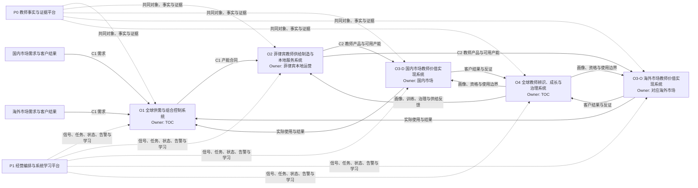

# TOC 成立后｜教师运营系统地图与责任清单 v0.3

> 本稿采用 zero-based thinking：不从现有部门和现有功能出发，而从最终价值、受控对象、完整反馈回路和责权对称出发划分系统。
>
> 一级架构：
>
> **4 个经营系统 + 2 个公共平台 + 3 份跨系统契约。**

## 〇、2026 年 8 月开篇与未来一年双主轴

**TIDE 是 Leon 八月最重要、最高优先级的 P0**：它是 TOC 成立后的第一仗、Leon 目标中的全公司第一个蜂巢／日心说成功试点，也是外教运营系统化的第一站。八月完成经受生产环境考验、具备扩量条件的试点；九月铺到全部新老师。

> **术语消歧**：这里的“八月 P0”是工作优先级；下文“P0 教师事实与证据平台”是架构编号。两者不是同一个概念。

在本地图中，**TIDE 不是第五个经营系统，也不等于 P1 平台本身**；它是第一条跨系统生产纵切面：

- 由 **P0 教师事实与证据平台**持续提供可信、可追溯、失败可见的数据燃料；
- 由 **P1 经营编排与系统学习平台**承接任务、状态、反馈与学习闭环；
- 贯穿 **O2 新师训练交付**与 **O4 持续辨识、成长和资格治理**；
- 最终必须接回 **O3 的客户使用与真实结果**，否则只能证明内部系统运行，不能证明教师价值。

这条纵切面由运营、AI 工程师、集团产研组成原子小队端到端负责，也承担对新生产方式的验证。完整决策与授权边界以 [[projects/TOC/运营支撑/系统资产卡/FT-DEC-011_TIDE八月P0与九月全量新师目标|FT-DEC-011]] 为唯一正本；本节只负责在系统地图中归位。

### TOC 未来一年双主轴

Leon 将 TIDE 与直通车定为 TOC 自 2026 年 8 月起未来一年的两项根本性改革：

1. **TIDE 新师营 → 老师管理彻底系统化、AI 化。**在本地图中，它是由 P0、P1 贯穿 O2、O4 并回到 O3 客户结果的第一条生产纵切面。
2. **直通车 → 供应模式根本转型。**在本地图中，它是 O3 市场教师价值实现系统的第一条生产纵切面，同时倒逼 O1 的供需规划以及 C1、C2 契约真正运行；客户从“被系统分配老师”走向“看见、选择、体验并能继续跟随同一老师”。

两者合成的系统回路是：

> **O2／O4 经 TIDE 生产老师与可信证据 → O1 形成可售产能 → O3 经直通车让客户看见、选择、锁定并持续使用 → 客户与经营结果回流 P0／P1 和 O4 → 下一轮训练、治理与供给调整。**

长期终局不是把体验课池、付费课池粗暴合并，而是建立**一个统一教师供给底座 + 各市场／课程／场景的动态分配策略**。东南亚和中东应复用共同对象、契约与反馈回路，区域 O3 仍保留贴近客户的执行策略与自治空间。

八月 TIDE 为第一战役、直通车为第二战役；“一大一小”只描述本月切口和投入尺度，不描述长期战略重要性。完整长期决策以 [[projects/TOC/运营支撑/系统资产卡/FT-DEC-012_TOC未来一年双主轴_TIDE与直通车|FT-DEC-012]] 为唯一正本。

## 一、三分钟重读

### 1. 顶层不是一个由 TOC 独占的超级系统

完整对象应定义为：

> **教师运营系统体系**

它的使命是：

> 持续把教师产能转化为客户学习价值、教师长期价值和健康经营结果，并让每轮运行提高下一轮的系统能力。

它是一个共享使命和共同事实的“系统之系统”，不是一套由 TOC 包办全部动作、审批和结果的超级系统。

### 2. 四个经营系统

| 编号 | 经营系统 | 系统 owner 类型 | 最终结果 |
|---|---|---|---|
| **O1** | 全球供需与组合控制系统 | TOC | 各市场在正确时间获得可兑现的教师产能 |
| **O2** | 菲律宾教师供给制造与本地服务系统 | 菲律宾本地运营 | 把候选人持续转化为真实可用、稳定履约的教师产能 |
| **O3** | 市场教师价值实现系统 | 国内、海外各市场分别持有区域实例 | 把教师产能转化为客户可感知、可持续的学习价值 |
| **O4** | 全球教师辨识、成长与治理系统 | TOC | 持续辨识、培养、放大、约束和公平治理教师 |

### 3. 两个公共平台

| 编号 | 公共平台 | 业务主权 | 专业实现 |
|---|---|---|---|
| **P0** | 教师事实与证据平台 | TOC 持对象、口径和使用规则 | 数据／技术团队持管道、接口、质量和生产稳定性 |
| **P1** | 经营编排与系统学习平台 | TOC 持经营编排和进化规则 | 产品／AI／技术团队持平台实现与运行 |

### 4. 三份跨系统契约

| 编号 | 契约 | 连接什么 |
|---|---|---|
| **C1** | 需求—产能契约 | 市场需求 ↔ TOC 组合控制 ↔ 菲律宾供给承诺 |
| **C2** | 教师产品—客户结果契约 | 菲律宾教师事实 ↔ TOC 共同语言 ↔ 市场使用和客户结果 |
| **C3** | 事件—整改—权益契约 | 市场客户补救 ↔ 教师整改 ↔ 权益 Gate 与复发预防 |

### 5. 责任结论

- **TOC 负责**：O1、O4，以及 P0、P1 的业务主权。
- **菲律宾本地运营负责**：O2。
- **国内／海外分别负责**：O3 在各自市场的区域实例。
- **专业团队继续负责**：数据、教室、CRM、推荐、Payroll、HR、财务、法务等专业系统的实现、稳定性和专业 Gate。
- **任何跨系统问题**：不再默认靠 Leon、Jennifer 或熟人协调，而应由 C1–C3 预先定义正常接口、失败状态和升级条件。

---

## 二、什么才值得叫一级系统

一级系统必须同时满足五个条件：

1. **独立结果**：能说清它最终为谁创造什么结果。
2. **受控对象**：能说清它控制什么对象及其状态变化。
3. **完整闭环**：能完成感知、判断、行动、反馈和改进。
4. **责权对称**：主 owner 对结果负责，也拥有相称的决定权。
5. **失败可见**：能识别未完成、超时、冲突、数据断流和结果恶化。

不满足五项的对象，不硬叫一级系统：

- 只提供共同事实的，归入**公共平台**；
- 只承担某一段动作的，归入**系统模块**；
- 横跨两个独立 owner 的，定义为**跨系统契约**；
- 需要 HR、财务、法务等承担不可转移专业责任的，设**受保护 Gate**。

这条判据防止把“有部门、有流程、有软件页面”误当成“有系统”。

---

## 三、系统总图

> 独立视觉图：四个经营系统以最终结果闭环，两个公共平台贯穿全局，三份契约负责跨系统连接。

![[journal/2026/07/2026-07-29/media/TOC教师运营系统总图_v0.3.png]]

展开结构化 Mermaid 源图

这张图表达五条组织原则：

1. TOC 持全球控制面，但不收走菲律宾和市场的执行面。
2. 菲律宾不是执行队，而是 O2 的系统 owner。
3. 国内、海外不是反馈节点，而分别拥有 O3 的区域实例。
4. 所有区域共享 P0 的教师对象和事实语言、P1 的运行与学习能力。
5. 两套系统之间靠契约运行，不靠某个强人长期做路由器。

---

## 四、四个经营系统

### O1｜全球供需与组合控制系统

**使命**

让不同市场、课程和时段在正确时间获得数量、质量、结构和成本都可兑现的教师产能。

**受控对象**

> 教师产能单元 = 教师 × 市场 × 课程／产品 × 时段 × 可用状态 × 质量／资格状态

它不把“培训人数、打标人数、名单人数”直接当作产能。

**输入**

- 国内、海外的需求预测和客户承诺；
- 菲律宾当前供给漏斗和产能承诺；
- 教师资格、档期、设备、纪律和持续履约状态；
- 实际预约、开课、履约、客户结果和单位经济性；
- 产品、教材、技术和政策对供需的约束。

**核心判断**

- 各市场需要多少、什么类型、什么时段的教师；
- 当前供给有多少能真实兑现；
- 缺口应通过招聘、训练、激活、调度还是需求降速解决；
- 发生跨市场冲突时怎样分配并保护长期价值；
- 哪些数字是库存、加工中供给、可约供给和稳定供给。

**系统动作**

- 发布需求与产能合同；
- 形成统一供需账和缺口预警；
- 触发菲律宾供给动作；
- 在边界内进行跨市场调度和供给保护；
- 对无法在规则内解决的冲突发起升级。

**输出**

- 唯一供需账；
- 分市场、课程、时段的产能合同；
- 缺口、风险和升级清单；
- 对 O2 的供给任务；
- 对 O3 的可使用产能边界。

**反馈**

实际使用、履约、客户结果和供给成本必须回流，用于修正下一周期需求和供给承诺。

**责任结构**

- 系统 owner：**TOC**；
- 需求责任：国内、海外各市场；
- 供给承诺责任：菲律宾本地运营；
- 数据实现责任：数据／技术 owner；
- 重大资源倾斜和超边界冲突：按授权契约升级。

**不负责**

- 不亲自运行菲律宾招聘和 Center；
- 不替各市场决定所有客户策略；
- 不用一次性 Excel 对账冒充统一供需系统。

**成立判据**

- 700／730／1200／1500／2000 等数字各有唯一对象、分母和用途；
- 供给缺口能按市场、课程、时段和资格状态自动暴露；
- 每次调度能说明对其他市场、客户和教师的影响；
- Leon 不催，供需周期仍按节奏运行。

---

### O2｜菲律宾教师供给制造与本地服务系统

**使命**

把供给需求持续转化为真实可用、稳定履约、能够进入市场价值循环的教师产能。

**受控对象**

- 渠道和候选人；
- 招聘漏斗状态；
- 准入、设备和环境状态；
- Orientation、Practice、质检和激活状态；
- 档期、Center、设备、网络和本地服务状态；
- 本地教师异常和服务请求。

**包含模块**

1. 渠道和招聘漏斗；
2. 全球硬门槛下的本地准入；
3. Orientation、Practice 和训练交付；
4. 教师激活、档期和可约状态；
5. 教师 Routine 触达与本地服务；
6. Center、设备、网络、考勤和灾备；
7. 教师侧事实核验、申诉受理和本地整改执行。

**输入**

- O1 的产能合同；
- O4 的全球硬门槛、资格状态和训练／治理任务；
- P0 的教师事实和历史结果；
- 市场回传的使用、履约和客户结果；
- 本地渠道、供给成本、法规和运营条件。

**核心判断**

- 使用什么渠道、节奏和本地运营方式兑现产能；
- 候选人是否满足全球硬门槛；
- 教师是否完成进入市场前的准备；
- 哪些 Routine 可自动执行，哪些异常需要人工判断；
- 哪些本地约束需要向 O1 或 O4 升级。

**系统动作**

- 运行招聘、准入、训练交付和激活；
- 维护真实档期和可用状态；
- 运行教师服务、Center 和本地基础设施；
- 执行 O4 已批准的训练、整改和治理动作；
- 回传失败原因、申诉、成本和供给结果。

**输出**

> 在约定时间、时段和质量边界下可兑现的教师产能，而不是“处理了多少人”。

同时输出：

- 供给漏斗和失败原因；
- 教师资格、训练、档期和本地服务事实；
- 对渠道、准入标准和训练内容的反馈；
- 无法兑现的产能和升级信号。

**反馈**

教师进入市场后的 30 天结果、履约稳定性、客户结果和生命周期表现，必须回流到渠道、准入和训练模块。

**责任结构**

- 系统 owner：**菲律宾本地运营负责人**；
- TOC：持 C1 需求合同、全球硬门槛和跨系统接口；
- 国内／海外：提供实际使用和客户结果；
- 招聘、培训、Center、教师服务负责人：运行相应模块；
- 技术／数据：负责工具、数据和接口的生产能力。

**允许本地自治**

- 渠道组合；
- 运营节奏；
- 本地沟通方式；
- 在全球硬门槛和权益红线内的局部试验；
- Center 和本地服务的具体组织方式。

**不允许本地静默修改**

- 全球 Teacher ID 和生命周期状态；
- 全球纪律、设备、出勤、合规硬底线；
- 对外已承诺的资格和产能定义；
- 影响教师收入、流量、停课或退出的正式 Gate。

**成立判据**

- 每个供给阶段有唯一状态、口径、owner、时效和失败原因；
- 产能承诺能回到具体教师、档期、资格和证据；
- Routine 不再依赖逐人催办；
- 新开 Center 或更换管理者后仍可复制运行；
- 招聘和训练能被入职后真实结果反向验证。

---

### O3｜市场教师价值实现系统

**使命**

让合适的教师在合适的市场、学生、课程和时间被客户看见、选择、信任并持续使用。

**系统形态**

O3 是一套共同架构、多个区域实例：

- O3-D：国内市场教师价值实现系统；
- O3-O：海外各市场教师价值实现系统；
- 新市场进入时复用同一接口，不复制一套不可比较的人治流程。

**受控对象**

- 教师产品和展示资产；
- 可用档期与市场库存；
- 匹配、推荐、曝光和预约决策；
- 体验课、前几节课、常规课和连续性承诺；
- 课堂交付和客户关系结果；
- 客户问题、补救和关闭状态。

**包含模块**

1. 教师产品化、包装和信任资产；
2. 市场库存、预约和释放；
3. 匹配、推荐、曝光和课量分配；
4. 新教师冷启动、客户保护和供给保护；
5. 课堂交付协调；
6. 客户问题受理、补救、回复和关闭；
7. 区域实验、效果归因和回滚。

**输入**

- O2 提供的真实可用产能；
- O4 提供的教师画像、资格、风险和使用边界；
- P0 提供的事实与证据；
- 学生、课程、阶段、市场和时间情境；
- 客户选择、复约、收藏、固定、投诉、拉黑、退费和沉默流失信号。

**核心判断**

- 在共同硬底线内，本市场看重哪些教师特征；
- 怎样让教师价值在客户决策时刻被看见；
- 怎样匹配、推荐、曝光和保护连续性；
- 何时放量、降权、暂停或回滚；
- 客户问题怎样补救，何时才算客户侧关闭。

**系统动作**

- 建立和维护教师产品；
- 运行预约、匹配、推荐和市场使用策略；
- 对新教师和关键客户阶段进行保护；
- 完成客户侧补救、回复和关闭；
- 将客户结果、市场反证和使用副作用回传 O1、O4。

**输出**

- 预约、匹配、曝光、课量和履约结果；
- 客户学习与关系结果；
- 市场权重和策略效果；
- 客户问题关闭证据；
- 对供给、质量和教师进化的反证。

**反馈**

市场策略必须接受真实客户结果检验；不能用曝光、预约或内部转化单独证明教师价值。

**责任结构**

- 区域系统 owner：**国内／对应海外市场业务负责人**；
- TOC：持共同教师对象、全球供给保护和跨区仲裁；
- 菲律宾：保证供给、档期和教师侧事实真实；
- 推荐／产品／教室／CRM owner：负责专业系统实现；
- O4：持全球硬门槛、教师资格和治理边界。

**市场可自治**

- 偏好权重；
- 教师包装和展示方式；
- 匹配、推荐、曝光和冷启动策略；
- 客户补救方式；
- 边界内的可逆实验。

**市场不可各自为政**

- 不另造 Teacher ID 和生命周期状态；
- 不静默改变全球硬门槛；
- 不把区域偏好冒充全球质量标准；
- 不通过私下名单和人工关系绕过共同供给与资格状态。

**成立判据**

- 教师质量提升能同步体现为真实使用和客户结果提升；
- 国内、海外可使用不同权重，但数据可比较、策略可解释；
- 库存、预约、释放和冲突可追溯；
- 放量有基线、对照、停机线和回滚；
- 客户关闭与教师根因消除不再被混为一个状态。

---

### O4｜全球教师辨识、成长与治理系统

**使命**

在真实授课中持续辨识教师，帮助值得发展的教师成长，让创造价值的教师被放大，并对风险和负面后果进行公平治理。

**受控对象**

- 教师生命周期状态；
- 多维能力与情境适配画像；
- 30 天试用和长期观察；
- 训练、支持、整改和复核任务；
- 风险事件和复发状态；
- Rank、推荐资格、课量、薪酬、奖励、暂停和退出等权益动作。

**包含模块**

1. 招聘后 30 天持续辨识；
2. 巡航期质量感知和变化识别；
3. 评价线：统计画像和长期判断；
4. 干预线：事件发生后的及时响应；
5. 训练、支持、复核和结果回写；
6. 同因复发与根因预防；
7. 评级、激励、课量、薪酬、暂停和退出的受保护 Gate；
8. 教师解释、申诉、更正和回滚。

**输入**

- P0 的课程、设备、纪律、教学行为和客户结果；
- O2 的招聘、训练、本地服务和申诉事实；
- O3 的真实使用、客户反馈和市场反证；
- 全球硬门槛、市场权重、政策和专业规则；
- 动作后的长期结果和副作用。

**核心判断**

- 这个教师在什么情境下表现如何，证据和置信度是什么；
- 当前需要继续观察、训练、支持、整改还是进入权益 Gate；
- 一次有害事件怎样立即响应，同时不污染长期评价；
- 区域反馈是情境权重，还是足以修改全球硬门槛的反证；
- 某项激励或治理动作是否真正带来客户和教师长期价值。

**系统动作**

- 更新教师画像和生命周期状态；
- 触发训练、支持、整改、复核和人工判断；
- 向 O3 输出资格、画像、风险和使用边界；
- 向 O2 回传渠道、准入、训练和本地服务改进；
- 对高风险权益动作形成证据包和正式 Gate 请求；
- 处理申诉、更正、回滚与同因复发。

**输出**

- 可解释的教师状态和画像；
- 训练、支持、整改和复核任务；
- 资格、推荐和使用边界；
- 经共签的权益动作；
- 对 O1、O2、O3 的系统改进反馈。

**责任结构**

- 系统 owner：**TOC**；
- 菲律宾：运行本地训练、支持、事实核验、沟通和整改；
- 国内／海外：共同定义市场权重，提供客户结果和反证；
- HR／财务／法务：持相应专业规则和不可转移 Gate；
- Payroll／推荐／排课：只执行已授权、可追溯的动作；
- AI：感知、分析、建议、编排和低风险执行，不持最终权益责任。

**四条硬边界**

1. 全球硬门槛统一，区域权重可以不同。
2. 评价与干预分离：一次事件可以立即响应，不等于立即给教师定性。
3. 客户反馈是传感器，不是未经校正的最终裁决。
4. 总分不能直接改变教师生计。

**成立判据**

- 任意判断可以回到事实、时间窗、样本量和规则版本；
- 观察、干预、资格和权益动作分层；
- 每项任务有触发、owner、截止、完成条件和结果回写；
- 教师知道为什么、还差什么、怎样申诉；
- 非作者可以持续运行完整 cohort；
- 训练、激励和治理的效果能被长期结果验证。

---

## 五、两个公共平台

### P0｜教师事实与证据平台

**使命**

让所有系统始终在说同一个教师、同一个状态、同一个事实。

**只负责事实，不直接负责裁决**

P0 负责记录和提供：

- Teacher ID；
- 生命周期状态；
- 课程、档期、设备、网络和纪律事实；
- 教学、客户反馈、任务和权益动作证据；
- 来源、时间、口径版本、刷新状态和可信度。

P0 不直接回答：

- 这个教师是不是好教师；
- 是否应增加流量；
- 是否应降薪、停课或退出。

这些属于 O4 和受保护 Gate。

**责任结构**

- 业务语义 owner：TOC；
- 源事实 owner：招聘、教室、TQ、培训、工单、推荐、Payroll 等专业系统；
- 工程 owner：数据／技术团队；
- 菲律宾、国内、海外：对各自产生事实的完整性和及时性负责。

**成立判据**

- 一个 Teacher ID 可以串起完整生命周期；
- 每个指标可以回到来源、时间、粒度和口径版本；
- 持续摄入失败、字段缺失和事实冲突能主动暴露；
- 三地不再长期依赖人工 Excel 对账。

---

### P1｜经营编排与系统学习平台

**使命**

让四个经营系统能够被共同观察、编排、审计和持续改进。

**公共能力**

- 信号识别；
- 任务创建和分配；
- owner、状态、截止与升级；
- Routine 自动执行；
- 异常转人工；
- Agent 建议、执行和监控；
- 数据断流、任务失败和接口异常告警；
- 规则、流程、Skill、Eval 和版本管理；
- 旧入口、旧报表和旧人工交接退役；
- 运行结果回放和学习复用。

**不持有的权力**

- 不替 O1–O4 定义经营目标；
- 不替区域决定客户策略；
- 不替 HR、财务、法务作专业裁决；
- 不因 Agent 置信度高就自动执行高风险权益动作。

**责任结构**

- 业务 owner：TOC；
- 共建：业务系统架构师、产品、数据、AI 和工程；
- O1–O4 owner：对自己的规则、任务和结果负责；
- AI变革部／平台团队：提供方法和底座，不单独验收 TOC 的经营成功。

**成立判据**

- 任意任务都有来源、owner、状态、期限和结果；
- 异常主动暴露，而不是等 Leon 或某位强人发现；
- 高频人工动作持续沉淀为规则、Skill 或系统能力；
- 每个经营周期都有旧路径真实退出；
- 非作者运行时，系统仍能连续工作和学习。

---

## 六、三份跨系统契约

### C1｜需求—产能契约

**连接**

> 国内／海外 O3 ↔ TOC O1 ↔ 菲律宾 O2

**必须写清**

- 需求对象和预测窗口；
- 数量、质量、课程、市场和时段；
- “名单、培训、打标、质检、可约、稳定交付”的状态定义；
- 供给承诺、确认节奏和变更窗口；
- 缺口阈值、预警时点和升级责任；
- 调度优先级、客户保护和其他市场影响；
- 成本、失约、补救和复盘规则。

**正常状态**

市场提交可比较需求，O1 形成组合，O2 返回可兑现承诺。

**失败状态**

- 需求无口径；
- 供给数字混层；
- 临时需求绕过统一账；
- 供给失约未预警；
- 调度伤害其他市场却不可见。

---

### C2｜教师产品—客户结果契约

**连接**

> 菲律宾 O2 ↔ TOC O4／P0 ↔ 国内／海外 O3

**必须写清**

- 教师产品的最低字段和展示资产；
- 资格、质量、档期、设备和风险状态；
- 全球硬门槛与市场权重的分界；
- 市场可使用、不可使用和需人工复核的状态；
- 匹配、曝光、预约和连续性结果；
- 复约、收藏、固定、投诉、拉黑、退费和沉默流失回传；
- 结果回传时效、可信度和失败告警。

**正常状态**

O2 交付真实可用产能，O3 按市场策略使用，结果回到 O4 和 O1。

**失败状态**

- 好教师标签停留在招聘端，未进入市场使用；
- 市场私下维护不可比较名单；
- 客户结果不回流；
- 曝光变化污染质量判断却没有对照；
- 市场偏好被冒充为全球标准。

---

### C3｜事件—整改—权益契约

**连接**

> 市场 O3 ↔ TOC O4 ↔ 菲律宾 O2 ↔ HR／财务／法务／专业系统

**必须写清**

- 事件唯一入口和分类；
- 原始事实、客户影响、教师影响和证据；
- 客户补救 owner、时效和关闭条件；
- 教师事实核验、整改 owner 和完成条件；
- 评价线与干预线；
- 同因复发和根因消除判据；
- 权益动作的证据、共签、生效、解释、申诉和回滚；
- 各状态之间的升级条件。

**必须保留两个独立状态**

1. 客户问题是否已回复、补救和关闭；
2. 教师侧根因是否已整改并验证不再复发。

**失败状态**

- 客户回复完成被当作根因消除；
- 菲律宾整改完成但市场仍持续受损；
- 一个总分直接触发流量、收入、停课或退出；
- 申诉、更正和回滚没有入口；
- 工单关闭率掩盖同因复发。

---

## 七、系统责任清单

| 一级对象 | 系统 owner | 主要运行者 | 共同定义／共签 | 专业实现 | 不应承担 |
|---|---|---|---|---|---|
| O1 全球供需与组合控制 | TOC | TOC 供需运营 | 国内、海外需求；菲律宾供给承诺 | 数据、计划、相关产品系统 | 菲律宾日常招聘、市场客户策略 |
| O2 菲律宾供给制造与本地服务 | 菲律宾本地运营 | 招聘、培训、教师服务、Center、本地运营 | TOC 全球硬门槛与产能合同 | 招聘工具、教师端、数据接口 | 全球调度、区域客户经营 |
| O3-D 国内市场价值实现 | 国内市场业务 | 国内运营、销售／服务、匹配与产品团队 | TOC 共同接口；O4 资格边界 | CRM、推荐、预约、教室 | 菲律宾本地管理、全球质量定义 |
| O3-O 海外市场价值实现 | 对应海外市场业务 | 对应海外运营、销售／服务、匹配与产品团队 | TOC 共同接口；O4 资格边界 | CRM、推荐、预约、教室 | 菲律宾本地管理、其他市场策略 |
| O4 全球教师辨识、成长与治理 | TOC | TOC＋菲律宾训练／服务／整改节点 | 国内、海外客户尺；HR／财务／法务 Gate | 评价、任务、训练、Payroll、推荐 | 未经责任链自动改变教师生计 |
| P0 教师事实与证据平台 | TOC 持业务语义 | 各源事实 owner | 各系统共同使用 | 数据／技术 owner | 替业务作价值裁决 |
| P1 经营编排与系统学习平台 | TOC 持业务编排 | O1–O4 owner 和人—Agent 小队 | 产品、数据、AI、技术 | 平台工程 owner | 成为所有业务判断的超级老板 |

### TOC 明确负责什么

- 全球供需、产能语言和跨区组合；
- Teacher ID、生命周期、指标和证据语言；
- 全球硬门槛、共同评价框架和教师进化机制；
- 30 天试用、持续辨识、训练、治理和权益 Gate；
- 跨系统契约、升级机制和旧路径退役；
- P0、P1 的业务优先级和使用验收；
- 对完整教师运营系统体系能否协同闭环负责。

### 菲律宾本地运营明确负责什么

- 本地渠道、招聘、准入和供给漏斗；
- Orientation、Practice 和训练交付；
- 教师激活、档期真实性和可用产能承诺；
- 教师 Routine 服务、Center、设备、网络和本地灾备；
- 教师侧事实核验、申诉受理和整改执行；
- 用进入市场后的真实结果持续改进招聘和训练。

### 国内／海外分别负责什么

- 各市场需求预测和承诺；
- 教师产品化、展示和客户信任资产；
- 各市场匹配、推荐、曝光、预约和使用策略；
- 市场权重和边界内实验；
- 客户问题受理、补救、回复和关闭；
- 将客户和经营结果按共同接口回传。

### 仍由专业团队负责什么

- 教室、CRM、预约、推荐、Payroll 等源系统和生产系统；
- 数据管道、接口、刷新、权限、质量和告警；
- HR、财务、法务的专业规则、合规和否决责任；
- 软件可用性、安全、审计、部署和生产事故；
- 不能把“TOC 是业务 owner”翻译成专业责任被 TOC 吞并。

---

## 八、哪些必须统一，哪些允许自治

### 必须全球统一

- Teacher ID 和生命周期状态；
- 供需与有效产能语言；
- 全球纪律、设备、出勤、合规硬门槛；
- 数据来源、时间、粒度和口径追溯；
- 事件状态和跨系统升级语言；
- 权益动作的证据、共签、解释、申诉和回滚要求；
- 系统运行与学习的最低验收标准。

### 菲律宾可以自治

- 渠道组合和招聘节奏；
- 本地运营、沟通和服务方式；
- Center 和本地基础设施组织；
- 全球硬门槛内的训练交付和局部试验；
- 对中央规则和模型的反证。

### 国内／海外可以分别自治

- 市场偏好权重；
- 教师产品化和展示方式；
- 匹配、推荐、曝光和客户保护策略；
- 市场内的可逆实验；
- 客户补救与关系维护方式；
- 对共同评价框架的反证。

### 必须触发升级

- 全球硬门槛与区域经营发生冲突；
- 一个市场的调度动作伤害其他市场或客户承诺；
- 供给无法兑现且超过契约阈值；
- 数据断流、事实冲突或关键口径漂移；
- 涉及教师收入、流量、暂停、停课或退出；
- 客户伤害、教师公平、合规或生产安全风险；
- 局部经验拟上升为全球规则。

---

## 九、v0.2 十个子系统如何归位

| v0.2 | v0.3 归位 |
|---|---|
| S0 教师对象、主数据与证据 | P0 教师事实与证据平台 |
| S1 供需规划与跨区调度 | O1 全球供需与组合控制系统 |
| S2 招聘与准入 | O2 招聘和准入模块 |
| S3 新师训练、试用与成长 | 训练交付归 O2；持续辨识、成长和资格归 O4 |
| S4 教师质量感知与评价 | O4 的辨识与评价模块 |
| S5 在岗运营、教师服务与本地基础设施 | 本地服务／Center 归 O2；Routine 编排归 P1；治理动作归 O4 |
| S6 匹配、分配与市场使用 | O3 市场价值实现系统 |
| S7 课堂交付、客户反馈与问题闭环 | 客户闭环归 O3；教师整改和复发预防归 O4；二者由 C3 连接 |
| S8 权益、激励、升降级与退出 | O4 的受保护 Gate |
| S9 经营控制与系统进化 | P1 经营编排与系统学习平台 |

这一重排的关键不是减少名字，而是减少人工交接：

- 招聘不再把“上岗”当终点，而接受真实使用结果反向验证；
- 质量不再停在评分，而必须进入训练、支持和治理闭环；
- 匹配不再只看推荐指标，而必须承担客户结果；
- 工单不再用一个关闭状态覆盖客户补救和教师根因；
- 数据和 Agent 不再被误认成经营 owner。

---

## 十、反人治验收

每个一级系统和平台都必须通过以下八问：

1. 换一批人，它还能否按共同事实和规则运行？
2. Leon 不参加，系统能否完成一个完整经营周期？
3. 异常会主动暴露，还是等熟人发现和催办？
4. 每个判断能否回到来源、口径、规则版本和责任人？
5. 动作是否有状态、截止、完成条件和结果回写？
6. 跨系统失败是否按契约升级，而不是临时拉群找人？
7. 每轮运行是否沉淀了数据、标准、流程、Skill、Eval 或系统能力？
8. 是否有旧表格、旧入口、旧报表或旧人工交接真实退出？

此外，整套体系必须通过四个总检验：

- **客户价值**：客户是否更容易获得并持续使用合适教师；
- **教师价值**：教师是否获得清晰、公平、及时且可申诉的成长与治理；
- **经营价值**：有效供给、履约、匹配和单位经济性是否改善；
- **反英雄**：第二个人能否独立运行，Leon 退出日常路由后系统不失速。

---

## 十一、下一版该补什么

v0.3 只拍系统边界和 owner 类型，不提前把组织现状写成正式授权。

下一版应逐系统补齐：

> 具体系统 owner／第二负责人／核心指标／输入输出合同／源系统／标准卡／流程卡／异常升级／人工 Gate／旧路径退役／首个真实验收场景

建议顺序：

1. 先把 O1–O4 的具体人名和授权差距列出来；
2. 再把 C1–C3 写成可签署、可回放的接口合同；
3. 选择一个最小但完整的真实闭环做样板；
4. 最后才决定哪些模块需要软件、Agent、Skill 或组织调整。

---

## 十二、当前待确认项

1. O2 是否由菲律宾本地运营整体持有，还是招聘、训练、Center 已存在不可合并的独立权责边界；
2. O3 的海外实例按“全球海外”还是按市场分别设系统 owner；
3. TOC 对 O1、O4 是否已有相称的人员、预算、规则和跨部门仲裁权；
4. 教师产品化在 O3 由市场持有后，TOC 保留哪些全球共同字段和供给保护权；
5. O4 权益 Gate 中，评级、流量、课量、薪酬、暂停、退出分别由谁共签；
6. P0 的 Teacher Master、持续摄入、质量 SLA 和异常告警当前真实成熟度；
7. TIDE 已作为首条生产纵切面进入八月 P0；P1 最终复用哪些 TIDE 能力、哪些只视为候选实现，仍须用生产证据判断，避免用原型名称绑死业务架构。

---

## 十三、证据与边界

主要依据：

- `projects/TOC/战役/历史/decisions/2026-07-13-CEO下半年外教战役指示-双主帅H2总纲.md`
- `strategy/02_长期战略/双任命长期判断_AI变革部与TOC.md`
- `projects/TOC/战役/战略/好老师生命周期.md`
- `projects/TOC/战役/战略/老师质量提升飞轮.md`
- `projects/TOC/战役/战略/外教战役四化_HowToStart_日心说升级.md`
- `projects/TOC/运营支撑/系统资产卡/FT-DEC-011_TIDE八月P0与九月全量新师目标.md`
- `projects/TOC/会议/正文/轻纪要-国内外教运营待决策-2026-07-28.md`
- `projects/TOC/会议/正文/轻纪要-教师侧开发AI Native讨论-2026-07-28.md`
- `journal/2026/07/2026-07-29/_agent/TOC成立后_教师运营系统地图与责任清单_草稿_v0.2.md`

证据边界：

- H2 总纲是正式决策正本；
- 长期判断是 living 判断页，不等于正式组织授权；
- 7 月 28 日国内外教运营材料缺逐字稿，数字、owner 和生效状态仍为 `[unverified]`；
- v0.3 的“4＋2＋3”一级架构已获 Leon 接受；
- 2026-08-03，Leon 已明确 TIDE 的八月 P0、三条关键路径及“八月生产试点／九月全量新师”目标；本稿对 TIDE 的系统归位是 COO 基于既有 4＋2＋3 架构作出的当前 assessment；
- 具体人名、权限、KPI、预算、汇报线、系统 owner 任命和业务规则仍未生效；
- 本稿先定义系统，不替 Leon 或组织完成正式任命。
