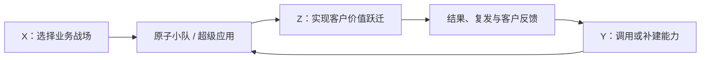

# X-Y-Z 三轴经营模型

> **X 选战场，Y 建能力，Z 判价值。**
>
> TOC 选择一个明确的 X 业务战场，调用或补建一组 Y 组织能力，推动客户发生一次可验证的 Z 价值跃迁；战斗结果再反哺 Y，让组织从依赖个人勤奋，走向可复用、可规模化、可持续进化的经营系统。

## 一、为什么需要这套语言

过去，外教运营的大量问题主要依靠个人经验、责任感、跨群协调和临时项目解决。这样的工作保护过许多客户，也体现了同事的勤奋与担当；但能力往往留在个人身上，问题再次发生时仍要重新组织救火。

Y 能力建设过去并非完全没有发生，而是没有作为一条持续经营的轴存在于公司的意识地图中。鹰眼、触达、匹配等能力常被当成单个项目：资源紧张时可以延期，项目结束后也未必形成长期 owner、共同底座和反馈闭环。

X-Y-Z 模型要改变的不是同事愿不愿意解决问题，而是组织如何同时看见三件事：

1. **正在为哪个业务战场负责；**
2. **解决问题的能力住在哪里、能否被组织复用；**
3. **客户最终获得了多深的价值。**

## 二、三轴总览

| 轴 | 定义 | 核心问题 | 结构形态 |
|---|---|---|---|
| **X：业务战场** | TOC 必须长期负责、持续创造结果的业务域 | 在哪里打仗？要改变哪一段真实业务？ | 一棵战场树 |
| **Y：能力承载层** | 解决问题的能力住在哪里，以及能否脱离特定个人稳定复用 | 凭什么打赢？能力是在人、组织系统，还是蜂巢中？ | Y0—Y3 的能力阶梯 |
| **Z：客户价值深度** | 客户实际获得的价值层次 | 客户从没有被看见，走到了多深的价值？ | Z0—Z4 的价值阶梯 |

三轴不是三类互不相干的项目。每项重要工作都应能同时说清自己的 X 坐标、Y 现状与目标、Z 现状与目标。

## 三、X 轴：业务战场树

### 3.1 定义

X 轴回答：**TOC 在哪些业务战场上持续负责？**

业务战场应由长期存在的业务任务和客户结果定义，而不是由部门、当前项目名、系统模块或工具名称定义。战场可以长期存在，承载它的项目、产品和超级应用可以迭代或退出。

因此：

- **X 是业务战场；**
- **超级应用是某个 X 战场在当前阶段的经营载体；**
- **原子小队是在一个具体 X 战场上推动 Y、Z 坐标迁移的责任单元。**

### 3.2 战场命名规则

一个合格的 X 战场应：

1. 描述一段需要长期负责的真实业务，而不是“做一个系统”；
2. 能说清主要客户是谁、客户或业务需要发生什么变化；
3. 能继续向下拆成较小战场，但不能只是项目任务清单；
4. 即使今天的 App、组织和技术方案全部更换，战场仍然成立；
5. 不用内部部门的舒服、忙碌或短期代理指标冒充客户价值。

### 3.3 战场语言示例

以下仅用于校准语言味道，**不是已经冻结的完整 X 战场树**：

| 容易写成内部工作 | 更适合的战场语言 |
|---|---|
| 招聘老师 | 获得足量、合格、适配市场的候选供给 |
| 做新师营 | 让新老师在 0—30 天成为 Customer-ready 供给 |
| 管理几万名老师 | 让大规模在岗老师持续稳定交付并不断进化 |
| 管理坏课 | 让每节课稳定发生，异常能被预防、保护和恢复 |
| 做匹配系统 | 让好老师被看见、选中、约到并形成稳定关系 |

完整 X 战场树应在本模型之后单独展开、验证和版本化，不在 v1.0 中提前锁死。

## 四、Y 轴：能力承载层

### 4.1 定义

Y 轴回答：**解决问题的能力住在哪里，以及能否脱离特定个人稳定复用？**

| 层级 | 名称 | 能力住在哪里 | 典型状态 |
|---|---|---|---|
| **Y0** | **无解** | 没有稳定承载者 | 问题看不见、无人持续负责，或每次都从零开始找办法 |
| **Y1** | **英雄解** | 个人脑中的经验、关系与责任感 | 勤奋负责的个人把事情扛下来；可以救一个 Case，但人走能力走 |
| **Y2** | **组织解** | 共同标准、规则、流程、产品和系统 | 普通人也能稳定执行，一次做对可以转化为多次做对 |
| **Y3** | **蜂巢解** | 人与 Agent 共生、可持续学习的经营系统 | AI 持续感知、判断、行动、反馈和学习；人负责目标、边界、复杂取舍与最终责任 |

### 4.2 组织解与四化

“流程解”只是组织解的早期形态。只写制度、流程或 SOP，不等于组织已经形成稳定能力。

Y2 组织解内部沿四化的前三步演进：

> **标准化 → 产品化 → 系统化**

- 标准化：正确动作有共同语言；
- 产品化：优秀经验可以被普通人使用；
- 系统化：数据、流程、责任和反馈能够稳定运转。

Y3 蜂巢解对应 AI 化，但不是给旧流程增加一个模型或自动化按钮：

> **蜂巢解 = 组织解地基 + 持续感知 + Agent 判断与编排 + 授权行动 + 结果反馈 + 持续学习。**

没有标准、数据、责任、权限和反馈，AI 只会放大混乱；因此蜂巢解不能跳过组织解。

### 4.3 外教侧当前重点能力

外教侧当前重点建设三类可跨战场复用的能力：

- **鹰眼：对老师、课堂和关键要素持续看见、理解和判断；**
- **触达：把正确的信息、任务或方案送达正确对象，并确认响应、行动和结果；**
- **匹配与推荐：连接学生需求和合适供给，并让交付与客户结果持续回流。**

身份、数据、事件、规则、权限、记忆和反馈学习是这些能力共同依赖的内核。不能把三个大项目各自建设一套割裂底座，也不能把一个推荐算法、监控页面或消息通道直接称为蜂巢解。

## 五、Z 轴：客户价值深度

### 5.1 定义

Z 轴只从客户所得定义，不从组织投入、同事辛苦程度或所用技术定义。

| 层级 | 名称 | 客户第一人称 | 客户实际获得的价值 |
|---|---|---|---|
| **Z0** | **看不见／接不住** | “我已经受损，但你不知道，或没人真正接手。” | 问题未被感知、无人负责，客户只能承受损失或反复寻找入口 |
| **Z1** | **接得住** | “我喊了，你有人接。” | 客户主动反馈后，有人响应、有人负责，损失不再继续扩大 |
| **Z2** | **解得好** | “我遇到的问题，真的解决了。” | 不止回复、安抚或关单，而是服务恢复、权益落实、当次需求真正完成 |
| **Z3** | **守得住** | “我不需要喊，你已经发现并保护了我。” | 主动发现异常、及时干预、恢复体验，并避免同类问题反复伤害客户 |
| **Z4** | **成就客户** | “你不只避免我受损，还帮助我获得更好的结果。” | 学习效果、成长体验、信任、连续性、续费和转介绍得到长期改善 |

Z0 必须保留，因为当前许多问题不是“解决得浅”，而是客户已经受损，组织仍然不知道。只有客户投诉、CC 或群消息触发后才被看见，仍属于被动感知。

同事的担当值得尊重，但**担当是 Z 轴的起点，不是 Z 轴的刻度**。熬夜、跨群协调和快速响应说明有人愿意接住客户；客户是否真正恢复、以后是否不必再喊、最终是否获得更好的学习结果，才决定 Z 的深度。

## 六、三轴如何相互作用

### 6.1 Y 与 Z 必须独立判定

Y 越高，不代表 Z 必然越高：

- 一名极其负责的同事可以依靠 Y1 英雄解，为某位客户创造真正的 Z2；
- 一套错误的自动化系统可以达到 Y2，甚至看起来像 Y3，却只创造 Z0；
- 因此，**Y 判断组织有没有形成能力，Z 判断这份能力有没有真正成就客户；Z 是 Y 的判卷人。**

“单点解决 → 系统性解决 → 系统性预防”不是 Z 轴，而是跨越 Y、Z 的组织解法演进链：

| 组织解法 | 常见 Y 状态 | 通常能够支撑的 Z 深度 |
|---|---|---|
| 单点解决 | Y1 英雄解 | Z1，偶尔达到 Z2 |
| 系统性解决 | Y2 组织解 | 稳定达到 Z2，并扩大到更多客户 |
| 系统性预防 | Y2 后段至 Y3 | 才可能规模化达到 Z3 |
| 持续进化 | Y3 蜂巢解 | 依据真实客户结果持续向 Z4 推进 |

这是一条常见路径，不是自动等式。任何层级都必须由客户结果单独验真。

### 6.2 X 选择方向，Y 形成复利，Z 负责判卷

- 没有 X，能力建设容易脱离真实业务，变成“有武器、没战争”；
- 没有 Y，团队只能反复依靠个人勤奋创造一次性结果；
- 没有 Z，系统建设、功能上线和任务完成会被误认为经营成功；
- 三者闭环后，一次战斗既创造客户价值，也让下一场战斗更容易打赢。

## 七、如何用三轴组建原子小队

一支原子小队不是按部门或系统模块组建，而是由以下要素共同定义：

> **一个明确的 X 业务战场 + 一次清晰的 Z 目标跃迁 + 一组需要调用或补建的 Y 能力 + 结果收据与能力收据。**

标准表达句式：

> 在「____」这个 X 战场，把客户从 Z__「____」推进到 Z__「____」；调用已有的「____」Y 能力，补建缺失的「____」能力，并分别用客户结果收据和能力沉淀收据验收。

在进入真实作战前，小队仍须补齐唯一 DRI、2—4 名核心成员与保护带宽、授权边界、数据与专业守门、阶段期限、升级机制和关闭／转制条件。三轴给出共同战略语言，不自动完成这些治理动作。

### 坏课治理示例

以下仅用于展示模型如何使用，不是正式基线或目标承诺：

- **X 战场**：让每节课稳定发生，异常能被预防、保护和恢复；
- **当前示意坐标**：主要依靠 Y1 英雄解，在客户投诉后做到 Z1，部分案例达到 Z2；
- **阶段方向**：通过 Y2 组织解，让客户从 Z1／Z2 推进到可稳定复现的 Z2，并开始达到 Z3；
- **长期方向**：形成 Y3 蜂巢解，使鹰眼主动感知，触达与匹配完成授权行动，结果持续回流，让 Z3 成为常态并向 Z4 学习；
- **两张收据**：真实坏课、复发、客户损失和学习连续性的变化；事件、规则、数据、触达、匹配和反馈能力是否被其他战场复用。

## 八、使用边界

本模型用于：

- 建立 TOC 的共同战略语言；
- 梳理完整 X 业务战场树；
- 选择原子小队任务并写清阶段跃迁；
- 识别某个战场过度依赖英雄解、能力建设脱离客户，或系统上线没有客户结果；
- 同时审视客户结果收据与能力沉淀收据。

本模型当前不直接用于：

- 评价个人是否勤奋、是否优秀；
- 直接决定绩效、晋升、薪酬、流量或奖惩；
- 证明某项能力已经生产可用或某个项目已经成功；
- 替代具体指标的分子、分母、数据源、观察窗口和验收合同；
- 替代人员投入、组织任命、业务授权和高风险动作的正式 Gate。

## 九、稳定内核与后续生长

### v1.0 稳定内核

1. **X 是业务战场树；**
2. **Y 是能力承载层：Y0 无解、Y1 英雄解、Y2 组织解、Y3 蜂巢解；**
3. **Z 是客户价值深度：Z0 看不见／接不住、Z1 接得住、Z2 解得好、Z3 守得住、Z4 成就客户；**
4. **X 选战场，Y 建能力，Z 判价值；**
5. **原子小队负责把一个具体战场从旧坐标推进到新坐标，并同时留下结果收据与能力收据。**

### 后续单独展开

- 完整 X 业务战场树及层级关系；
- 各战场当前 Y、Z 坐标的事实回放；
- 各层级的可观察证据与反例；
- 鹰眼、触达、匹配及共享内核的能力地图；
- 三轴如何进入月度组合管理、原子小队合同与复盘语言。

## 来源

- [外教运营规划 V1.2](https://alidocs.dingtalk.com/i/nodes/MyQA2dXW7eRlDK7jt1lqNKePJzlwrZgb?utm_scene=person_space)
- [2026-08-17 TOC 周会](https://alidocs.dingtalk.com/i/nodes/yQod3RxJKGDly0PASl33ZD9wJkb4Mw9r?utm_scene=person_space)
- 2026-08-17 Leon 与 COO 对 X、Y、Z 定义的逐轮挑战、修订与明确确认

## 附录：2026-08-25 解读稿的独有补充（草稿，非新增生效规则）

原通俗解读版 v0.1 明确“待 Leon 人审”；以下内容并入本原料副本只为减少重复文件，不把它升级为已批准的 v1.1，也不改变前文 v1.0 的裁决地位。

### 定义

大号 X = **比较固定的业务域**，是"铁打的营盘"，是具体业务结果的物理支撑。例如：

- 老师招聘
- 新老师 leads 获取
- 老师薪酬激励体系
- 新老师训练营
- 存量老师日常经营管理
- ……

判断标准一句话：**把今天的项目、App、组织和技术方案全部换掉，这块业务还在不在？** 在，就是营盘。

### 营盘下面是什么

营盘下面挂**项目**——或大或小，以**原子小队**方式做，指向客户价值。

> **铁打的营盘，流水的原子小队和客户任务。**

项目（TIDE、直通车、好老师看得见、Cocos-Ready、坏课治理小队、触达小队、Center 试点……）是营盘在当前阶段的**经营载体**；载体可以迭代、可以退出，营盘长期存在。目标钉在营盘上，不钉在载体上——载体换了，营盘和结果还在。

## 6. XYZ × 公司基本法四关键（对照表）

| 基本法关键 | XYZ 对应 | 怎么对上的 | 常见误读 |
|---|---|---|---|
| ① 以客户价值为北极星 | **Z 轴** | 每场仗都必须回答"客户从 Z 几走到 Z 几"；北极星 = 客户所得，不是成交、活动量或 Agent 产量 | 把"多做活动、多成交"当北极星 |
| ② 坚持系统化交付 | **Y2 组织解** | "可重复、可观测、可纠错，有真实结果与独立证据" = 普通人也能稳定执行、一次做对变多次做对 | 把写 SOP、上线功能当完成系统化 |
| ③ 坚持 AI 驱动 | **Y3 蜂巢解** | AI 进入感知、分析、推荐、执行、监控、协同与学习主链；人负责价值取舍、关系判断、授权与最终责任 | 给旧流程挂个 AI 按钮就叫 AI 化（跳过组织解只会放大混乱） |
| ④ 积极探索原子小队与任务制组织 | **X 上的责任单元** | 铁打的营盘，流水的原子小队和客户任务；小队是把一个战场从旧坐标推到新坐标的责任单元，TOC 的实践就是为全公司开荒探路 | 把小队当临时项目组，打完就散，不留两张收据 |

**一句话总结：XYZ 就是基本法四关键在 TOC 的日常操作语言。** 讨论目标时不需要再造一把尺子，直接用 XYZ 写：打哪个营盘（X）、能力升到哪一级（Y）、客户走到多深（Z）。

## 本地原料合并记录

本次仅整理 Team Memory 投喂副本，原知识库正本未修改。以下两份属于同一主题或同一会议的来源链，不作为两份独立证据。原有日期、草稿、建议及待确认状态继续适用。

- [合并前：X-Y-Z三轴经营模型.md](</Users/wangdong/Desktop/Team memory/TOC深度精简_合并前留档_2026-09-14/X-Y-Z三轴经营模型.md>)
- [合并前：X-Y-Z三轴经营模型_通俗解读版.md](</Users/wangdong/Desktop/Team memory/TOC深度精简_合并前留档_2026-09-14/X-Y-Z三轴经营模型_通俗解读版.md>)
