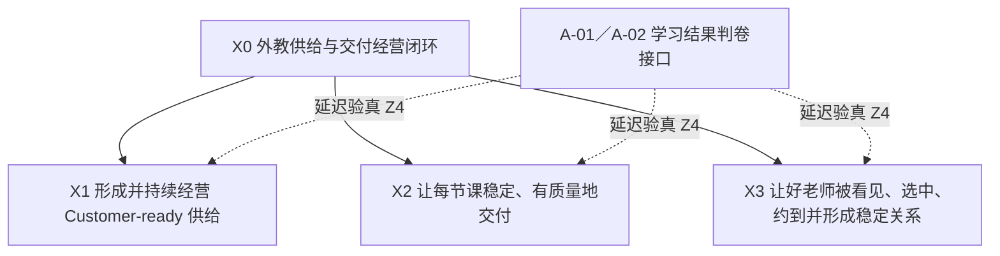

# 外教侧需求 X-Y-Z 需求地图 v0.2

> **结论：82 个原始编号，不是 82 个项目。**
>
> 战略层收敛为三个一级战场：**形成好老师、守住每节课、连接好关系。**分析层保留 10 个二级战场及其需求簇；能力层保留 **3 类横向共享能力 + 7 个共同内核**；客户价值仍沿 **承接解决、主动保护、成就增长** 三条路径递进。项目名、产品名、规则、指标和治理 Gate 必须继续独立保留，不能为了表格整齐被硬塞成 X、Y 或 Z。

## 一、这次整理最重要的修正

### 1.1 一级战略语言稳定为三个战场



这三个 X 不是严格按编号发生的“三阶段”，而是三类长期经营对象：

| 一级战场 | 主要经营对象 | 核心完成定义 |
|---|---|---|
| **X1 供给形成与持续经营** | 一名老师／一批老师的供给状态 | 进入、成材，并持续保持 Customer-ready |
| **X2 单课稳定交付** | 一节已经预约的课 | 正常课按承诺发生；异常课被主动发现、保护、恢复并防复发 |
| **X3 选约与稳定关系** | 一次选约及一段师生关系 | 好老师被可信看见、真正约成，关系持续稳定 |

真实客户旅程常常是“供给形成 → 被选约 → 稳定交付 → 客户结果回流”，但经营上三个战场长期并存。

### 1.2 v0.1 的细分不删除，降为分析层

v0.1 的“5+1+1”帮助发现遗漏，但作为一级战略语言过碎。v0.2 只调整层级，不丢失原需求：

| v0.1 分析视角 | v0.2 归位 |
|---|---|
| 候选供给进入 | **X1.1 候选供给** |
| 新师真实课堂成材 | **X1.2 0—30 天 Customer-ready** |
| 大规模在岗老师经营 | **X1.3 全量在岗供给经营与进化** |
| 每课稳定兑现与异常保护 | **X2.1—X2.4** |
| 客户选约与稳定关系 + 候选“可信认知” | **X3.1—X3.3** |
| 学习结果可测可见 | **Z4 判卷与反馈接口**，不升为第四个 X |

旧“两类客户 × 六条价值线”仍是一张客户价值全景，而不是纯 X 树：

| 旧价值线 | 新三轴中的主要身份 | 本次处理 |
|---|---|---|
| 招进好老师 | X1 与 Z 的混合语言 | 归 **X1.1—X1.3**；不仅招进，还要成材、保持可供给并持续进化 |
| 客户省心约 | X3 与 Z 的混合语言 | 归 **X3.1—X3.3**：看懂、选中、约到、关系稳定 |
| 安心每节课 | X2 与 Z 的混合语言 | 归 **X2.1—X2.4**：稳定交付、主动保护、恢复、防复发 |
| 老师挣钱快 | 老师客户的 Z4 结果 | 由 X1 与 X3 共同创造，X2 提供稳定履约护栏；不单列 X |
| 教学更轻松 | 老师客户的 Z2—Z4 结果 | 主要由 X1.3 与 X2 创造；不能简化成“做 Teacher App” |
| 好老师看得见 | X3 与 Z 的混合语言 | 可信证据、选择与真实约成统一归 X3，不再另立“认知战场” |

学习进步、前后测、进度与下一步行动没有消失；它们被保留为 **Z4 学习结果判卷接口**，不能短周期归因给单个老师，也不能用教师评分、坏课率、预约率或曝光量替代。

### 1.3 每条输入先判“它是什么”，再放坐标

| 输入类型 | 识别问题 | 本批典型例子 | 怎样处理 |
|---|---|---|---|
| **X 业务战场** | 即使 App、项目和组织全换了，这段业务仍需长期负责吗？ | 候选供给、30 天新师验证、稳定履约、客户选约 | 进入 X 树 |
| **Z 客户价值** | 客户第一人称究竟得到了什么？ | 约得到、课被恢复、老师少走弯路、老师挣到钱 | 作为阶段目标与收据，不冒充项目 |
| **Y 能力承载成熟度** | 这项能力住在哪里，能否脱离特定英雄稳定运行？ | 鹰眼、触达、匹配与推荐、招聘生产 | 先进入能力地图，再单独判 Y0—Y3；跨 X 复用只说明共享性 |
| **项目／方案／载体** | 它是不是当前阶段的一种实现方式？ | TIDE、直通车、Cocos、Teacher App、Workforce、AC | 挂到 X×Y×Z，不反过来定义战场 |
| **规则／权益动作** | 它会不会改变资格、机会、流量、关系或客户权益？ | 熔断、降权、移除、排序、曝光、换师、代课 | 单列 Gate；必须双客户验真 |
| **指标／证据** | 它是诊断和验收尺子吗？ | Leads 流失、触达率、转化率、前后测、阅读量 | 挂到相应 X/Z 收据，不单独立项 |
| **事实缺口／背景方法** | 它是在描述断点、约束、优先级或组队方式吗？ | lesson memo 冲突、架构图、原子小队规则、催收过程 | 保留来源，不强塞三轴 |

### 1.4 总体成熟度判断

这批材料可以证明：组织看见了大量问题、断点、局部组件和目标设想；但不能证明任何一台横向能力已经形成端到端 Y2，更不能证明 Y3。

仅据这批需求材料，当前最稳妥的总判断是：

> **当前端到端坐标统一记为 `Y?｜待核`。材料反复出现人工承接、局部组件和“已经上线”等状态声称，可形成“可能混有 Y1 与局部 Y2”的工作假设；只有真实回放证明普通人可稳定使用、连续运行、异常可见、结果可回读后，才能正式判 Y2。鹰眼／触达／匹配的完整闭环目前只作为 Y3 愿景。**

同样，需求存在不等于客户当前一定是 Z0。多数当前坐标应先写成 `Z?｜待核`，经过真实客户旅程回放后再判。

---

## 二、X 轴：三个一级战场，十个二级业务任务

### X1｜形成并持续经营高质量、Customer-ready 的外教供给

#### X1.1 获得足量、合格、适配市场的候选供给

| 分析簇 | 原始来源 | 主要客户与阶段 Z 目标 | 主要 Y 调用 |
|---|---|---|---|
| 持续获得、唤回候选老师 | `B-06、B-09、B-15、B-17` | CN：`Z? → Z2`，能进入／续接申请；成熟后 Z3 主动发现阻塞与流失 | 触达；身份、状态、记忆、反馈 |
| 让合适候选顺畅走完招聘漏斗 | `B-05–B-07、B-10、B-14–B-16` | CN：`Z? → Z2`，只交一次资料、知道进度、真实完成申请 | 招聘生产包；触达；数据、事件、规则 |
| 完成资格、设备、教学审核与上岗 Gate | `B-03、B-04、B-08、B-11–B-13` | CN：`Z? → Z2`，依据透明、过程可完成、结果可解释和纠错 | 资格／Eval；鹰眼；规则、权限、审计 |

登录页、Teacher Admin API、招聘运营 AI、CE 页面都只是 Y 能力诉求或方案载体，不定义战场。

#### X1.2 让新老师在 0—30 天通过训练与真实课堂验证，成为 Customer-ready 供给〔当前载体：TIDE〕

| 分析簇 | 原始来源 | 主要客户与阶段 Z 目标 | 主要 Y 调用 |
|---|---|---|---|
| 完成训练与上岗准备 | `B-01`；条件性输入 `F-02` | CN：`Z? → Z2`，真实准备好，而不是只完成培训 | Eval／训练；鹰眼；证据、反馈 |
| 获得相对公平、足够的真课验证机会 | 8 月 11 日会议新增战场 `05A:M-01`；`C-05` 只提供“实习期增加曝光池量”的机会分配问题，`E-05` 只提供产能依赖 | CN：`Z? → Z2`，实际获得适配真课与清楚机会；SP 是准备度护栏 | 匹配与推荐；Workforce；规则、权限 |
| 用可复核证据完成继续试用／可信入池／交接判断 | `B-01、D-02、F-01、F-02、F-07`；研究约束 `F-03–F-06` | CN：`Z? → Z2`，判断可解释、可纠错；长期 Z3 主动支持差距 | 鹰眼；Eval；身份、数据、事件、规则、反馈 |

完整业务终点主要来自 `05A:M-01`；原始需求没有给出完整的入池、延期、退出和申诉规则，不能写成现行机制。TIDE 是当前载体，不等于 X1.2 本身。

#### X1.3 让全量在岗老师持续可供给、好协作并不断进化〔供给经营持续；慧茹版本标注“全量外教成长体系当前暂停”，现状待核〕

| 分析簇 | 原始来源 | 主要客户与阶段 Z 目标 | 主要 Y 调用 |
|---|---|---|---|
| 管理开槽、排班、请假、替补、改派与产能 | `E-05` | AT：`Z? → Z2`，排班／请假／替补真实办成；成熟后 Z3 主动预警冲突 | Workforce；匹配；身份、事件、规则 |
| 看见课表、任务、状态、收入信息并自助办事 | `E-01–E-04、E-06–E-07` 中的老师办事子项 | AT：`Z? → Z2`，无需绕路完成任务；成熟后 Z3 主动提示和协助 | Teacher App／My Page；触达；身份、权限、记忆 |
| 持续获得训练、支持、复测和能力升级 | `B-02、F-02`；研究输入 `F-03–F-07`。`D-07` 只有在真实流程证明会触发支持／复测时才建立交叉关系 | AT：`Z? → Z2`，得到支持和复测；长期 Z4 看专业成长、稳定教学与健康收入 | Eval／训练；鹰眼；证据、反馈、权限 |

即使“成长体系当前暂停”的状态经核属实，暂停的也是建设载体，不是 X1.3 战场。Teacher App、My Page、Workforce 也只是被调用的能力或载体。

### X2｜让每节课按承诺稳定、有质量地交付，异常能被预防、主动发现、保护、恢复并防止复发

| 二级战场 | 原始来源 | 主要客户与阶段 Z 目标 | 主要 Y 调用 |
|---|---|---|---|
| **X2.1 到课与可用性稳定：迟到、缺勤、早退** | `D-05、D-09、D-11、D-20` | SP：`Z? → Z2`，正常课真实上成；异常课完成代课／改期与权益落实。AT 需事实准确、可复核 | 鹰眼、触达、匹配；规则、权限、审计 |
| **X2.2 设备、网络与课堂技术环境稳定** | `D-06、D-12、D-15`；`E-07` 为老师侧设备／CPU 办事输入 | SP：`Z? → Z2`，听看与课程真实恢复；AT 得到及时支持且不被误判 | 鹰眼、触达；事件、工单、权限 |
| **X2.3 课中教学与互动质量稳定** | `D-04、D-07、D-09、D-10、D-14、D-16`；`D-02` 条件性交叉 | SP：`Z? → Z2`，服务恢复；AT 得到支持、纠错、复测和适用申诉 | 鹰眼、Eval、工单；规则、权限、反馈 |
| **X2.4 横切以上三类：异常确认、快速恢复、双侧保护、复核申诉和防复发** | 感知与事实：`D-01–D-03、D-08、D-11、D-13、D-15`；恢复与防复发：`D-10–D-12、D-14、D-15、D-20`；`C-15、C-21` 仅在恢复某节已约课时交叉 | SP：稳定达到 Z2 后再验证 Z3；客户不必投诉，风险已被发现并保护成功。AT 是权益护栏 | 鹰眼、触达、匹配；数据、事件、工单、记忆、反馈、审计 |

X2.4 是贯穿 X2.1—X2.3 的闭环，不是第四类异常根因。鹰眼是 Y 能力；慧茹版本把“坏课治理”标为当前载体，其生产状态仍待当前正本核验。真正的完成定义是课程与权益被保护，而不是告警、工单或自动动作执行成功。

### X3｜让好老师被可信地看见、被合适客户选中并真实约到，形成稳定、可持续的关系

| 二级战场 | 原始来源 | 主要客户与阶段 Z 目标 | 主要 Y 调用 |
|---|---|---|---|
| **X3.1 客户看懂可信、相关的老师证据；老师被准确、有授权地呈现** | `B-13、C-02–C-04、C-09、C-23`；8 月 11 日会议补充 | SP：`Z? → Z2`，看见可信相关证据并能放心选择；AT 被准确呈现、可纠错并获得公平机会 | 数据／证据、内容生产与分发；权限、版本、反馈 |
| **X3.2 学生需求与合格、可用老师高效适配，并真正完成预约** | 适配：`A-03、A-04、C-10、C-11、C-13、C-14`；约成：`C-01、C-07、C-10、C-12、C-16、C-19、C-20`；`C-05` 是机会分配 Gate | SP：`Z? → Z2`，看懂、选到并真实约上；AT 获得适配、规则清楚的客户机会 | 匹配与推荐；触达；身份、档期、交易状态、规则、记忆 |
| **X3.3 固定老师、复约、偏好、关系变更与替补连续性得到管理** | 关系与偏好：`C-06、C-17、C-18、C-22`；变化与连续性：`C-15、C-21、D-10、D-15、D-20` | SP／AT：`Z? → Z2`，未来关系、课表和偏好真实生效且可解释；成熟后 Z3 主动保护连续性 | 匹配与推荐、Workforce、触达；关系记忆、事件、规则、审计 |

“匹配与推荐”是支撑 X3、并可跨战场复用的 Y 能力，不是战场本身；直通车是当前经营载体，也不是完整 X3。内部团队的信心、海报数和阅读量都不是 X3 的客户结果。

#### X2.4 与 X3.3 的交界

| 判断项 | X2.4 单课恢复 | X3.3 长期关系连续性 |
|---|---|---|
| 经营对象 | 一节已经预约的课及其当次权益 | 一段师生关系及未来连续课程 |
| 完成定义 | 当次课恢复、完成代课／改期，或补偿、解释与权益落实 | 客户认可的新关系方案生效，未来课表、偏好和固定关系重新稳定 |
| 典型来源拆法 | `C-15` 代课状态；`C-21` 当次改期；`D-10` 单节代课；`D-15` 推荐代课；`D-20` 当天已约课保护 | `C-21` 周期关系调整；`D-10` 固定老师重绑；`D-15` 长期不可用后的交接；`D-20` 未来固定课／新约限制 |

同一个动作不能给两个战场重复记一张 Z 收据。X2.4 输出已核异常事实、当次恢复结果、客户反馈和“是否需要长期关系处理”；只有未来关系需要变化时，X3.3 才接手。

### Z4 学习结果判卷与反馈接口〔不是第四个 X〕

| 客户任务／判卷接口 | 原始来源 | 当前与阶段价值 | 怎样连接三个战场 |
|---|---|---|---|
| 测量并向客户呈现学习进步与下一步行动 | `A-01、A-02` | 作为独立客户任务：SP `Z? → Z2`，获得可信、可理解、可行动的反馈；作为延迟判卷：真实成长才是 Z4 | X1 看某批老师进入真实教学后的客户结果；X2 看异常是否损伤学习连续性；X3 看匹配与稳定关系是否改善学习、适配与信任 |

每个短周期小队不必直接交付 Z4，但必须留下可连接的键、cohort 与观察窗口：`学生—老师—课程—师生关系—异常／干预—时间窗口—学习结果／下一步行动`。A-01／A-02 不能直接生成单个老师总分，也不能自动触发入池、薪酬、流量或退出。

---

## 三、Y 轴：先画能力地图，再判 Y0—Y3 承载成熟度

```text
X 业务战场
  └─ 纵向业务能力包
       招聘生产｜新师训练与验证｜异常处置与工单｜关系状态与变更｜可信内容管理
                ↓ 共同调用
          鹰眼｜触达｜匹配与推荐
                ↓ 共同依赖
       身份｜数据｜事件｜规则｜权限｜记忆｜反馈
```

### 3.1 三类横向共享能力

| 横向共享能力 | 当前坐标与材料信号 | Y2 组织解 | Y3 蜂巢解愿景 | 主要来源 |
|---|---|---|---|---|
| **鹰眼** | `Y?｜待核`。材料提及 AC、TMS、My Page 等局部组件／现状声称，同时提出事实冲突与跨系统断点；不能据此判任何组件已达 Y2 | 一课一事实；感知、确认、任务、工单、救援、复核、结果可重放 | 全老师、全课、全要素持续感知；Agent 在权限内判断与编排，人负责复杂取舍 | `D-01–D-04、D-08–D-16、G-01` |
| **触达** | `Y?｜待核`。需求列出多种渠道，并要求送达、频控、响应、转人工与结果回写；尚无统一运行收据 | 统一“对象—事件—内容—渠道—频控—响应—任务—结果”合同 | Agent 选择时机与渠道，失败自动升级给人，结果反哺策略 | `B-14–B-15、C-07、C-19–C-20、C-23、D-04、D-12、D-20、E-01–E-02、E-06` |
| **匹配与推荐** | `Y?｜待核`。材料提及预约、固定关系、代课等交易组件／需求，但没有证明统一资格、档期、排序、关系记忆和结果回流已形成能力 | 候选生成、资格过滤、档期、排序、偏好／禁排、固定关系、替补恢复使用同一合同 | 按学生需求、老师动态状态与长期结果持续学习；异常时在授权边界内重匹配 | `A-03–A-04、C-01、C-05–C-22、D-10、D-15、E-05` |

### 3.2 七个共同内核

| 共同内核 | Y2 地基应是什么 | 主要来源 |
|---|---|---|
| **身份** | 候选、新师、在岗、回流老师及师生关系拥有唯一实体和生命周期映射 | `B-06–B-10、B-12–B-13、B-16、D-15、G-01` |
| **数据／证据** | 来源、口径、分母、时间、有效期、质量和可重放证据清楚 | `A-01–A-02、B-07、C-23、D-01–D-02、F-01–F-02、F-07、G-01` |
| **事件／状态** | 候选、一课、师生关系和任务都有一致状态、失败原因和版本 | `B-09–B-10、C-17–C-22、D-03、D-08、D-11、D-13、D-20、E-05` |
| **规则／决策** | 规则可解释、可版本化、可灰度、可撤回；模型信号与正式动作分离 | `B-08–B-14、C-05–C-22、D-04–D-16` |
| **权限／审计** | 人审 Gate、操作权限、素材授权、申诉、更正、回滚和审计日志 | `B-13、C-03、C-23、D-04、D-06–D-07、D-10–D-12、D-20` |
| **记忆** | 老师生命周期、师生关系、事件处理、触达、规则和内容版本能跨时段续接 | `B-09–B-10、C-06、C-17–C-22、D-11、D-14` |
| **反馈学习** | 客户结果、老师响应、人工改判、误报漏报、复发和传播反馈写回能力 | `A-01–A-02、C-06、D-04、D-09–D-16、F-01–F-02、F-07` |

最高风险不是“少做一个系统”，而是三台引擎各自建设一套老师身份、事件、规则和反馈，最终形成三套互相矛盾的“老师真相”。

### 3.3 仍须保留的纵向能力包

| 纵向能力包 | 服务哪些 X | 说明 |
|---|---|---|
| 候选供给与招聘生产 | X1.1 | 把触达、身份、状态、规则、资料和审核组合成端到端招聘能力 |
| 资格、训练与 Eval | X1，条件性服务 X2.3 | CE、TESOL、TIDE、FSD、GC、口音／发音不能合成一个“好老师总分” |
| 课堂异常、工单与恢复 | X2 | 同时调用鹰眼、触达、匹配和权限；必须区分技术、缺席、质量根因 |
| 档期、产能与 Workforce | X1.2、X1.3、X2、X3 | 不能被任何一个项目或战场独占 |
| 老师工作台 | X1.1、X1.3、X2、X3 | App／My Page 是载体；转介绍、请假、费用、课表、求课、CPU 与异常支持是不同客户任务 |
| 可信证据到内容传播 | X3.1 | 事实、授权、版本、触点与反馈缺一不可；传播量不等于客户选择 |
| 客户结果测量 | X1、X2、X3 与 Z4 判卷接口 | 学习结果为延迟反馈，不是老师统一评分 |

### 3.4 Y 判级原则

1. 有页面、接口、模型或流程，不等于 Y2；必须普通人可稳定使用、连续运行、异常可见、结果可回读。
2. 写了 AI 或自动执行，不等于 Y3；必须具备感知、判断、授权行动、结果反馈、持续学习和人的责任边界。
3. 局部组件与端到端能力分开判级。AC 可以是 Y2 组件，但“异常被主动发现并保护客户”仍可能是 Y1。
4. Y2 只判断能力是否由组织稳定承载，不要求它必须跨战场；第二个 X 的复用收据证明的是“共享性”。若宣称某能力是横向公共能力，才需要复用收据支撑。
5. 身份、权限、审计、规则版本等不必追求花哨 Y3，应先成为确定、可重放的 Y2 地基。

---

## 四、Z 轴：先标目标，不伪造当前坐标

### 4.1 客户与标注句式

需求总账只使用三类 Z 客户：

- `SP`：学生／家长；
- `CN`：候选／回流／新老师；
- `AT`：在岗老师。

内部运营、销售、审核、产品和技术团队是服务者或能力使用者，不能单独成为 Z 客户。同一需求若同时影响学生和老师，必须拆成两行，不取平均 Z。

统一句式：

> `客户=SP｜客户任务=已约课程稳定发生｜当前=Z?【原始现象，生产待核】｜阶段目标=Z2｜长期目标=Z3/Z4｜收据=……`

证据标签：

- `【原】`：原始提报或会议确实说过，只证明“有人这样提报”；
- `【推】`：从功能诉求合理推断的客户问题或价值；
- `【核】`：必须回真实系统、客户旅程或数据验证。

### 4.2 四道分界线

从经营动作看，五级 Z 可以归为三条连续的价值路径：

| 价值路径 | 主要跃迁 | 含义 |
|---|---|---|
| **承接与解决** | Z0／Z1 → Z2 | 从“看不见、接不住或只响应”走到客户任务真正完成 |
| **主动保护** | Z2 → Z3 | 客户不必喊，组织已经发现、干预并保护成功 |
| **成就与增长** | Z3 → Z4 | 不只避免受损，还持续改善学习、信任、关系、专业成长或健康收入 |

| 分界 | 必须回答的问题 |
|---|---|
| **Z0 → Z1** | 客户发出信号后，是否有明确的人接手并持续负责？ |
| **Z1 → Z2** | 客户任务是否真的完成，服务、关系或权益是否恢复？回复、安抚和关单不算。 |
| **Z2 → Z3** | 是否在客户不必喊之前主动发现、干预并保护成功？只检测到异常不算。 |
| **Z3 → Z4** | 是否持续改善学习、信任、稳定关系，或老师的可持续收入与专业成就？一次无事故或一次曝光不算。 |

Z0 不能等同于“没有功能”。只有客户损失已经发生、组织没有感知或无人接手，客户只能承受／放弃／四处找入口，才判 Z0。

### 4.3 各战场的阶段 Z 方向

| X 战场 | 主要客户 | 当前坐标 | Z2 客户收据 | Z3 客户收据 | Z4 最终判卷 |
|---|---|---|---|---|---|
| **X1 供给形成与持续经营** | 分阶段：CN 为候选／新师主客户，AT 为在岗阶段主客户；SP 是最终判卷客户 | `Z?`；若静默流失无人感知才可能是 Z0 | CN／AT 真正完成申请、审核、准备、试用、请假、训练、复测或支持任务；依据透明、结果可解释、可纠错；老师实际成为／保持 Customer-ready | 静默流失、资料阻塞、准备度差距、设备风险或能力问题在失败／复发前被主动发现，并得到有效支持 | 老师形成稳定专业能力与健康收入；学生持续获得准备充分、适配并带来真实成长的老师。由 `A-01／A-02` 延迟判卷，不以培训完成率或教师分数替代 |
| **X2 单课稳定交付** | SP 为主要客户；AT 是必须同时保护的权益对照客户 | `Z?`；“上线了”、看板或架构图都不证明 Z | 正常课真实上成；异常课完成恢复、代课／改期、解释及权益落实。AT 侧事实准确、得到支持和适用复核／申诉 | 客户不必投诉，风险已被主动发现、确认并干预，课程损失被避免或显著缩小；告警或熔断执行不算 | 学习连续性与长期信任没有持续受损；由 `A-01／A-02` 观察中长期结果，不能用坏课率单独冒充 |
| **X3 选约与稳定关系** | SP 为主要客户；AT 是准确呈现与公平机会客户 | `Z?`；功能诉求只说明有摩擦 | SP 看懂可信证据、选到并约上合适老师，偏好／固定／关系变更真实生效；AT 被准确、有授权地呈现并获得适配机会 | 在档期、供给或关系变化前主动提供适配备选并保护连续性；信息、资格和偏好及时更新、可纠错 | 稳定适配关系带来持续信任与学习进步；老师获得合适学生与可持续收入。预约量、曝光量和固定率只是前置收据 |
| **Z4 判卷接口** | SP | `Z?` | `A-01／A-02` 本身先完成 SP-Z2：客户得到可信、可理解、可行动的进步反馈 | 主动识别学习缺口并调整后续服务 | 可验证的学习成长；与三大战场通过学生、老师、课程、关系、干预和时间窗口连接 |

原子小队一次只承诺一个 Z 跃迁。若尚未证明某类事件能稳定达到 Z2，就不能把“做到 Z3 主动预防”直接写进同一阶段验收。

### 4.4 权益动作必须双客户验真

熔断、降权、资格移除、换固定老师、自动代课、曝光、排序、流量等，可能保护学生，却误伤老师。任何此类动作都必须同时验证：

1. 学生是否真的避免或恢复了损失；
2. 老师事实是否准确；
3. 老师是否得到解释、纠错、复核／申诉；
4. 是否存在错误限制机会；
5. 动作是否可撤回并留痕。

“自动动作执行成功”只是过程收据，不是 Z 收据。

---

## 五、不能被误立成项目的需求

### 5.1 复合载体必须拆回客户任务

| 复合输入 | 必须拆开的真实任务 |
|---|---|
| Teacher App／My Page | 转介绍、请假、课表、任务、费用／工资展示、求课、异常触达、PC CPU；主归 X1.1／X1.3，并按具体结果交叉 X2／X3 |
| 直通车 | 老师证据、匹配、求课、预约、固定关系与关系恢复；主要挂 X3 |
| TIDE | 训练、真课机会、持续感知、证据判断、支持、入池／延期／退出；主要挂 X1.2 |
| Cocos | 全量培训、教材筛选、设备资格、标签、课堂异常与关系恢复；跨 X1—X3 |
| 鹰眼 | 感知、一课事实、任务、工单、救援、复核、反馈；是 Y，不是项目结果 |
| 外教数据治理 | 身份、数据、事件、规则、权限、记忆、反馈底座；是共同内核，不是第四个 X |

### 5.2 一句话里混了多个权益动作，必须继续拆

- `C-03／B-13`：人工／自动资格核验主要归 X1.1；客户侧资格展示归 X3.1，两者不能被“资格展示”一句话强行统一。
- `C-05`：“实习期增加曝光池量”服务 X1.2 真课验证；“优秀老师优先曝光”属于 X3.2 的机会分配 Gate。
- `D-10`：设备资格移除归 X2.2／X2.3 Gate；Cocos 标签掉落会同时影响 X3.1 的呈现、X3.2 的机会，若波及既有关系还涉及 X3.3，必须作为跨场权益 Gate；固定老师重绑归 X3.3；单节代课归 X2.4。
- `D-20`：`no noti` 与 `nonti` 未定义、未证实等价；方案内容与“上线了”状态声称必须分开。
- `C-17`：固定关闭起算和满 4 周是关系状态规则，不是“固定老师功能”完成。
- `E-01／E-02`：转介绍归 X1.1，请假与工资／办事归 X1.3，异常请假后的当课保护归 X2，触达／VOIP 是 Y。
- `E-03／E-04／E-06／E-07`：My Page 与课表是载体；老师自助办事归 X1.3，课堂事实、技术负担与当课恢复按结果归 X2，学生查询返岗日期与未来关系安排归 X3.3。
- `E-05`：Workforce 是 X1—X3 共同调用的 Y 能力，不能被 X1.3 私有化。

---

## 六、轴外但必须保留的来源

| 来源 | 它是什么 | 本次处理 |
|---|---|---|
| `C-08` 约课系统问题跟进表 | 外接 backlog 容器 | 不把历史行自动洗成本轮需求；逐条展开后再归 X3 |
| `D-17` 蔡林架构图 | 架构／方案输入 | 作为 Y 设计证据，不证明生产上线 |
| `D-18` “坏课这个月吃透” | 优先级信号 | 不等于 X2 任务合同、DRI 或范围 |
| `D-19` “涉及整个生命周期” | 范围提醒 | 约束 X2 不被缩成技术功能，不独立立项 |
| `F-04–F-06` | 算法能力与节奏约束 | 挂在 Eval 能力，不转成人员评价或已启动项目 |
| `G-01` 外教数据治理 | Y 共同地基 | 由所有 X 复用，不拆成多套 |
| `G-02、G-03` | 需求收集／原子小队方法与规则 | 作为治理方式，不进入 X |
| `G-04` | 催收、补链、会议和输入过程 | 只保留来源，不派生功能或小队 |

---

## 七、从需求地图到原子小队的候选切片

以下只是“可被切成任务”的形状，不代表优先级、立项、DRI 或资源承诺。

| 候选切片 | 标准三轴表达 | 必要收据与护栏 |
|---|---|---|
| 候选申请不中断 | 在 X1.1，以一类候选 cohort 为对象，把 CN 从 `Z?` 推进到 Z2；调用触达、身份、状态和资料复用 | 客户：真实完成／续接申请、时长与放弃原因；能力：状态、失败原因和资料记忆可复用；护栏：供给质量不下降 |
| 0—30 天新师判断 | 在 X1.2，以一批新师为对象，把 CN 从 `Z?` 推进到 Z2；调用鹰眼、Eval、匹配与 Workforce | 客户：公平真课机会、有效支持、可解释判断与入池结果；能力：证据、规则、复核和反馈；SP 课堂准备度为护栏，`A-01／A-02` 延迟判 Z4 |
| 老师办事与支持 | 在 X1.3，以一个真实老师任务为对象，把 AT 从 `Z?` 推进到 Z2；调用工作台、触达、状态和权限 | 客户：请假／任务／费用／求助真实办成；能力：统一办事合同而非新增页面数；课程和客户权益不受损为护栏 |
| 一类技术异常恢复 | 在 X2.2／X2.4，以一类已约课程事件为对象，把 SP 从 `Z?` 推进到 Z2；调用鹰眼、触达和工单 | 客户：当次课恢复或权益落实并得到确认；能力：事件、失败原因、恢复路径和回读；AT 不被错误归责为护栏 |
| 一类缺席主动保护 | 仅在同类事件已稳定达到 Z2 后，在 X2.1／X2.4 验证 SP 从 Z2 到 Z3 | 客户：投诉前发现、干预并保护已约课成功；能力：感知、触达、代课与升级链可重放；熔断执行数不是客户收据 |
| 客户可信选师 | 在 X3.1／X3.2，以一次真实选约任务为对象，把 SP 从 `Z?` 推进到 Z2；调用证据、匹配、档期和交易状态 | 客户：看懂、选到、约上；能力：证据来源、授权、资格、排序和档期合同；AT 准确呈现、纠错和公平机会为护栏，`A-01／A-02` 延迟判适配 |
| 固定关系连续性 | 在 X3.3，以一段受影响的师生关系为对象，把 SP 从 `Z?` 推进到 Z2 | 客户：未来关系、固定课表和偏好真实恢复；能力：关系记忆、档期、规则和交接可重放；X2.4 当次课程结果只作输入，不重复计成果 |

---

## 八、下一轮怎样把 `Z?` 变成事实坐标

正式排优先级或组队前，先做五条只读小回放：

1. 一名流失或回流候选老师，从首次进入到最终去向；
2. 一名新师的约 30 天真实课堂试用与判断；
3. 一次客户选师、求课、预约或固定关系任务；
4. 一节真实坏课，从异常发生到客户和老师两侧结果；
5. 一次老师请假／技术求助／内容曝光，从发出信号到实际结果。

每条回放只回答：

- 客户任务是什么；
- 当前真实停在 Z0—Z4 的哪一层；
- 依赖 Y0—Y3 的哪种承载方式；
- 哪一步靠英雄，哪一步已有组织解；
- 客户结果收据和能力收据分别是什么。

一级 X 战略语言已经按本轮确认更新；在这五条回放完成前，本文件仍不冻结二级以下完整 X 树、当前 Y/Z 坐标、需求优先级和组队决定。

---

## 九、来源覆盖与使用方法

### 9.1 82 个原始来源编号的覆盖

- `A-01—A-04`：`A-01／A-02` 为 Z4 学习结果判卷接口，`A-03／A-04` 归 X3.2；
- `B-01—B-17`：以 X1.1／X1.2 为主，部分交叉 X2、X3 与权益 Gate；
- `C-01—C-23`：以 X3 为主，`C-05` 交叉 X1.2，`C-15／C-21` 在单课恢复时交叉 X2.4；`C-08` 保持外接原件；
- `D-01—D-20`：以 X2 为主，部分交叉 X1 与 X3；`D-10／D-15／D-20` 必须按单课与长期关系拆分，`D-17—D-19` 保持背景／方法身份；
- `E-01—E-07`：以 X1.3 为主，按转介绍、课堂稳定、求课／关系等具体客户任务交叉 X1.1、X2、X3；Workforce 与工作台能力不被任何 X 私有化；
- `F-01—F-07`：Y Eval／训练能力主要服务 X1，条件性服务 X2.3；不直接充当 Z4；
- `G-01—G-04`：Y 公共底座与治理／过程输入，不派生新的 X。

### 9.2 三份不同粒度的账本

| 层级 | 去哪里看 | 用途 |
|---|---|---|
| 原始逐条事实 | `02_截至19_36_群输入全景逐条核验.md` | 回到原消息、附件、图片和原始限定 |
| 编号与原始提案 | `05D_三业务域编号字典_原始提案与当前归位_v0.md` | 从 `03` 或 `05` 编号反查提报人和接近原话的描述 |
| 三轴战略归并 | 本文件 | 看三个一级战场、细颗粒分析簇、能力复用、客户价值假设、Gate 与候选任务形状 |

本文件不复制 05D 的 421 行字典；它在字典之上增加一个新的**归并层**。会议讨论时仍应带来源编号，任何规则、现状、上线、优先级与人员结论仍须回当前正本或真实系统核实。

### 9.3 本轮版本记录

- `v0.1`：用 5 个核心战场 + 1 个候选战场 + 1 个邻接接口做全量需求扫描，主要解决“有没有漏”。
- `v0.2`：吸收慧茹提出的三个一级战场版本，并按 Leon 本轮确认升级为战略主干；补上在岗供给经营、主动发现、真实约成、单课恢复／长期关系交界和 Z4 学习结果判卷接口。
- 本轮已稳定的是**三个一级战场的战略语言**；二级以下结构、事实坐标、优先级、组队与生产动作仍待真实回放和当前正本验证。
