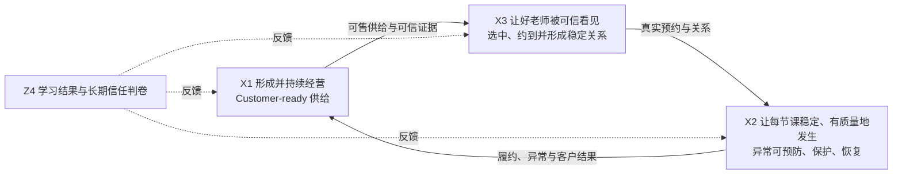

# 外教侧需求 X-Y-Z 需求地图｜对齐版 v0.3

> **深搜后的结论：三大战场没有过期；过期的是若干状态词、项目边界与成功想象。**
>
> 本轮没有证据支持新增第四个一级 X，也没有证据推翻 Y、Z 的定义。真正需要更新的是：把 **TIDE／直通车等阶段载体与长期战场拆开，把局部组件与端到端能力拆开，把客户当次补救与根因整改／防复发拆开，把“会议说上线”与生产收据拆开。**

本版继承 v0.2 对 82 个原始编号的 `82/82` 覆盖，新增的会议、聊天、当前文档和 GBrain 证据单独记为两周增量，不改写原始分母。

## 一、这次深搜到底改了什么

| 对齐项 | v0.2 后的新证据 | v0.3 结论 |
|---|---|---|
| 一级 X | 过去两周的 TIDE、SIV、鹰眼、坏课、品牌与直通车材料 | **仍是 X1 形成好供给、X2 守住每节课、X3 连接好关系。**没有第四个 X |
| X1.1 | SIV 出现“页面提交成功、PRS 实际未收到”的断链；8 月 17 日群内汇报的 8 月 16 日数据为 229 人使用 Studio、仅 7 人回传成功 | 新增一等任务：**候选到 Launch 的供给转化交易必须真实完成**。SIV 同时是 X1.1 上岗 Gate 与 X3.1 呈现资产，不能只按“老师包装”理解 |
| X1.2 | TIDE 是八月 P0；但 8 月 14 日有服务器联通延期公告，8 月 17 日仍未读到生产验收回执 | 战略优先级已定，**生产状态仍待核**；8 月 14 日、8 月 17 日 readiness 节点已过，不能继续写成未来目标，也不能写成已上线 |
| X1.3 | 慧茹曾自报“其余全量成长运营暂停”；同期又有全量鹰眼、人工质检、整改与成长规则工作。新师 Cocos Ready 属 X1.2，不能作为 X1.3 恢复证据 | 战场一直存在；**正式“全量成长体系”载体是继续暂停、局部恢复还是重组，当前存在口径冲突，未读到正式暂停／恢复决定** |
| X2.4 | 坏课当前第一切口是课中缺席；熔断、外呼与代课有局部进展声称，但规则、代课容量、客户结果和防复发回执都不完整 | 保持 `Y?／Z?`；必须分成 **客户当次补救账** 与 **根因整改和防复发账**，两本账分别关闭 |
| X3.1 | “好老师被看见”已从视频／资料扩展为事实采集、授权审核、场景叙事、持续分发与客户反馈 | X3.1 是一条可信内容供应链；**视频数、阅读量、品牌曝光都不是 Z 收据** |
| Y | 8 月 17 日直接对齐认为“大量 Y0/Y1、少许 Y2”；同时存在组件 demo、局部上线和人工英雄解 | 这只能作为工作假设。**没有一条端到端链拿到正式 Y2 收据**；主图继续只保留鹰眼、触达、匹配三类能力 |
| Z | 夜间救火、快速回复和单 Case 推动大量存在 | Leon 的观察／工作假设是：英雄可以创造 Z1，也可能把个别 Case 做到 Z2；这不是低级工作。**具体 Case 仍记 `Z?`，更不能据此把整个战场判成 Z2／Z3** |

### 证据标签

- `[D]`：Leon 当前决策／本地正本，证明方向、边界或授权，不自动证明生产结果；
- `[M]`：原始会议或直接聊天，证明“当时这样讨论／汇报”，不自动证明当前状态；
- `[S]`：AI 总结、蒸馏或二次整理，只作线索；关键结论仍须回原文／原系统；
- `[H]`：GBrain 长期认知，用来校准历史逻辑；当前事实冲突时让位于正本与真实系统；
- `[R]`：真实系统、生产数据或完整客户旅程读回。本轮关键状态升级所需的 `[R]` 普遍缺失。

## 二、稳定主干：三个一级 X

三个 X 是长期经营对象，不是严格串行的三阶段，也不与系统、部门、项目或常驻小队一一对应。

### X1｜形成并持续经营高质量、Customer-ready 的外教供给

#### X1.1 获得足量、合格、适配市场的候选供给

| 长期业务任务 | 两周增量与当前判断 | 主要 Y 调用 | 阶段 Z 收据 |
|---|---|---|---|
| 获得、唤回高质量候选 | 8/14 当前提醒把教师转介绍定义为高质量获客**候选假设**，不是已立项目 `[D]`；旧材料把 Referral 写成“确定机会”已过强 `[H/旧文档]` | 触达、身份、漏斗归因、反馈 | 推荐人完成真实推荐；候选顺利进入；质量、留存与最终客户结果不退化 |
| 候选顺畅走完招聘漏斗 | **候选到 Launch 的供给转化交易可靠性成为当前主矛盾。**SIV Studio→PRS 的“假成功”说明页面成功不等于候选完成 `[M]` | 招聘生产、事件、状态、失败原因、回执 | 候选只提交一次、知道真实状态、能续接失败步骤；Launch 数量和质量同时成立 |
| 完成资格、设备、教学审核与上岗 Gate | SIV 既是上岗条件，也是未来客户可见证据；自动检测不可靠时应只拦截极端异常，其余后台人审 `[M]` | Eval、鹰眼、规则、权限、审计 | 依据透明、过程可完成、结果可解释、可纠错；不会因假阴性或系统断链静默流失 |

**边界：**Customer-ready 在 X1 只表示资格、能力、可用档期与真实课堂证据已准备好；不等于客户已看见、已约成或课程已兑现。

#### X1.2 让新老师在 0—30 天通过训练与真实课堂验证，成为 Customer-ready 供给〔当前载体：TIDE〕

| 长期业务任务 | 两周增量与当前判断 | 主要 Y 调用 | 阶段 Z 收据 |
|---|---|---|---|
| 完成训练与上岗准备 | Cocos 操作准备是当前 Customer-ready 的实际组成；不能只看课程或任务完成 `[M]` | 训练、Eval、鹰眼、证据 | 新师能在真实环境完成课堂，不因工具、教材或设备准备不足伤害客户 |
| 获得公平、足够的真课验证机会 | TIDE 需要真实课、档期和市场使用共同配合；不能只在内部训练数据里毕业 | 匹配、Workforce、规则、反馈 | 新师获得适配真课；机会分配可解释；客户准备度不退化 |
| 用可复核证据完成毕业／继续试用／入池／退出判断 | TIDE 的“任务／积分→毕业、曝光、约课推送”已经触碰教师机会与流量 Gate；会议数字只作方向，不作现行规则 `[D/M]` | 鹰眼、Eval、匹配、权限、审计 | 判断可解释、可复核、可申诉；老师得到差距支持；学生侧结果同时被保护 |

**当前状态：**TIDE 的八月 P0 与九月全量新师是 Leon 已拍方向 `[D]`；8 月 14 日服务器联通延期、8 月 17 日 readiness 自报与未读到验收回执并存 `[M]`。因此只能写：**优先级明确，生产上线与扩量条件待 `[R]` 验证。**

#### X1.3 让全量在岗老师持续可供给、好协作并不断进化

| 长期业务任务 | 两周增量与当前判断 | 主要 Y 调用 | 阶段 Z 收据 |
|---|---|---|---|
| 管理档期、排班、请假、替补、改派与产能 | 人工执行不会因系统化消失；菲律宾仍需处理工单、设备网络整改、教师服务与本地灾备 | Workforce、匹配、事件、规则 | 老师任务真实办成；产能承诺可靠；课程与其他市场不被隐性挤占 |
| 看见任务、状态、课表、收入并自助办事 | App／My Page 只是载体；当前仍要按请假、求课、费用、课表、支持等客户任务逐一判卷 | 老师工作台、触达、身份、权限、记忆 | 老师不必跨群找人；结果可读回；失败有明确接手与升级 |
| 持续获得训练、支持、复测与能力升级 | 全量鹰眼、人工质检与整改在推进，不等于“全量成长体系恢复”；新师 Cocos Ready 在 X1.2 推进，不能作为本战场恢复证据 `[M]` | Eval、训练、鹰眼、反馈 | 老师得到有效支持并避免同因复发；复杂教学判断保留人工复核 |
| 降低教师课前准备、课后整理和基础自查的重复负担，同时守住课堂结果 | 课前准备、课后摘要、基础自查是三个候选窄场景，仍须择一验证，不是已形成蜂巢 `[D]` | 工作台／Agent、数据、反馈 | 老师实际节省时间且体验改善；客户结果不退化；错误率和人工接管可见 |

**状态校正：**慧茹版本曾标注“其余全量成长运营暂停”；本窗口没有正式的“继续暂停”或“恢复”决定。v0.3 保留这项矛盾，不替组织补一个不存在的统一状态。

### X2｜让每节课按承诺稳定、有质量地交付，异常能被预防、主动发现、保护、恢复并防止复发

| 二级战场 | 两周增量与当前判断 | 完成定义 |
|---|---|---|
| **X2.1 出勤稳定：迟到、缺勤、早退** | 当前坏课第一切口是课中缺席。熔断和外呼有局部上线声称，但规则范围仍冲突；替补现有“第 4 分钟触发、只找 1 人”的断点 `[M]` | 正常课真实上成；异常课被及时确认并完成代课／改期或权益保护；不能以熔断执行数代替客户结果 |
| **X2.2 设备、网络与课堂技术稳定** | 设备整改仍依赖菲律宾人工执行；体验课侧已有 AI 降噪关闭／下线方向与数据线索，付费课范围待定，实际执行待 `[R]` 读回。这是“拍板不等于生产完成”的反例 `[M]` | 课程听看恢复，客户损失缩小；老师得到支持且不被误判；发布具备灰度、观测、回滚 |
| **X2.3 课中教学与互动质量稳定** | 鹰眼无法覆盖全部复杂教学维度；当前人工质检与整改必须保留 `[M]` | AI 发现候选问题，人工完成复杂判断；服务恢复、教师支持、复测与适用申诉闭环 |
| **X2.4 异常确认、恢复、双侧保护与防复发** | 鹰眼／坏课已组队并形成第一阶段设计，但没有端到端生产闭环和客户结果 `[M]` | 同时关闭下面两本账；告警、工单、外呼或自动动作成功都只是过程收据 |

#### X2.4 必须关闭两本账

| 账本 | 关闭条件 | 常见伪完成 |
|---|---|---|
| **客户当次补救账** | 客户已得到回复、代课／改期／补偿／解释，且确认当次权益恢复 | 回复了、工单关了、熔断了 |
| **根因整改和防复发账** | 根因已归属到教师／产品／系统／流程／供给容量；整改完成，并在观察窗内验证同因不复发。只有涉及教师时才进入教师权益 Gate | 菲律宾说已处理、修了一个按钮、老师参加了培训 |

两本账可以由不同 owner 运行，但必须通过同一事件键连接。客户补救完成不能冒充根因消除；根因整改完成也不能掩盖市场仍持续受损。

### X3｜让好老师被可信地看见、被合适客户选中并真实约到，形成稳定、可持续的关系

| 二级战场 | 两周增量与当前判断 | 完成定义 |
|---|---|---|
| **X3.1 老师价值被准确、有授权地呈现** | 新形态是“事实采集→授权审核→场景叙事→分发调用→客户反馈”；教师故事／IP 是持续供应链，不只是拍视频 `[D/M]` | 客户看懂可信、相关证据；老师被准确呈现、可纠错；肖像、地区、渠道与撤回权清楚 |
| **X3.2 学生与合格、可用老师高效适配并真实约成** | 已出现“搜索可见但因地区、合同、资格或标签不可约”的待核线索；**呈现真相必须与预约真相一致** `[M]` | 客户看见、选中并真实约上；老师获得适配、公平且规则可解释的机会 |
| **X3.3 固定老师、复约与长期关系稳定** | 现有 `C-06／C-17／C-18／C-22` 已覆盖固定、复约、偏好和关系；固定排课 BUG 造成重复／跳课 17 节是待回放案例。8/17 分享的 Polly Q&A 仍是待解图原料，不在本版提炼为需求 `[M]` | 未来关系、课表、偏好、替代方案真实生效；不仅修一节课，还让关系重新稳定 |

**X2.4 与 X3.3 的边界保持不变：**一节已经预约的课如何恢复，归 X2.4；未来固定关系和连续课程如何重建，归 X3.3。同一动作不能重复记两张 Z 收据。

### Z4 学习结果判卷接口〔不是第四个 X〕

`A-01／A-02` 继续作为三个战场的延迟判卷：连接学生、老师、课程、师生关系、异常／干预、观察窗口和学习结果。GBrain 历史材料主要停在复约、收藏、退费、商业结果等代理指标，**没有历史共识把 A-01／A-02 明确定义为 Z4 接口**；这是 v0.2/v0.3 的重要新增澄清，必须保留，但不能冒充已验证机制。

## 三、Y 轴：三类武器不变，补上组织承载前置条件

本地图把能力分成三层，避免把所有系统名都叫成第四种 Y：

| 层级 | 包含什么 | 是否进入战略主图 |
|---|---|---|
| **3 类横向武器** | 鹰眼、触达、匹配与推荐 | **是** |
| **纵向能力包** | 招聘生产、资格／训练／Eval、异常处置、Workforce、教师工作台、可信内容、客户结果测量 | 否；由具体 X 组合调用 |
| **7 个共同内核** | 身份、数据、事件、规则、权限、记忆、反馈学习 | 否；是所有能力的地基 |

战略主图继续只保留三类共享能力：

| Y 共享能力 | 能力合同 | 当前最稳妥判断 |
|---|---|---|
| **鹰眼：知道** | 持续感知老师、课堂与关键要素；事实可确认、可重放，结果能进入任务、救援、复核与反馈 | `Y?`；已有局部组件、demo、组队与影子运行方向，未拿到端到端 Y2 收据 |
| **触达：推动行动** | 正确对象、事件、内容、渠道、频控、响应、任务与结果形成统一合同 | `Y?`；渠道很多，统一送达、响应、升级与结果回写未证实 |
| **匹配与推荐：连接** | 资格、档期、候选生成、排序、偏好、关系、替补恢复与结果回流用同一合同 | `Y?`；匹配算法 owner、固定 Eval 节奏与端到端交易收据未读回 |

身份、数据、事件、规则、权限、记忆、反馈学习仍是共同内核，但从战略主图下沉到能力建设层，不再与三类武器并排争夺注意力。

### Y2 的组织承载前置条件〔合同最小字段，不是第四种武器〕

过去两周暴露出的最大 Y 缺口，不只是“少一个 App”，而是三类能力进入 Y2 前必须有人和组织真实承载：

1. 谁是业务 owner、生产 owner、第二负责人；
2. 中国 TOC、菲律宾本地运营、国内／海外市场分别负责什么；
3. 哪些节点必须由人执行：工单、设备整改、复杂质检、申诉、客户补救；
4. 服务时间、容量、安全缓冲、失败状态与升级阈值是什么；
5. 数据、产品、教室、推荐、HR、财务、法务等专业 Gate 由谁共签；
6. 结果如何回写，旧入口和熟人路由如何退出。

**判断：**8 月 17 日“大量 Y0/Y1、少许 Y2”是有价值的领导者观察 `[M]`；但本版不把它升级为系统审计结论。正式坐标仍是 `Y?`，局部只标“Y2 组件候选”。

## 四、Z 轴：定义不变，当前坐标不拔高

| 层级 | 客户第一人称 | 判卷要点 |
|---|---|---|
| **Z0 看不见／接不住** | 我已经受损，但你不知道，或没人真正接手 | 只有投诉、CC 或群消息后才被看见，仍是被动感知 |
| **Z1 接得住** | 我喊了，有人接手并持续负责 | 英雄解可以稳定创造 Z1；勤奋与担当应被尊重 |
| **Z2 解得好** | 我的真实任务完成、服务或权益恢复了 | 回复、安抚、关单、页面成功都不算完成 |
| **Z3 守得住** | 我不用喊，你已发现并保护成功 | 告警不算；必须确认干预成功、客户损失被避免或显著缩小 |
| **Z4 成就客户** | 你持续帮助我获得更好的结果 | 学习、信任、关系、成长体验、续费／转介绍与教师健康收入长期改善 |

当前组织级坐标继续写 `Z?`。Leon 的观察／工作假设是：大量工作发生在 Z0→Z1，英雄 Case 可能偶尔做到 Z2；但具体 Case 仍缺客户任务完成读回。本轮没有足够客户结果，把任何完整战场正式升级为稳定 Z2 或 Z3。

## 五、Gate：能力越强，边界必须越清楚

| 动作 | 必须具备的 Gate |
|---|---|
| 任务／积分→毕业、曝光、约课推送 | 规则版本、分母、解释、人工复核、申诉、灰度、撤回；不得把模型分数直接变成生计动作 |
| 熔断、锁页、减流、停课、移除 | 双客户结果、人审或共签、错误纠正、恢复路径、审计；区域实操口径不能自动变全球规则 |
| 自动代课／匹配／关系变更 | 资格、档期、客户同意、替补容量、安全缓冲、失败重试、长期关系交接 |
| 教师故事、SIV、品牌素材传播 | 事实卡、教师授权、肖像／素材权、合同市场范围、渠道、有效期、撤回与纠错 |
| 跨境数据与 Agent 分析 | 用途、敏感性、地域、粒度、时效、权限、不落地边界；探查权不携带决策权 |
| 产品／模型上线 | 测试、灰度、观测、事故回退、真实成功回执；demo、页面可开、单一组件上线都不能替代生产验收 |

## 六、两周冲突账：不要抹平，逐项挂账

| # | 证据 A | 证据 B | 对齐结论 |
|---|---|---|---|
| **C-01 TIDE 状态** | 八月 P0、九月全量新师 `[D｜D-TIDE]` | 8/14 服务器联通延期；8/17 无生产验收读回 `[M｜CHAT-TIDE-0814]` | 方向有效；上线、扩量和 readiness 待 `[R]` |
| **C-02 SIV 状态** | 后端转码组件已上线、双入口并行 `[M｜M-SIV-0813]` | 229 人使用 Studio、仅 7 人回 PRS；存在“假成功” `[M｜CHAT-SIV-0817]` | 局部组件可用不等于端到端交易成功；主归 X1.1，交叉 X3.1 |
| **C-03 X1.3 暂停** | 慧茹自报“其余全量成长运营暂停” `[M｜CHAT-HR-0814]` | 全量鹰眼、人工质检与整改持续；新师 Cocos Ready 不构成 X1.3 恢复证据 `[M｜M-FULL-0813]` | 活动持续不等于体系恢复；本窗未读到正式暂停／恢复决定 |
| **C-04 坏课上线** | 群内声称首类熔断、外呼已上线 `[M｜CHAT-X2-0814]` | 规则范围仍有未做项，代课容量与客户结果缺失 `[M]，待核` | 只能记局部进展；整体仍 `Y?／Z?` |
| **C-05 代课恢复** | 设计目标是课前预防—课中召回／代课—课后治理 `[M｜M-X2-0807]` | 当前第 4 分钟才触发、只尝试 1 名替补，失败后课程仍坏 `[M｜CHAT-BLACKBOARD-0812]` | X2.4 当前硬断点；需容量、重复尝试和停止条件 |
| **C-06 数据优先级** | 26 个数据集曾平推 | 8/14 改为课堂稳定第一、AC 触达第二，招聘前四项冻结、质检后移 `[M｜M-DATA-0814]` | 这是阶段排期变化，不删除 X1/X3 需求，也不把数据集变成 X |
| **C-07 好老师被看见** | 旧理解偏视频、包装、内容 | 新方向是责任域→事实→授权→叙事→分发→反馈 `[D/M｜M-X3-0810/0817]` | 扩写 X3.1；客户真实选约与关系才是结果 |
| **C-08 Referral** | 旧战役总览写“确定机会” `[H/旧文档]` | 8/14 当前提醒明确为待验证假设 `[D｜D-REF-0814]` | 以后者为准；先做漏斗、质量、因果与停止条件 |
| **C-09 教师评分** | 旧历史材料写分数应进入评级、课量、薪酬、推荐 | 当前 Gate 要求信号与权益动作分离 `[D/H]` | 可进入决策闭环，不得自动生效；先影子运行、人审、申诉、回滚 |
| **C-10 价值传播** | 旧飞轮有“让好老师被感知为好老师，比老师本身先一步达标” `[H]` | 当前 X3.1 要求先事实、授权、真实档期和交付能力 `[D]` | 只保留“缩短可信信息流动”；不得让传播跑在兑现之前 |
| **C-11 XYZ 语言** | 8/17 TOC 周会 AI 总结仍出现把能力／问题／客户混作三轴的旧表述 `[S｜M-TOC-0817]` | 同日 Leon 与慧茹后续逐轮对齐形成当前 X/Y/Z `[D/M｜D-XYZ-0817]` | 以后续模型为准；会议早期语言是被同日修订的过程版本 |
| **C-12 官方 Wiki** | `search-ft-wiki` 约定唯一根 `02-业务知识目录` | 当前根节点返回 `workspace node has been recycled` `[WIKI-ROOT]` | 官方 Wiki 证据通道本轮不可用；不旁路搜索、不把缺失当“没有内容” |
| **C-13 GBrain 指针** | 部分历史页仍指向 `projects/外教战役/...` | 已迁文件位于 `projects/TOC/...`；另有页面本来就锚定 journal 证据或当前正本 | GBrain 逻辑可作历史支撑；逐页核对 canonical pointer，journal 锚不机械迁移，旧路径不能当当前来源回读 |
| **C-14 聊天蒸馏回执** | 8/17 蒸馏头部写 `PUBLISHED` | 正文门禁仍写“未自动 publish、待审核” `[DISTILL-0817]` | 可用作候选线索和审核记录，不能单独证明远端发布状态 |
| **C-15 新师试用窗口** | 6/26 历史方案写 10—15 天 `[H]` | 较新的 H2 总指示与当前模型写约 30 天／0—30 天 `[D/H]` | 战略地图采用较新 0—30 天口径；当前实际业务规则仍须回生产正本核验 |
| **C-16 老师身份** | 8/11 价值地图用“两类客户：学生／家长、老师”作简写 `[D]` | 8/19 Leon 进一步选择：学生／家长是最终客户；老师是直接用户、价值共创者与独立权益主体 `[D｜D-ROLE-0819]` | 不新增第四个 X；以后者澄清身份与责任，保留原语言的时点来路 |

### 6.1 低权重历史参考复核：同事视觉版 v0

桌面 HTML 与 8 月 11 日已收进黑板决策包的版本 **SHA256 完全一致**，所以它不是新的独立证据，也不重复增加权重。它的群输入截止于 8 月 10 日 19:36:35、会议校准于 8 月 11 日，且原文明确标为本地讨论稿、未发布、未发送。

| 旧视觉版的表达 | 与当前三轴的关系 | v0.3 处理 |
|---|---|---|
| **两类客户：学生／家长、老师** | 当前 `SP／CN／AT` 不是增加第三类客户家族，而是把“老师”按候选／新师与在岗阶段拆开记账 | 保留为 8/11 价值地图简写；8/19 经 [[projects/TOC/运营支撑/系统资产卡/FT-DEC-014_老师三重身份与老师体验双层责任|FT-DEC-014]] 澄清为：学生／家长是最终客户，老师是直接用户、价值共创者与独立权益主体。继续按阶段拆 Z 收据，不新增 X |
| **六条价值线** | 是客户价值全景，不是六个一级 X；“客户省心约／好老师看得见”在 X3 内分别落到可信呈现、真实选约与稳定关系，“老师挣钱快／教学更轻松”主要是老师侧 Z 结果 | 已被 v0.2/v0.3 继承，不重开战场、不改 `82/82` 分母 |
| **客户价值→经营抓手→系统能力** | 是每个 X 内部很有用的展开顺序：先写清 Z 客户所得，再写经营动作，最后调用 Y 能力；但它不是另一套 X/Y/Z 定义 | 保留为分析手法，不进入战略主图 |
| **六步生命周期只回答“发生在哪”** | 与“X1/X2/X3 不是串行三阶段”一致；“好老师看得见”横跨招募、授课、客户认可与传播，不是生命周期终点 | 强化使用边界，不改 X 树 |
| **AI 任务三分：自动承接／AI 增强／人承担** | 可作为 X1.3 窄实验的低权重设计启发；原文自己也标明是 AI 生成的方向参考，不是当前能力或授权 | 只有完成时间基线、错误代价、人工接管和客户结果验证后，才进入具体实验合同 |
| **“TIDE 是新师训练营；Cocos 是全量老师培训”** | 这是旧视觉版的范围说法；较新的 8 月 4 日 Cocos Ready 会议只证明新师 0—30 天准备，且本轮没有全量 Cocos 运行收据 | 继续把已核 Cocos Ready 放 X1.2；不据旧稿推断 X1.3 已恢复，同时把“Cocos 是否仍有全量载体”留待当前正本核验 |

旧稿还留下 5 条有价值、但证据不足以直接写进主地图的细线索。这里只登记，等待真实旅程或现行规则升级：

| 待核线索 | 暂不写成当前事实／规则的原因 | 升级所需证据 |
|---|---|---|
| 返岗老师应按已核历史阶段续接，只补缺失或已过期的 Gate；“高质量 Leads”定义未核前，不触发快速通道 | 来自 8 月 11 日讨论稿，未读到现行招聘规则 | 一名返岗候选完整旅程、当前资格有效期与分流规则 |
| 共享老师／档期／事件等事实与接口合同，不等于招聘、预约、代课恢复共用一套业务规则 | 是正确的系统边界启发，但不证明现有系统已做到 | 各场景当前规则、版本、owner 与失败回执 |
| X2 中经复核的正向课堂事实，可成为 X3.1 的候选证据；监测信号不能直接对外 | 仍涉及代表性、授权和教师权益，旧稿不能代替发布 Gate | 事实卡、样本分母、授权范围、审核与撤回链 |
| 资格核验通过与获准对客展示是两件事；不同区域的证件上传、审核、展示链不能相互覆盖 | 旧稿只给出 PRC／菲律宾线索，现行地区规则待核 | 两地当前资格与展示规则、系统读回及法务／业务 Gate |
| 选择教师效率 AI 场景前，应先观察一名在岗老师的一次真实备课／办事／求助旅程 | 旧稿明确承认近期缺少老师访谈，不能用讨论替代现场 | 时间基线、断点、错误代价、人工接管与双客户结果 |

因此，这份参考材料**没有改变主地图，也没有增加第 16 个主冲突**；它主要补清了三组语言关系，并留下 5 条待真实旅程核验的细线索：两类客户家族与三种阶段标签、六条价值线与三个 X、生命周期导航与经营架构。

## 七、阶段载体与长期战场的 crosswalk

| 阶段载体／系统 | 主承载 X | 必须调用的相邻战场 | 不能被误读为 |
|---|---|---|---|
| **TIDE** | X1.2 | X1.1 入口、X3 真课机会与市场使用、X2 客户课堂结果 | 完整 X1、完整成长体系或已实现蜂巢 |
| **直通车** | X3 | X1 的可售供给与证据、X2 的稳定履约 | 完整 X3、全部海外市场或第四个 X |
| **坏课治理** | X2.4 当前载体 | X2.1—X2.3、X3.3 关系连续性、菲律宾整改执行 | 鹰眼能力本身、告警项目或客户结果 |
| **SIV** | X1.1 上岗 Gate；交叉 X3.1 | X1.2 训练／入营衔接、X3.2 预约真相 | 纯视频工具或纯品牌素材 |
| **鹰眼／触达／匹配** | 跨 X 的 Y | 由每个具体战场调用并以客户结果判卷 | 三个项目、三个战场或自动成功的蜂巢 |

GBrain 的“未来一年 TIDE＋直通车双主轴”与本版“三个一级 X”不冲突：前者是阶段战略程序和经营载体，后者是长期经营对象。X2 不能因为双主轴而被吞掉。

## 八、下一轮只读回放：把 `Y?／Z?` 变成事实

| 回放 | 只回答什么 | 会改变哪个动作 |
|---|---|---|
| SIV 候选从进入到 Launch | 真实分母、每步成功／失败、Studio→PRS 回执、质量与流失原因 | 是否继续双入口、优先修哪一步、是否放宽 Gate |
| 一名新师 0—30 天 TIDE | 是否真实上线、任务／真课／支持／毕业如何运行、失败如何接管 | 能否放量、哪些规则只能影子运行 |
| 一节课中缺席坏课 | 谁先发现、何时触达、替补尝试几次、客户补救与根因防复发两本账何时关闭 | 熔断／代课范围、菲律宾容量与升级阈值 |
| 一次“可见但不可约”选师 | 资格、地区、合同、标签、档期和预约状态在哪里分叉 | X3.1/X3.2 的统一事实与交易合同 |
| 一次固定关系排课 BUG | 当次 17 节权益如何恢复、未来固定关系是否真正修好 | X2.4 与 X3.3 的交接和补偿 Gate |
| 一条教师转介绍漏斗 | 推荐人、候选、触达、质量和最终客户结果 | 是否把 Referral 从假设升级为小队任务 |

每条回放都必须同时交两张收据：**客户结果收据**与**组织能力收据**。没有第二个人可重复运行、失败不可见或结果不回写，就不能判 Y2；没有客户任务真实完成，就不能判 Z2。

## 九、来源覆盖与边界

### 9.1 本轮实际覆盖

- **会议／本地材料**：深读 2026-08-04—08-17 的 21 份相关会议原稿、轻纪要与战略材料；重点包括 TIDE kickoff、外教质量双周会、SIV、全量外教、国内招聘与质检、鹰眼与全量触达、数据集排序、好外教被看见、TOC 周会。
- **钉钉聊天**：读取既定白名单会话的两周增量，并对外教战役黑板、TOC 教师运营中心、Battle1-TIDE、坏课治理原子小队、SIV atom teams、战役二外教价值前置及慧茹／Tammy 等直接对话做重点核对。聊天只证明当时汇报，不替代生产回读。
- **本地当前正本**：X-Y-Z 模型、v0.2、八月总纲、FT-DEC-011／012、教师运营系统地图、AI 教师体验窄实验、Referral 战略提醒、价值传播方法。
- **GBrain**：只读检索 `teacher-battle`，用于校准双主轴、H2 总指示、好老师生命周期、鹰眼最小纵切、直通车与历史评分逻辑；不用于证明当前 owner、上线、指标或成熟度。
- **官方外教 Wiki**：唯一约定根节点已被回收，本轮无法纳入；没有改用宽搜绕过边界。

### 9.2 高价值本地来源

- `projects/TOC/战役/战略/X-Y-Z三轴经营模型.md`
- `projects/TOC/战役/战略/外教侧需求_X-Y-Z需求地图_v0.2.md`
- `projects/TOC/运营支撑/系统资产卡/FT-DEC-011_TIDE八月P0与九月全量新师目标.md`
- `projects/TOC/运营支撑/系统资产卡/FT-DEC-012_TOC未来一年双主轴_TIDE与直通车.md`
- `projects/TOC/运营支撑/系统资产卡/FT-DEC-014_老师三重身份与老师体验双层责任.md`
- `projects/TOC/战役/战略/TOC成立后_教师运营系统地图与责任清单_草稿_v0.3.md`
- `projects/TOC/战役/战略/AI增强教师体验与效率_首个窄实验假设.md`
- `projects/TOC/战役/战略/2026-08-14_高质量获客与转介绍_战略提醒.md`
- `projects/TOC/战役/战略/责任域-叙事逻辑-宣传机器.md`
- `projects/TOC/_agent/chat-distill-2026-08-14.md`
- `projects/TOC/_agent/chat-distill-2026-08-17.md`
- `projects/TOC/_raw/meetings-raw/2026-08-12_SIV流程优化与决策纪要.md`
- `projects/TOC/_raw/meetings-raw/2026-08-14_鹰眼与全量老师触达纪要.md`
- `projects/TOC/_raw/meetings-raw/2026-08-14_数据集建设排序_钉钉原稿纪要.md`
- `projects/TOC/_raw/meetings-raw/2026-08-17_好外教被看见-品牌部纪要.md`
- `projects/TOC/_raw/meetings-raw/2026-08-17_TOC周会纪要.md`
- `/Users/wangdong/Desktop/04_外教战役业务全景_同事视觉版_v0.html`（低权重历史参考；与黑板决策包归档副本字节一致，不作独立证据计数）

### 9.3 关键短来源键

| 来源键 | 可反查原件 |
|---|---|
| `D-TIDE` | `projects/TOC/运营支撑/系统资产卡/FT-DEC-011_TIDE八月P0与九月全量新师目标.md`、`FT-DEC-012_TOC未来一年双主轴_TIDE与直通车.md` |
| `CHAT-TIDE-0814` | 新师训练营-1st蜂巢，2026-08-14 18:30:37 延期公告；本地反查 `projects/TOC/_agent/chat-distill-2026-08-17.md` |
| `M-SIV-0813` | `projects/TOC/会议/正文/2026-08-13_SIV_atom_teams纪要.md` |
| `CHAT-SIV-0817` | SIV atom teams，2026-08-17 15:39:54—15:51:08；本地反查 `projects/TOC/_agent/chat-distill-2026-08-17.md` |
| `CHAT-HR-0814` | 慧茹直接对话，2026-08-14 21:53:39 起及 2026-08-17 后续 |
| `M-FULL-0813` | `projects/TOC/会议/正文/2026-08-13_全量外教分纪要.md`、`2026-08-13_国内招聘和质检任务同步会纪要.md` |
| `CHAT-X2-0814` | 坏课治理原子小队，2026-08-12—08-14 的熔断／外呼／规则讨论 |
| `M-X2-0807` | `projects/TOC/_raw/meetings-raw/2026-08-07_外教质量提升双周会纪要.md` |
| `CHAT-BLACKBOARD-0812` | 外教战役黑板，2026-08-12 替补触发与单一候选断点 |
| `M-DATA-0814` | `projects/TOC/_raw/meetings-raw/2026-08-14_数据集建设排序_钉钉原稿纪要.md` |
| `M-X3-0810/0817` | `projects/TOC/_raw/meetings-raw/2026-08-10_战役二海外需求沟通纪要.md`、`projects/TOC/_raw/meetings-raw/2026-08-17_好外教被看见-品牌部纪要.md` |
| `D-REF-0814` | `projects/TOC/战役/战略/2026-08-14_高质量获客与转介绍_战略提醒.md` |
| `D-ROLE-0819` | `projects/TOC/运营支撑/系统资产卡/FT-DEC-014_老师三重身份与老师体验双层责任.md` |
| `M-TOC-0817` | `projects/TOC/_raw/meetings-raw/2026-08-17_TOC周会纪要.md` 及钉钉 AI 总结 |
| `D-XYZ-0817` | `projects/TOC/战役/战略/X-Y-Z三轴经营模型.md` 及 2026-08-17 慧茹直接对话 |
| `DISTILL-0817` | `projects/TOC/_agent/chat-distill-2026-08-17.md` |
| `WIKI-ROOT` | 外教 Wiki 唯一约定根 `4lgGw3P8vR2aBrGZSgjzkaRq85daZ90D`；本轮读取返回 `workspace node has been recycled` |

### 9.4 GBrain 对照页

**当前投影〔不算独立历史佐证〕**

- `concepts/x-y-z三轴经营模型`（2026-08-17 从当前模型同步）
- `concepts/老师三重身份与体验双层责任`（2026-08-19 从 FT-DEC-014 同步）

**历史认知**

- `decisions/toc-next-year-dual-transformation`
- `decisions/2026-07-13-ceo-h2外教质量战役总指示`
- `decisions/2026-06-26-外教战役主轴重构-蜂巢系统`
- `decisions/2026-07-06-好老师标准升级-试用期分数`
- `decisions/2026-07-07-好老师价值前置与三段式战役`
- `quality-standards/ce评估体系`
- `patterns/好老师生命周期八阶段`
- `patterns/hawk-eye最小纵切与教师权益gate`
- `patterns/直通车模式`
- `playbooks/教师质量提升飞轮`
- `patterns/老师app与沟通矩阵`

**近期候选／方法假设**

- `patterns/2026-08-10-atomic-squad-on-site-integrated-operation`（`unverified_hypothesis`）
- `patterns/referral与招聘渠道`（含 2026-08-14 当前增量，不算纯历史页）

### 9.5 原 82 个编号的处理

v0.2 的 `A-01—G-04` 归并关系全部继承，不增删、不改分母。两周新增材料只用于：

1. 更新状态与时间词；
2. 暴露冲突和事实缺口；
3. 增补 X 内长期任务、Y 组织承载条件与 Gate；
4. 生成下一轮真实回放队列。

本文件仍不是生产总账。任何“已上线、覆盖率、owner、规则生效、客户结果、教师处置”在行动前都必须回当前业务系统、正式公司正本或完整旅程读回。

## 十、版本判断

- **稳定不动**：三个一级 X；Y0—Y3；Z0—Z4；鹰眼／触达／匹配三类共享能力；两张收据；Z4 学习结果接口。
- **本版升级**：候选到 Launch 的供给转化交易可靠性、X1.3 状态冲突、X2 两本关闭账、X3.1 可信内容供应链、Y2 组织承载前置条件、阶段载体 crosswalk、两周冲突账；8 月 18 日补入同事视觉版低权重复核，不改变主地图。
- **仍不冻结**：二级以下完整树、当前 Y/Z 事实坐标、需求优先级、具名 DRI、上线状态、指标目标与所有权益动作。

> **一句话使用法：**选一个具体 X，先回放当前 Y 和 Z；只组一支对单一客户跃迁负责的小队，同时补齐 Y2 组织承载前置条件，最后用客户结果与能力沉淀两张收据判胜。
