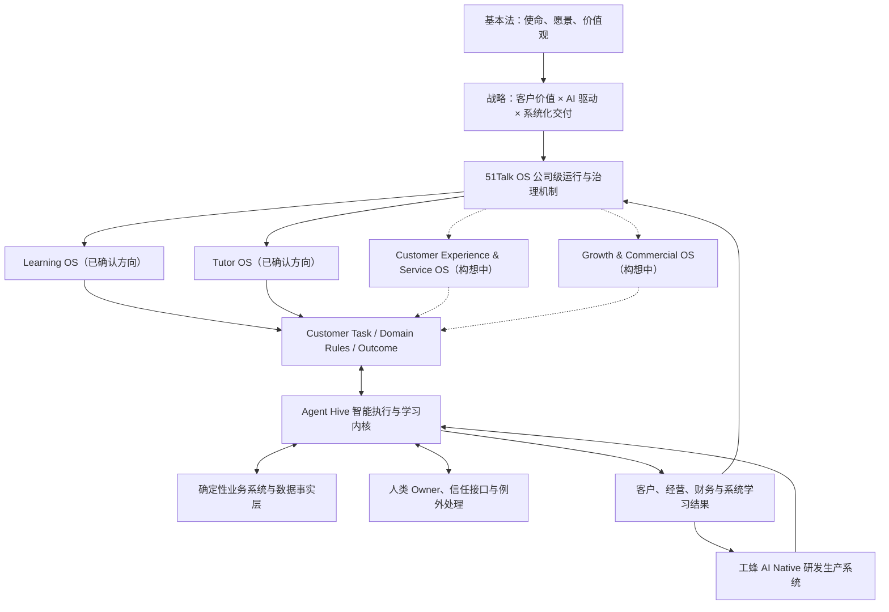
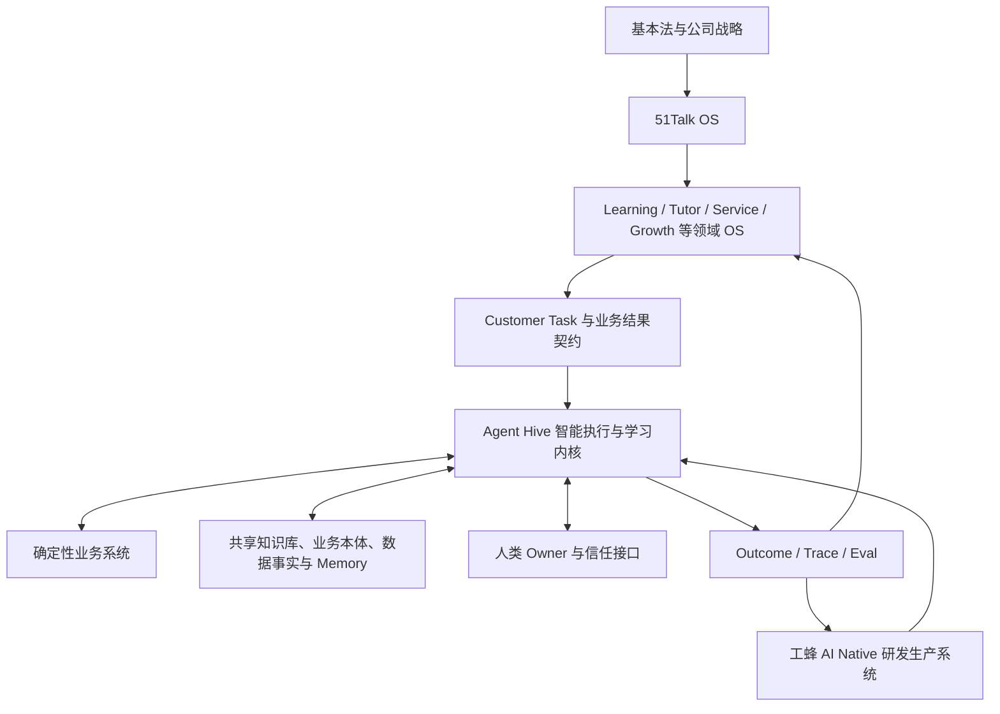

# 51Talk 公司治理 Context Pack

## Version 1.0 · 五篇核心全文合订本

> 正式发布：2026-09-15 · 内部使用  
> 本文件完整串联合并五篇原文，分篇文件为校验基准。章节中的原始版本、元数据、来源与语义均保留；不新增审批要求。具体适用范围见 README 和发布说明。

## 目录

1. [51Talk基本法](#gov-01)
2. [从十五年复盘到第四个五年：51Talk 的主要矛盾与战略铁三角](#gov-02)
3. [第四个五年战略方向：AI-first Hybrid Personalized Learning 领导者](#gov-03)
4. [51Talk OS：公司级操作系统定义](#gov-05)
5. [蜂巢系统：目标、定位与核心架构原则](#gov-06)

---

<a id="gov-01"></a>

<!-- BEGIN GOV-01 | fulltext/01-51Talk-基本法-15周年发布版.md -->

---
type: synthesis
status: active
created: 2026-07-06
updated: 2026-07-13
source_count: 4
domain: 51Talk 操作系统
category: 总纲与宪法
tags: [51Talk基本法, 15周年发布版, 基本大法, 组织宪法, 15周年, 51TalkOS, AI驱动, 人与AI共生, 蜂群组织, 以奋斗者为本, 简单可信赖, 长期主义, 战略聚焦]
event: 51Talk 15周年庆
target_date: 2026-07-10
finalized: 2026-07-06
published: 2026-07-10
---

# 51Talk 基本法

15周年发布版

## 序言

过去十五年，51Talk 从一个创业想法成长为一家国际化在线教育公司。我们依靠创业精神、客户意识、强执行、强运营和全球化探索，完成了从 0 到 1 以及从 1 到 10。

今天发布《51Talk 基本法》，不是否定过去，而是把过去的成功经验沉淀为未来十五年的组织操作系统。下一阶段，51Talk 要从依赖强人、经验、会议和救火，走向依靠使命、客户、系统、数据、AI 和组织能力持续进化。

## 第一条 使命

51Talk 的使命是：让每一个人都有能力对话世界。

语言不仅是一种技能，更是一种连接世界的能力。教育不仅是知识传递，更是机会创造。所有战略、产品、服务、流程、系统和 AI，都必须回到这个问题：我们是否真正帮助客户更有能力对话世界？

## 第二条 愿景

51Talk 的愿景是：成为一家受人尊敬、AI 驱动、面向全球的百年教育企业。

“受人尊敬”，意味着我们坚持长期主义，坚持客户价值，坚持正直经营，坚持对教育结果负责。

“AI 驱动”，不是用 AI 替代老师、销售、服务和管理者的价值，而是用 AI 改进学习服务、客户成长、组织协同和经营管理方式，让人更懂客户、更好服务客户、减少重复劳动、放大人的价值。

“面向全球”，意味着我们要在全球市场服务更多学习者，建设跨国家、跨文化、跨区域的组织能力。

“百年教育企业”，意味着我们立志建设一家真正经得起时间检验、持续创造教育价值和社会价值的企业。

## 第三条 价值观

51Talk 的价值观是：成就客户、激情人生、拥抱变化、团队协作。

成就客户，是一切商业价值的源头。成就客户不是讨好客户，而是持续理解客户、持续创造客户价值、持续帮助客户成长。我们把这种能力称为用户亲密。客户成长带来客户满意，客户满意带来续费和转介绍，续费和转介绍带来健康增长。

激情人生，是保持热爱、进取和长期奋斗的生命状态。系统化和 AI 化不是为了让人变成机器，而是让人从低水平重复中释放出来，把热情投入到更高价值的创造、判断、创新和成长中。

拥抱变化，是 51Talk 从一次胜利走向下一次胜利的精神内核。我们不固守过去的成功经验，不用昨天的方法解释明天的问题。变化不是威胁，而是组织进化的入口；每一次变化，都要求我们重新学习、重新定义、重新建设能力。

团队协作，不是靠人情协调，也不是部门之间简单配合，而是在共同目标、共同规则、共同事实源、充分信息流动和共同反馈循环之上，实现高质量协同。信任是团队协作的底层资产，简单可信赖是 51Talk 重要的价值观底色：做人真实坦诚，做事清楚透明，承诺可靠交付，减少猜疑、迟疑、内耗和不必要的信息加工。未来的团队协作，也包括人与智能体的协作。

## 第四条 长期主义与战略聚焦

51Talk 坚持长期主义。长期主义不是慢，也不是保守，而是把每一次增长、每一个产品、每一次组织调整，都放到客户长期价值、企业长期价值、组织能力和未来十五年的复利中判断。

客户价值不是一时成交或短期满意，而是客户学习效果、成长体验、信任关系、续费和转介绍共同形成的长期价值。企业价值也不是短期规模，而是客户信任、教育质量、健康现金贡献、组织能力和系统资产共同形成的长期价值。

短期和长期发生冲突时，我们坚定选择长期；局部利益和客户长期价值发生冲突时，我们坚定选择客户长期价值。这不是权宜之计，而是公司的根本信仰。我们重视企业价值，但不片面追求短期利益，不以牺牲教育质量、客户信任和组织健康为代价换取短期结果。

长期主义要求战略聚焦。资源要投向客户价值最大、长期回报最高、最能形成系统资产的主航道。我们选择少数真正能形成复利的事情，集中资源打穿打透。真正的战略，不只是选择做什么，也包括清楚地选择不做什么。

## 第五条 持续进化的系统、组织和个人

51Talk 必须建设持续进化的系统、组织和个人。

持续进化不仅是改善方法，更是一种自我革新能力。问题不是坏事，反复发生而不沉淀才是坏事。每一个客户反馈、服务异常、销售失误、教学问题和系统缺陷，都要进入发现问题、分析问题、解决问题、标准化、系统化的闭环。

自我革新意味着，我们要敢于面对真实问题，敢于否定过时经验，敢于重构不再适应客户和时代的组织、流程、系统和能力。公司真正的竞争力，是把问题变成学习，把学习变成能力，再让能力持续自我迭代。

系统层面的持续进化，是让数据、流程、规则、Agent（智能体）、Memory（组织记忆）和 Skills（组织技能）持续迭代。组织层面的持续进化，是让每个团队都能从客户、区域、系统和 AI 的反馈中学习，主动调整打法，持续建设能力。

个人层面的持续进化要求 51Talk 每一位员工都具备成长型思维模式。我们相信能力不是固定不变的，而是可以通过学习、实践、反馈和复盘持续提升的。面对问题、挑战和变化，我们不把它们当成失败标签，而把它们当成成长入口。

## 第六条 51Talk 操作系统

51Talk 要致力于打造公司级操作系统，也就是 51Talk OS。

我们相信：不能被系统复制、放大和沉淀的能力，还不是真正的组织能力。优秀经验如果只存在于某个人脑子里，它属于个人；优秀经验进入标准、产品、系统和 AI 之后，才真正属于组织。

51Talk OS 的建设路径是四化：标准化、产品化、系统化、AI 化。标准化让正确动作有共同语言；产品化让优秀经验可以被普通人使用；系统化让流程、数据、责任和反馈稳定运转；AI 化让组织具备规模化理解、判断、执行和学习的能力。

## 第七条 “总部协同，区域自治”的蜂群组织

51Talk 未来的组织形态，是“总部协同，区域自治”的蜂群组织。

总部不是简单的协同部门，而是公司级方向、规则、系统、数据、品牌、产品底座和组织能力建设的责任主体；区域不是简单执行终端，而是在统一规则和统一系统上，贴近客户、快速响应、本地创新，并对经营结果负责。

蜂群组织有三条简单原则：

1. 简单规则：组织不靠层层指令运行，而靠清晰、简单、可执行的规则运行。规则一旦形成，就要被理解、被遵守、被坚决执行。

2. 信息流动：信息的流动速度，比信息本身更重要。客户信息、业务数据、一线问题、区域经验和关键变化，都要高速流动起来，让组织更快看见真实世界。

3. 反馈循环：组织不是靠控制运行，而是靠反馈运行。51Talk 要持续感知、持续反馈、持续修正，让问题快速暴露，让经验快速复用，让组织在行动中持续进化。

真正高效的全球化组织，不是总部控制每一个动作，而是在统一规则和统一系统上，让区域自主生长、快速反馈、全局协同。

## 第八条 人与 AI 共生的组织

AI 不是工具点缀，而是 51Talk 未来组织能力的一部分。51Talk 要建设人与 AI 共生的组织。

人负责使命、价值观、创造力、复杂判断、信任沟通和最终责任；AI 负责规模化分析、推荐、执行、监控和协同。系统和 AI 要帮助人更懂客户、更好服务客户、减少重复劳动、放大人的价值。

AI 必须服务于成就客户和企业长期价值。数据边界、权限边界和责任边界必须清晰。

## 第九条 核心人才标准

51Talk 的核心人才，不能只做短期结果的负责人和问题救火者，而要成为一号位、枪管型人才和系统架构师。核心人才的责任，不只是拿结果，更要建设机制、培养人才、沉淀方法，让组织能力超越个人能力。

51Talk 既有领导力模型，是核心人才标准的重要组成部分：经营思维、战略能力、用户思维、系统思考、体系机制、超越伯乐。在 51Talk OS 阶段，这六条领导力要进一步落实到核心人才的日常判断和关键动作中：既要对经营结果负责，也要看见长期方向和客户价值；既要深入业务现场，也要用系统方式解决问题；既要带出团队战斗力，也要持续提升组织能力。

核心人才必须有专业深度、跨域理解和系统思考能力。在人与 AI 共生的组织里，核心人才还必须具备理解 AI、使用 AI，并与 AI 协同创造客户价值和企业价值的能力。

核心人才不能只会个人使用 AI，还要能带动团队用 AI 重构工作方法，把有效做法沉淀为流程、数据、Skill（组织技能）、Agent（智能体）和可衡量的客户价值、经营结果或组织效率提升。

## 第十条 以奋斗者为本

51Talk 坚持以奋斗者为本。这是我们“以人为本”的组织底色，也是 AI 时代必须坚守的价值立场。

奋斗者必须永远保持 Day One 心态。过去的成功不是未来成功的保证，十五周年不是终点，而是下一个十五年的新起点。我们要保持创业状态、危机意识和进取心，不因阶段性胜利而自满，不因组织变大而迟缓。

系统和 AI 不是为了削弱人的价值，而是为了让真正成就客户、承担责任、持续学习、拥抱变化、建设系统、培养他人的奋斗者拥有更大的舞台。公司尊重每一位员工的尊严和成长，但资源、机会、荣誉和回报，要向长期创造客户价值、推动组织进化、让系统变强的人倾斜。

以奋斗者为本，也要求组织保持相互尊重、真实沟通和对不同文化的理解。51Talk 在共同使命、共同价值观、共同规则和结果责任之下，尊重各地区、各岗位的差异，保留必要的本地化管理弹性。

51Talk 要让奋斗者与公司共同成长，让人的创造力、责任感和热情在 AI 时代被放大，而不是被替代。

## 第十一条 价值创造与分配

51Talk 的价值由客户信任、员工劳动、老师与伙伴贡献、知识、技术、企业家精神、资本共同创造。

公司坚持让真正创造客户价值、建设系统资产、培养人才、推动组织进化的人分享发展成果。公司的价值分配按照贡献进行。为客户和公司创造更多价值的人，应该获得更多机会、更大责任和更多回报。

公司要把更多价值分配给那些为公司未来发展做出更大贡献的伙伴。他们可能是在一线持续成就客户的人，可能是建设系统和组织能力的人，可能是推动新业务、新区域、新技术突破的人，也可能是培养更多优秀人才的人。价值分配要鼓励长期贡献、关键贡献和可持续贡献，让奋斗者与公司共同成长。

## 第十二条 修订机制

《51Talk 基本法》不是一次性文件，而是公司长期进化的共同契约。

公司每年进行一次复盘，每三年进行一次系统修订；当外部环境、技术范式或公司战略发生重大变化时，可提前修订。

<!-- END GOV-01 -->

---

<a id="gov-02"></a>

<!-- BEGIN GOV-02 | fulltext/02-从十五年复盘到第四个五年-主要矛盾与战略铁三角-V1.0-Full-Text.md -->

# 从十五年复盘到第四个五年：51Talk 的主要矛盾与战略铁三角

> 版本：Version 1.0 Authoritative Full Text  
> 文档状态：已确认生效  
> 确认人：Jack（CEO）  
> 生效日期：2026-09-15  
> 文档定位：公司治理 Context Pack 的战略总纲，合并承接“当前主要矛盾”与“未来五年铁三角”。  
> 来源说明：根据既有 Wiki 和相关战略材料重新撰写，经 CEO 对六项审阅内容全部确认后正式发布。本文为当前战略总纲，不作为历史文章的恢复版本。

## 一、从十五年走向下一个五年

走过十五年，51Talk 需要回答三个相互关联的问题：我们为什么能够活下来，为什么仍然做得如此辛苦，接下来应该发生什么改变？

过去的成功为我们留下了品牌、客户信任、团队、经营经验和全球化能力。这些资产值得珍惜。但规模扩大、市场增加、客户需求升级，也让过去的组织方式面临新的压力。支撑公司走到今天的能力，需要在下一个阶段以更稳定、更容易复制的方式发挥作用。

十五年复盘的意义，在于辨认哪些东西应该坚持，哪些方式已经限制了公司继续成长。在这一基础上识别当前主要矛盾，才能理解第四个五年的战略选择。

我们的思考沿着一条主线展开：

**十五年复盘解释为什么必须改变；当前主要矛盾明确改变的焦点；第四个五年铁三角提出改变的方向与方法。**

## 二、过去十五年，哪些能力让我们走到今天

### 1. 创业精神与自我革新

从成人英语到青少英语，从追求规模到聚焦盈利，从国内经营到全球化，51Talk 多次在压力下重新选择方向。面对环境变化，我们能够重新学习、重新组织，也愿意为正确方向承受转型的困难。

这种自我革新的能力，是公司需要持续保留的生命力。拥抱变化，最终要体现为改变自己的行动。

### 2. 战略聚焦与取舍能力

过去的关键转折，都伴随着明确的选择和放弃。聚焦菲律宾外教一对一、推进全球化，使有限资源得以集中到真正重要的事情上。

公司继续发展，仍然需要这种能力：看清阶段性主要矛盾，集中资源，并让组织理解为什么要这样选择。战略的力量来自清晰的判断及持续一致的行动。

### 3. 财务纪律与自我造血

成本意识、现金流意识和对企业价值的重视，使公司在困难时期保有重新出发的能力。财务纪律是长期经营的基础。

进入下一个五年，我们仍要让增长经得起经营质量的检验。客户价值能够持续创造，企业才有长期生存的理由；健康的现金贡献使企业有能力继续投入客户、产品、人才和系统。

### 4. 品牌与客户信任

公司长期积累的教师供给经验、教育服务经验和品牌认知，构成了客户选择我们的基础。客户愿意把学习时间和成长期待交给我们，这份信任本身就是需要持续维护的资产。

信任需要通过一次次真实交付得到巩固。教育质量、服务确定性和客户成长，决定品牌能否继续积累。

### 5. 团队韧性与全球化探索能力

核心团队的共同承担、强执行和简单可信赖的文化，使公司能够穿越困难。跨区域经营的实践，也锻炼了开拓市场、理解不同客户和组织本地业务的能力。

未来要让这些经验被更多团队使用，让区域探索成为全公司的学习来源，使个人和局部团队创造的价值能够持续积累。

## 三、为什么赢下了很多仗，公司仍然做得很累

十五年复盘揭示的核心问题是：**许多有效能力仍然依附于个人经验和临场协调，尚未充分沉淀为可复制、可放大、可持续进化的组织能力。**

首先，成功过度依赖强人和救火。业务遇到困难时，习惯于找能人、加会议、盯过程、临时协调。这样的方式能够解决眼前问题，但当客户、区域和协作关系增加时，协调成本也随之上升。组织越忙，越难抽出精力解决反复发生的问题。

其次，客户价值尚未稳定成为经营决策的中心。我们重视客户，也有优秀的教学与服务实践，但短期业绩压力容易把组织注意力拉回成交、续费和升舱动作。如果忽略客户为什么愿意继续学习、为什么信任我们，经营就容易反复追逐结果，缺少对结果成因的建设。

再次，优秀经验没有充分进入标准、产品、系统、数据和 AI。一位优秀教师、一位服务高手或一个区域团队形成了有效方法，其他团队却不一定能够获得、理解和稳定使用。人员变化或市场扩张后，同样的问题常常需要重新解决。

短期主义又强化了这一循环。战略上重视长期，日常行动却可能被当月数字支配。建设产品、数据、系统和人才需要持续投入，收益也未必立即出现；当这些投入不断让位于即时动作，公司就难以享受到长期积累的回报。

全球化进一步放大了上述问题。语言、文化、时区、客户需求和经营环境各不相同，单靠总部经验和个人协调越来越难以覆盖。公司需要共同的方向与基础能力，也需要区域贴近客户、作出判断并反馈经验。

这些问题要求我们改变能力的承载方式：让优秀人才既创造当下结果，也把经验转化为组织能够长期使用的资产。

## 四、当前主要矛盾：客户价值升级与系统化交付能力的差距

51Talk 当前的主要矛盾是：

> **客户价值急需升级，与客户价值链系统化交付能力不足之间的矛盾。**

“客户价值急需升级”，意味着客户期待的不只是买到课程、完成课时。他们希望看到真实的学习进步，希望孩子愿意学、能够坚持，希望获得适合自己的学习安排，也希望问题出现时得到及时、可信的回应。

“客户价值链”，意味着这些结果需要多个环节共同完成。从理解需求、作出承诺，到课程与教师匹配、实际学习、反馈、调整和长期服务，客户经历的是连续的过程。局部环节完成了内部动作，仍可能留下客户无人承接的问题。

“系统化交付能力不足”，意味着公司的产品、教师、服务、数据、流程和 AI 尚未充分协同，无法在不同客户、不同团队和不同区域中，稳定复制好的交付结果。很多时候，我们知道应该怎样做，却还不能让组织持续、普遍地做到。

例如，一个孩子持续学习却感受不到进步，问题可能同时涉及目标设定、教学匹配、学习反馈和家长沟通。单独增加一次提醒或一次续费联系，很难解决完整问题。组织需要能够识别学习状态，判断原因，安排合适的干预，并验证客户是否真正受益。

因此，当前战略焦点应落在客户价值链的系统化交付能力上。AI 能力、组织改革、数据治理和产品建设，都需要说明自己如何改善这条价值链。

## 五、第四个五年的战略铁三角

针对这一主要矛盾，第四个五年的战略主线是：

> **以升级客户价值为目标，以 AI 驱动为核心，完成系统化交付革命。**

这个铁三角的三个方面相互支撑：客户价值确定方向，AI 驱动改变组织理解和完成任务的方式，系统化交付让好的结果能够稳定到达客户，并在实践中继续改善。

### 1. 客户价值：经营的北极星

公司应从客户希望获得的结果出发，反向设计产品、教师、服务和商业安排。

对教育企业而言，客户价值包括学习效果、学习动机、服务确定性、个性化适配、可感知成长和长期信任。我们既要提升真实的教育效果，也要让客户理解自己的目标、进步和下一步安排。

续费、转介绍和长期客户价值，是检验客户关系和经营质量的重要结果。它们也受价格、支付、竞争和家庭条件等因素影响，不能机械地等同于教育效果。但长期经营应当建立在客户愿意持续选择我们的价值基础上。

财务纪律同样不可缺少。公司应持续验证客户价值如何转化为健康的毛利、现金贡献和长期发展能力，避免以损害教育质量或客户信任的方式取得短期结果。

### 2. AI 驱动：组织的运营核心

AI 应进入公司理解客户、判断问题、执行任务、协同工作和持续学习的过程。

组织设计首先看客户任务：客户处于什么状态，需要得到什么结果，系统已经知道什么，下一步应由谁完成。具备明确上下文、权限和验证方式的任务，可以由 Agent 承担；需要准确执行的事务由确定性系统完成；人负责目标、价值判断、客户信任、复杂例外和最终责任。

这种变化需要共同的知识和业务语言。公司治理、客户事实、领域规则、经验与系统能力，要能够被 Agent 正确理解和使用。业务本体帮助不同 Agent 对对象、状态、事件和行动形成一致理解；共享记忆与反馈使上下文得以延续。

研发本身也应采用 AI Native 方式，让 Agent 参与架构、编码、验证和系统改进，使业务理解能够更快转化为可靠能力。

我们将这一方向概括为：**人掌舵，Agent 执行，系统学习。**

### 3. 系统化交付革命：让客户价值稳定实现

系统化交付，是把有效的客户价值交付方法，沉淀为组织可以持续使用和改善的能力。

标准使对象、动作和判断有清晰定义；产品使能力能够方便地被使用；系统连接流程、事实、责任和反馈；AI 则帮助组织更大规模地理解差异、作出判断和完成任务。

这些能力需要相互促进。清晰的数据与规则，使 AI 有条件可靠工作；AI 又能帮助发现问题、改进规则并重构交付方式。建设过程中可以根据实际需要反复迭代。

系统化也应支持个性化。公司可以对教学质量、响应责任和效果验证形成共同标准，同时根据不同学习者的状态，提供不同的教学和服务安排。

衡量系统化交付，应看客户任务能否更稳定地完成，问题能否更早被发现和解决，有效经验能否被复用，组织能否从结果中持续改进。

## 六、铁三角如何形成持续进化的能力

客户价值、AI 驱动和系统化交付需要同时成立。

缺少客户价值，AI 和系统建设容易失去方向；缺少 AI 驱动，公司难以充分利用新的理解、判断和执行能力；缺少系统化交付，好的想法和个别成功就难以稳定复制。

三者形成一个持续反馈的过程：

**识别客户需要 → 组织 AI、人和系统完成任务 → 验证交付结果 → 沉淀知识与经验 → 改进下一次交付。**

“AI Native Inside”可以用来表达这一转型希望形成的内在能力：公司的产品、运营、研发和学习机制逐步以 AI 能力为基础进行设计，使知识、数据、行动与反馈相互连接。

这是一项需要持续建设和验证的能力目标。它的价值应体现在更好的客户结果、更健康的经营质量，以及更容易积累和复用的组织能力上。

随着 AI 能力变化，今天的代码、工具和组织协作方式都可能被调整。公司需要长期掌握的是客户理解、业务知识、规则、信任、系统接口、经验和验证能力，使这些积累能够进入下一代产品与系统。

## 七、这条战略主线对公司的要求

对经营而言，管理者需要同时看客户结果和财务质量，理解结果背后的交付能力，把资源投向最重要的客户价值断点。

对人才而言，核心人才既要拿结果，也要建设能力。个人专业判断、创造力和责任感越强，越需要通过培养人才、完善机制和沉淀系统资产，让组织受益。

对总部与区域而言，总部负责共同方向、规则和基础能力，区域负责贴近客户、本地创新和经营结果。区域经验能够回到公司，总部能力能够支持区域，才能形成全球化经营的积累。

对系统与 AI 而言，51Talk OS 承接公司运行、治理和学习机制，蜂巢组织智能执行，工蜂支持研发生产。具体架构与方法可以随实践演进，它们共同接受客户价值与长期企业价值的检验。

客户价值需要哪些产品与交付形态，由《AI-first Hybrid战略方向》进一步展开；本篇提供其上层战略依据。

## 八、结语：让过去的能力成为未来的基础

过去十五年，51Talk 依靠创业精神、战略聚焦、财务纪律、品牌信任和团队韧性走到今天。这些优秀基因仍然是未来的基础。

第四个五年的任务，是让它们进入更强的组织运行方式：优秀经验能够积累，客户价值能够稳定交付，人和 AI 能够共同创造更大价值，公司能够持续学习和进化。

我们应以当前主要矛盾为焦点，以客户价值、AI 驱动和系统化交付革命构成共同战略主线，让每一次建设都为下一次交付留下能力。

**客户获得更好的成长，公司形成更强的能力，经营产生更健康的结果——这三者的持续相互促进，是第四个五年希望实现的变化。**

<!-- END GOV-02 -->

---

<a id="gov-03"></a>

<!-- BEGIN GOV-03 | fulltext/03-第四个五年战略方向-AI-first-Hybrid-Personalized-Learning-领导者-V1.0-Full-Text.md -->

# 第四个五年战略方向：AI-first Hybrid Personalized Learning 领导者

> 版本：Version 1.0 Authoritative Full Text  
> 文档状态：已确认生效  
> 确认人：Jack（CEO）  
> 生效日期：2026-09-15  
> 适用范围：51Talk 公司级战略、产品与交付、全球业务及 AI Native 建设  
> 权威 Owner：CEO / 公司治理 Owner  
> 说明：本文为公司治理 Context Pack 的正式战略方向全文，不含收入、增长率或利润率等财务目标，不代替具体产品方案、预算、对外指引或组织任命。

---

## 一、我们要成为一家什么样的公司

第四个五年，51Talk 的战略目标是：

> **成为全球 AI-first Hybrid 个性化学习领导者。**

这意味着，公司从以全球在线真人一对一英语服务为主要形态，逐步走向面向全球学习者、由 AI 与真人共同交付个性化学习结果的教育公司。

我们要经营的，不只是课程、教师和课时，而是一段持续的学习关系：理解一个学习者的目标和处境，知道他现在在哪里，帮助他采取合适的下一步，并用真实证据判断是否取得进步。

“全球”定义我们的长期市场视野；“AI-first Hybrid”定义我们的产品与交付范式；“个性化学习”定义我们为客户创造的价值；“领导者”则是需要用结果赢得的地位，而不是对现状的描述。

这一方向不替代《51Talk 基本法》的使命与长期愿景，也不替代第四个五年的战略铁三角。它回答的是：沿着“以升级客户价值为目标，以 AI 驱动为核心，完成系统化交付革命”这条主线，我们要建设怎样的教育产品、交付能力和全球业务。

## 二、客户需要的不是更多工具，而是持续有效的学习

学习者的困难并不止于缺少内容或找不到讲解。目标不清、能力差距不明、不愿开始、无法坚持、反复犯错、学过却不会应用，以及家长无法判断学习是否有效，往往共同构成一条没有被完整解决的任务链。

传统课程可以提供内容，真人课堂可以提供互动，AI 可以提供即时帮助，但单独拥有任何一项，都不等于持续交付学习结果。我们的机会，是把这些能力组织成围绕学习者运行的完整服务。

因此，产品应持续完成六件事：

1. 理解目标：学生希望获得什么能力，家庭最关心什么。
2. 判断现状：基于可追溯证据识别基础、困难与不确定性。
3. 安排下一步：把目标转化为适合当前状态的学习任务。
4. 支持完成：组合 AI、真人、内容和服务，帮助学生真正参与。
5. 验证成长：检查独立完成、延迟保持和新情境应用，而不只看当场答对。
6. 持续调整：用新证据修正判断、学习计划和介入方式。

个性化不是为每个学生生成更多内容，也不是给每个人贴上更多标签，而是同样的学习投入能够更准确地回应这个学生的真实需要。

我们所说的“对学习结果负责”，是对目标、过程、证据、解释和改进承担责任，不是作出脱离条件的提分、升学或效果保证。

## 三、AI-first：让 AI 成为默认引擎

AI-first 不是在现有真人业务旁边增加一个 AI 功能，而是重新判断整条客户任务链中的工作应当如何完成。

对于能够在质量、安全、权限与验证边界内可靠完成的任务，优先以 AI 和系统组织执行。讲解、练习、反馈、备课、学情整理、日常跟进和服务编排，都应持续探索新的完成方式，而不是预先保留给旧岗位。

这一原则同时作用于三个层面：

- **产品与学习**：AI 持续理解学习者，提供适合其状态的支持，并让每一次学习改变下一次安排。
- **经营与交付**：AI 参与教师供给、质量、匹配、客户服务和异常处理，降低对人工传递信息和层层协调的依赖。
- **研发与进化**：通过 AI Native 研发生产方式，把业务意图和可信上下文持续转化为经过验证的系统能力。

AI-first 是经营与产品的选择；AI Native 是支撑这一选择的建设方式。数据、业务语义、任务、记忆、工具与评价机制需要相互连接，不能只在旧流程外面套一层对话界面。

AI 是默认引擎，并不意味着凡事都必须调用模型，也不意味着未经验证就把任务交出去。简单规则和确定性系统能够可靠完成的工作，应使用合适的方式完成。最终标准始终是客户结果，而非 AI 的使用次数。

## 四、Hybrid：真人按价值介入，系统动态组合

未来五年，我们选择 AI-first Hybrid 作为主要产品与竞争方向。

这里的 Hybrid，主要指 AI 与真人共同完成学习交付，不特指线上与线下混合，也不等于固定比例的“AI 课加真人课”。其核心形态是：

> **AI 高频支持学习，真人在关键节点创造价值，Agent 将两者连接成持续、可监督的学习关系。**

真人可能在建立关系、理解复杂困难、激发动机、开放表达、重要复盘、家长沟通和异常恢复等节点发挥作用。是否介入、何时介入、由谁介入以及介入多长时间，应随年龄、学科、学习状态、风险和实际效果调整。

周期性真人互动与事件触发介入可以并存。一对一的核心是学生被持续理解、得到适合自己的支持，不意味着每一分钟学习都必须购买真人同步课时。

我们要保护的是学习结果、客户信任和责任链，而不是固定的真人课时结构。真人介入应接受效果检验；AI 也应接受同样的检验。减少真人分钟不是独立的最高目标，如果减少后损害学习、坚持或信任，就应调整组合。

真人参与的具体责任配置与客户接口形式，现阶段不作统一规定。本文不对“每位学生配置一位具名学习责任人”或“稳定、可识别的真人责任接口”作具体选择；相关安排留待后续产品与业务设计验证，不作为本战略的统一产品承诺。

持续 Agent 支持必须服务于学生能力和自主性的成长，不能以代做、制造依赖或模糊 AI 身份来维持活跃。面向未成年人的设计，尤其需要保留适当的人类监督和异常升级路径。

## 五、为什么这条方向值得 51Talk 选择

我们选择 Hybrid，不只是因为判断真人仍可能有价值，也因为这是一条能够发挥公司已有积累的竞争路径。

51Talk 的真人一对一交付经验、全球教师供给、课程和服务能力、跨文化经营经验以及长期客户关系，构成了转型的起点。若这些能力能够与 AI 深度结合，公司就有机会提供单一聊天工具或单次真人课堂难以独立完成的持续服务。

但已有经验不是天然护城河，教师数量也不自动等于竞争优势。如果保留真人的代价，是每增加学生都同步增加排课、质检、管理和服务人员，Hybrid 仍会受制于传统模式的成本和复杂度。

真正需要建立的优势是：

> 知道什么样的学习者，在什么时刻，需要什么样的 AI 或真人支持；能够可靠地提供这种支持，并从结果中不断改进。

真人网络要成为优势，需要同时证明三点：真人介入创造可识别的客户价值；供给和管理能够被系统有效组织；经验能够转化为可复用的知识与能力。

我们不以“模型公司不会做真人业务”为战略前提。竞争者也可以建设或整合教师网络。51Talk 的优势需要来自整套交付能力及其持续进化速度，而不是依赖竞争者停留在某种商业边界内。

## 六、从 Learning OS 到公司级系统能力

AI-first Hybrid 的实现载体，不只是面向学生的 Learning OS，而是公司级 51Talk OS。

**Learning OS 是学习结果的核心。** 它把目标、学习任务、证据、诊断、干预和结果连接起来，使系统持续理解学生并决定下一步。课程产品战役是重要起点：未来应让课程、体验、智能与服务形成的成长链逐步长成 Learning OS，而不是另起一个脱离实际课程和学生的大平台项目。

**Tutor OS 是全球真人供给与交付的重要支撑。** 面向大规模 Freelancer Tutor 网络，不能依靠复制传统人工管理层级来扩张。需要用 AI 和系统支持招募、能力识别、匹配、履约、教学质量、训练和发展，使优秀经验能够传播，问题能够及时识别，真人能够专注于最有价值的教育工作。

自由职业教师网络不等于无人治理。评价依据、规则、责任与异常处理需要清晰；具体合作安排由适用的业务、合同和当地要求确定，不能把系统化管理理解为任意自动处置教师。

客户服务、信任维护、增长与商业能力同样重要，但当前只有 Learning OS 和 Tutor OS 的领域方向已经明确确认。Customer Experience & Service OS、Growth & Commercial OS 仍处于构想阶段，其命名、范围和独立设置的必要性继续迭代，不把“四个 OS”视为已经定型的建设清单。

领域 OS 定义业务含义、规则与结果；蜂巢系统组织 Agent、工具、确定性系统和人执行任务；订单、支付、排课、权益等系统保存权威事务事实；人类 Owner 承担目标、授权、重大判断与最终责任。

知识库和业务本体为这套体系提供共同语言，工蜂研发生产系统则持续建设和改进其实现。它们共同支撑战略，但都不能替代真实的学习价值与经营结果。

## 七、全球化：多个市场，共同积累能力

全球英语、中国业务与 S9，以及对中东学科和美国学科产品的探索，为战略提供了不同入口。美国、欧洲、中东和中国是重要的长期市场视野，但不代表同一时间、同等力度进入所有市场，更不意味着这些探索已经全部得到商业验证。

英语主业既是当前客户价值与经营的基础，也是建设新能力的重要场景。S9 可以帮助验证特定学习任务、习惯与反馈；中东和美国的学科探索可以检验本地课程、师资与家庭需求；欧洲则需要理解不同国家的具体条件，不能被当成单一市场。

不同业务的意义，不只是各自贡献收入，还在于检验哪些能力能够共享、哪些必须本地化。

应持续积累的共同能力，包括学习任务与证据协议、学员和教师状态、匹配与质量方法、Agent 执行、知识与记忆、评价和权限体系。必须尊重的差异，包括语言、课程、考试、教学法、教师资质、家庭习惯、定价、渠道和本地要求。

共同底座不等于把所有原始客户数据集中到一起。共享能力、共享语义和跨区域访问个人数据是不同事项，需分别处理授权、适用范围与数据边界。

我们追求的是：进入一个新场景时，已有能力能够帮助它更快、更稳地创造价值；新场景的经验又能增强公司的共同能力。不是在每个市场重建一家重运营公司，也不是用总部的统一模板压平真实差异。

## 八、商业模式：让持续价值形成健康增长

从销售课时走向经营学习关系，意味着产品设计、服务组织和客户价值表达需要改变，但不意味着立即取消课时计价或在所有市场采用同一种订阅方案。

客户可以通过课包、订阅或组合服务购买产品；无论采用哪种形式，都应清楚知道获得什么支持、如何观察进步，以及出现问题时谁负责。具体定价和收费方式，应由客户需求、价值证据与经济模型共同决定。

未来可以探索不同真人强度的产品：以 Hybrid 为主要方向，保留 AI-only 产品与实验，也可为确有需求的客户提供更高强度的真人服务。这不是要求立即推出完整产品矩阵，而是保留适应市场的空间。

续费与转介绍是客户价值能否转化为长期经营的重要反馈，但不能单独证明学习效果。需要同时查看学习证据、体验、价格、获客质量、退费和市场变化。

AI 降低某一项成本，也不自动意味着经济模型改善。评估应覆盖教师、服务、销售、模型、技术、审核与风险等完整成本，并考虑现金贡献和持续投入。健康增长不能依赖持续加重销售与人工救火，也不能以降低教育质量换取短期利润。

## 九、面对 AI-only：战略坚定，假设可被修正

未来 AI 是否能够替代我们提供的真人服务，是这一战略需要持续面对的核心问题。

这里必须区分两个命题：孩子的成长可能仍然需要父母、学校老师或同伴，并不等于家庭一定长期需要额外购买 51Talk 的真人服务。“人有价值”不能直接证明“我们的真人产品有付费价值”。

我们的五年主方向是 AI-first Hybrid，但不把“真人永远不可替代”作为系统前提。应允许不同任务由 AI、真人或其他工具完成，并根据证据调整组合。

如果某些学生和任务中，AI-only 能够持续提供相当或更好的独立学习效果、留存、信任与安全表现，且完整成本更低，就应主动调整产品，而不是为了维护既有教师结构保留无效环节。反之，如果减少真人明显损害结果，就应保留或加强有价值的介入。

重要比较应覆盖不同年龄、学科和学习状态，观察持续效果，而不只看一次体验或短期正确率。实验方式、样本、时长和门槛由专业团队结合风险制定，不在公司战略全文中固化统一数字。

面向学习者的 AI-only，也不等于公司没有人类治理、服务补救或最终责任。技术执行方式可以改变，企业对客户和风险的责任不能消失。

## 十、从现在走向终点

这条战略不要求等待所有系统建完后再开始，也不要求以全新概念否定已有业务。建设应从真实学习与交付问题出发，让产品、组织和系统相互推动。

第一，继续提升当前主业的客户价值，把课程产品、教师质量和客户体验的改进连接到真实学习结果。

第二，把有效做法沉淀为可运行能力，让学习证据真正改变下一次安排，让教师与 Agent 的合作可评价、可纠错，而不止于内容上线和报告生成。

第三，在合适的新学科和新市场检验复用，分清共同能力与本地差异，再根据客户、财务和组织承受能力扩大投入。

第四，让经营反馈持续推动系统迭代，使规模增长同时积累知识、证据、教师能力和研发生产能力。

建议优先通过范围适当的端到端场景验证关键假设，但不设统一的小船数量、上线日期或晋级门槛。具体节奏应进入年度计划和业务方案，而不是由本篇文章代替经营决策。

“成为领导者”最终要接受多方面检验：是否持续创造真实学习价值；是否形成客户信任、续费与推荐；是否具备健康的增长与现金贡献；是否以更合理的人机组合稳定交付；是否能够跨市场复用；是否比过去更快地从经验中学习。

市场容量和新产品范式能否大规模成立，仍需持续验证。我们可以明确选择方向，但不能把战略雄心当作赛道必然成立的证据。

## 十一、我们真正要积累的长期价值

从未来回看，今天某一种课程包装、某组 Agent、某段代码乃至某种人机比例，都可能被替换。AI Native 研发越成熟，复制和重建软件实现的能力越强，仅靠某一代系统功能维持优势就越困难。

因此，我们需要有意识地积累：

- 真实、持续、被客户信任的学习关系；
- 有来源、有权限、可纠正的学习证据和长期记忆；
- 对有效学习、优质教学和适当干预的专业定义；
- 被系统组织起来的全球教师网络及其质量与协作能力；
- 知识、本体、规则、方法、接口和评价资产；
- 能依据这些资产持续建设和验证新实现的工蜂研发生产能力。

这些资产不会因为写进文档就自动形成，也不保证技术迁移没有成本。它们必须在真实运行中被使用、检验、纠正和复用。

我们的终点，不是成为拥有最多真人教师的公司，也不是成为生成最多 AI 内容的公司，而是：

> **能够把 AI、全球真人教育能力与本地客户需要连接起来，持续交付可信、有效、可负担的个性化学习，并且越运行越懂学生、越能创造价值的全球教育公司。**

AI-first 是默认引擎，Hybrid 是当前主要交付方向，个性化学习是客户价值，全球领导地位是结果。支撑这一切的，是持续进化的公司能力。

<!-- END GOV-03 -->

---

<a id="gov-05"></a>

<!-- BEGIN GOV-05 | fulltext/04-51Talk-OS-公司级操作系统定义-V1.0-Full-Text.md -->

# 51Talk OS：公司级操作系统定义

> 版本：Version 1.0 Authoritative Full Text  
> 文档状态：已确认生效  
> 确认人：Jack（CEO）  
> 适用范围：51Talk 公司级战略、经营、组织、产品、系统与 AI Native 建设  
> 权威 Owner：CEO / 公司治理 Owner  
> 生效日期：2026-09-15  
> 说明：本文定义 51Talk OS 的正式含义、边界与运行原则，不记录概念形成过程，不代替各领域业务制度与技术实施规范。

---

## 一、总定义

**51Talk OS 是 51Talk 的公司级操作系统。**

它以使命、愿景和价值观为最高约束，以客户价值为北极星，以客户任务为组织运行的基本颗粒度，把战略、业务、组织、人才、数据、系统、AI、治理和反馈连接成一套能够持续运行、持续学习和持续进化的公司机制。

51Talk OS 不是某一个软件系统，也不是 IT 系统的总称。它回答的是一个更根本的问题：

> 51Talk 如何在全球不同市场中，持续创造客户价值、完成经营目标、降低组织复杂度，并把成功经验沉淀为可复制、可放大、可进化的公司能力？

最简表达：

> **使命和战略定义方向，领域 OS 定义业务，蜂巢系统组织智能执行，确定性系统保障事务，人类掌舵负责，工蜂系统持续建设，真实结果推动整个公司学习。**

---

## 二、建设 51Talk OS 要解决的根本问题

51Talk 当前阶段的主要矛盾是：

> **客户价值急需升级，与客户价值链系统化交付能力不足之间的矛盾。**

过去支撑公司发展的创业精神、核心人才、经验判断、会议协调和现场救火仍然重要，但如果关键能力长期停留在少数人的头脑、关系和临场发挥中，就难以稳定复制，难以全球扩张，也无法形成智能复利。

51Talk OS 的任务，不是消除人，而是改变组织承载复杂度的方式：

- 从依赖强人，转向人和系统共同承担；
- 从部门与岗位出发，转向客户任务与客户结果；
- 从会议传递信息，转向事实、语义、记忆和状态实时流动；
- 从一次性交付项目，转向可持续运行和迭代的系统资产；
- 从 AI 辅助个人，转向 AI 参与公司的感知、判断、执行与学习；
- 从旧路径长期并存，转向新路径验证后有计划地退役旧路径。

---

## 三、51Talk OS 的战略终点

### 3.1 使命、愿景与价值观

51Talk OS 必须服从《51Talk 基本法》：

- **使命**：让每一个人都有能力对话世界；
- **愿景**：成为一家受人尊敬、AI 驱动、面向全球的百年教育企业；
- **价值观**：成就客户、激情人生、拥抱变化、团队协作。

使命、愿景和价值观不是系统外的口号，而是所有目标、规则、模型、Agent 行动和人类决策的最高约束。

### 3.2 第四个五年的方向

51Talk 第四个五年的战略主线是：

> **以升级客户价值为目标，以 AI 驱动为核心，完成系统化交付革命。**

面向产品与市场的目标形态是：

> **成为全球 AI-first Hybrid 个性化学习领导者。**

这里的 AI-first，是把 AI 作为默认智能底座和生产力底座；Hybrid，是根据学习者、学习任务、年龄、地区和风险，动态组合 AI 学习、真人教师关键节点、持续 Agent 陪伴，以及必要的人类服务、信任与责任。

战略对象由“销售更多课时”升级为“持续经营学习结果和长期客户关系”。学习效果、学习动机、客户信任和价值可见是原因；续费、转介绍、LTV、增长和现金贡献是结果。

---

## 四、51Talk OS 的北极星

51Talk OS 的第一北极星是：

> **持续为客户创造可感知、可验证、可积累的学习价值。**

这一北极星必须同时接受四类结果检验：

| 结果维度 | 核心问题 |
| --- | --- |
| 客户结果 | 学习效果、学习动机、满意度、信任和长期学习关系是否改善？ |
| 经营结果 | 客户任务是否更稳定、更及时、更一致地完成？ |
| 财务质量 | 增长、毛利、现金贡献、LTV 与单位任务成本是否健康？ |
| 系统学习 | 数据、Memory、Skill、Eval、规则和系统资产是否因真实运行而变强？ |

任何只改善局部效率、却损害客户价值、财务质量或长期系统能力的方案，都不能被视为 51Talk OS 的成功。

---

## 五、51Talk OS 的总体架构

以下架构图代表我们在 Version 1.0 阶段对 51Talk OS 的当前理解，供建设和协作参考。它具有指导价值，但仍需通过实践检验，并随客户需求、业务经验和 AI 能力的发展持续迭代。正式确认本文，意味着确认这一有生命力、可修订的运行框架，并不意味着图中的每一层、每一条关系都已被证明完全正确。

其中，Learning OS 和 Tutor OS 的领域方向已明确确认；客户体验与服务、增长与商业两个 OS 仍处于构想阶段。领域方向的确认也不代表其具体架构或生产能力已经完备。



当前可从以下七个相互关联的方面理解 51Talk OS。层次划分和实现方式可以随实践调整。

### 5.1 宪法与战略层

定义公司为什么存在、要去哪里、什么不能被牺牲，以及当前阶段要解决的主要矛盾。它包括《51Talk 基本法》、公司战略、经营原则和重大风险边界。

### 5.2 客户价值与领域 OS 层

围绕客户生命周期定义业务世界。V1.0 明确确认两个领域方向：

1. **Learning OS**：定义学习目标、学习证据、诊断、干预与学习结果；
2. **Tutor OS（全球教师领域）**：定义教师供给、能力、匹配、履约、训练、评价与发展。

另外两个领域 OS 保留为待验证的构想：

- **Customer Experience & Service OS**：拟覆盖客户体验、服务、信任、风险、问题解决和长期关系；
- **Growth & Commercial OS**：拟覆盖获客、转化、定价、支付、续费、升舱、转介绍和健康增长。

这两个构想尚缺乏足够扎实的业务与架构验证，其命名、范围、独立设置的必要性以及与其他领域的关系，均可继续调整。当前不将“四个 OS”作为必须完整建设的固定清单。相关客户任务仍由现有明确的责任人和系统承接。

各领域 OS 必须定义自己的核心对象、状态、事件、规则、指标、权限、人类边界和成功标准。领域之间共同服务一条客户价值链，不得各自形成新的部门墙或数据孤岛。

### 5.3 Agent Hive 智能执行与学习层

蜂巢系统把业务事件转化为 Customer Task，组织 Agent、Skill、工具、确定性系统和人完成感知、判断、执行、人工确认和结果回流。

蜂巢不自行发明业务目标和业务语义；它依据领域 OS 运行，并把真实结果反馈给领域 OS 和公司治理层。

### 5.4 确定性业务系统层

订单、合同、支付、排课、课堂、权益、身份、财务、审计等必须准确、可追溯的事务，由确定性系统保存和执行。

概率模型可以理解、建议和编排，但不得替代必须确定的交易规则、账务事实、法定记录和最终授权。

### 5.5 数据、知识与 Context 层

公司必须把原始数据转化为可被人和 Agent 共同理解的可信事实、业务语义和授权 Context：

- 数据事实有来源、时间、Owner、口径和权限；
- 业务术语有统一定义，避免各团队自行解释；
- Knowledge、Memory、Data、Trace 与 Document 保持边界；
- Agent 按身份、任务、地域和风险加载最小充分 Context；
- 纠错、冲突、过期和撤销均可追踪。

没有数据治理和语义治理，就没有可靠的 AI Native 公司。

### 5.6 组织、Owner 与治理层

51Talk OS 不是无人负责的自动系统。每个重要领域、系统资产和客户任务至少要明确：

- Business Owner：对客户与经营结果负责；
- Product Owner：对业务能力、使用路径和产品结果负责；
- Technical Owner：对技术实现、稳定性、安全和演进负责；
- Data Owner：对事实、口径、质量、权限和数据生命周期负责；
- System Asset Owner：对跨版本价值、复用、投资、维护和退役负责。

一个人可以兼任多个 Owner，但责任不能缺失，也不能以“Agent 做的”为由转移最终责任。

### 5.7 工蜂研发生产与持续进化层

工蜂系统是建设和进化 51Talk OS、蜂巢系统与具体任务蜂群的 AI Native 研发生产系统。它以 Context 和 Spec 为控制基础，由架构、Coding、测试、检查、发布和学习 Agent 完成系统变更，人类负责目标、边界、审核、批准和最终责任。

工蜂系统追求代码由 AI 执行，但不把业务价值判断、重大风险批准和责任归属交给 AI。

---

## 六、51Talk OS 的运行单位

### 6.1 客户任务是基本颗粒度

51Talk OS 的第一层设计对象不是部门、岗位或功能菜单，而是客户在特定状态下需要完成的任务。

一个完整客户任务必须说明：

- 服务谁，处于什么状态；
- 发生了什么事件；
- 客户需要获得什么结果；
- 当前的事实与证据是什么；
- 应由 Agent、系统还是人执行；
- 哪些动作可自动完成，哪些必须确认；
- 如何判断完成、失败、暂停或终止；
- 结果如何更新事实、记忆、规则和后续任务。

### 6.2 对象—状态—事件—决策

每个领域必须把业务经验沉淀为四类可执行语义：

```text
核心对象：谁或什么被管理
→ 状态：对象现在处于什么阶段
→ 事件：发生了什么变化
→ 决策：下一步应做什么、由谁做、在什么边界内做
```

只有写进对象、状态、事件、规则、权限和反馈的业务能力，才真正进入 51Talk OS。

---

## 七、公司的默认运行原则

### 原则一：客户价值优先

所有系统、组织和 AI 方案都必须说明改善哪一个客户结果。不能把 Agent 数量、自动化率、功能数量或替代人数当作最高目标。

### 原则二：客户任务优先于部门边界

先画完整客户任务链，再决定由哪个 Agent、系统、人或组织单元承担。旧岗位只用于迁移映射，不作为未来架构的第一层。

### 原则三：AI 是默认执行单元，人类承担掌舵责任

可被清晰定义、授权、验证和审计的工作，默认由 Agent 执行。人类负责使命、目标、业务语义、价值判断、复杂例外、客户信任、风险批准和最终责任。

### 原则四：先定义，再自动化

任何术语、指标、规则和状态，如果没有唯一业务定义、事实源、Owner、权限和审计方式，不得直接交给 AI 自动执行。

### 原则五：确定性与智能性分层

必须准确的交易、权益和状态由确定性系统负责；需要理解、推理、生成和跨域协同的任务由 Agent 承担。两者通过明确契约协作。

### 原则六：共享记忆优先于孤立工具

系统和 Agent 必须在授权范围内共享客户事实、组织知识和任务状态。任何能力如果只能依赖个人聊天记录、临时文件或口头传递，就还不是公司能力。

### 原则七：反馈闭环优先于功能上线

每个系统必须能看到行动结果、客户反馈、人工纠错和失败原因，并将其转化为 Memory、规则、Prompt、Skill、Eval、模型、流程或产品变更。

### 原则八：建议优先通过端到端小船验证

建议在范围适当、端到端完整的真实客户场景中验证关键假设，再逐步扩大建设。小船是优先参考的方法，具体范围、顺序和验证方式由团队结合业务特点与风险选择，不作为所有项目一律适用的刚性门槛。

### 原则九：总部协同，区域自治

总部统一使命、核心对象、身份、协议、数据治理、权限、审计和公共底座；区域对本地客户、语言、文化、渠道、法规、创新速度和经营结果负责。

### 原则十：系统资产必须有生命周期

系统资产必须有 Owner、消费者、版本、Eval、运行证据和维护机制。建议在新路径验证成立后，结合客户连续性、迁移成本和业务风险，逐步减少重复的旧流程、旧报表、旧群聊和人工协调。旧路径退役的节奏、范围及必要的并行期由具体场景决定。

### 原则十一：建议用真实场景验证复用价值

建议以多个真实场景的使用证据判断公共能力的复用价值。两个差异化场景可以作为有用参考，但不设统一数量门槛；团队可结合能力性质、建设成本和实际需求决定何时共享。身份、安全、审计等公共要求仍按其适用规则执行。

### 原则十二：增长必须接受财务与长期价值约束

系统不仅要提高速度和规模，还要关注毛利、现金贡献、LTV、风险和单位任务成本。不得以短期增长牺牲教育质量、客户信任和组织健康。

---

## 八、人、Agent 与系统的责任边界

### 8.1 Agent 可以成为默认执行者

在目标、Context、权限、Eval 和失败保护明确的前提下，Agent 可以承担：

- 信息发现、分析和方案生成；
- 客户任务识别、分解和路由；
- 低风险、可逆、可审计动作；
- 内容、代码、测试、配置和报告生产；
- 异常发现、提醒、检查和复盘；
- 对下一步行动提出建议。

### 8.2 人类必须保留的责任

以下责任不得因 AI 能力提升而消失：

- 使命、价值观和战略选择；
- 客户价值和业务成功标准的定义；
- 高风险、不易逆转或重大外部承诺的批准；
- 复杂例外、冲突和伦理判断；
- 客户信任沟通和关键关系承担；
- 权限授予、责任签收和最终问责。

### 8.3 确定性系统必须守住的边界

订单、支付、合同、排课、权益、财务与法定记录等，不得由模型输出直接替代。Agent 的建议只有通过确定性规则、权限校验和审计后，才能改变真实业务状态。

---

## 九、从战略到运行的闭环

```text
使命、基本法与战略
→ 客户价值目标
→ 领域 OS 与客户任务
→ 对象、状态、事件、规则和指标
→ Agent / Skill / Tool / Human / 确定性系统协同
→ 客户、经营、财务和系统学习结果
→ Trace、反馈与人工纠错
→ 更新规则、Memory、Skill、Eval、产品和组织机制
→ 新版本验证
→ 根据业务条件逐步迁移或退役旧路径
```

系统上线后，仍需持续验证结果并形成学习回流。旧路径迁移与退役作为优化方向，根据业务条件推进，不以是否立即退役作为系统建设完成的统一判定条件。

---

## 十、建设与迁移建议

### 10.1 优先考虑端到端小船

小船验证可参考以下要点，并按场景调整：

- 面向真实客户和真实任务；
- 范围足够小，可以看清每一个失败；
- 链条足够完整，不把关键环节留在系统外；
- 有明确的客户、经营、财务和系统学习指标；
- 有业务、产品、技术、数据和系统资产责任人；
- 有人工接管、降级和回滚能力；
- 评估旧路径的迁移或退役条件与时机。

本章提供方法建议，不设置统一的小船规模、实施顺序、复用次数或退役时限；客户价值、人类责任及适用的权限和安全边界仍需遵守。

### 10.2 从局部能力进入公司资产

建议从契约稳定性、真实消费者、运行证据、Eval、维护成本和复用价值等方面判断局部创新是否适合成为公司共同能力，并随实践逐步完善。权限、安全和责任归属按相应治理要求落实。

### 10.3 不围绕旧组织复制系统

现有 CC、SS、LP、客服、运营、产品和技术岗位可以作为现状映射，但未来系统应围绕客户任务重新分配工作。岗位会变化，客户任务、责任和系统能力必须持续存在。

---

## 十一、51Talk OS 的成功标准

### 11.1 客户结果

- 学习效果和学习动机可被持续观察；
- 客户获得更稳定、更及时、更个性化的体验；
- 客户信任、满意度、续费意愿和转介绍意愿改善；
- 关键客户问题不再反复发生。

### 11.2 运营结果

- 客户任务的完成率、及时率和一致性提高；
- 例外能够被发现、升级、处理并闭环；
- 组织对会议、Excel、群聊和人肉协调的依赖下降；
- 区域创新能够被总部识别、验证并工业化。

### 11.3 财务结果

- 增长、毛利、现金贡献和 LTV 健康；
- 单位客户任务的交付成本和协同成本下降；
- 系统投入与客户和经营结果之间可追踪；
- 规模增长不再要求组织复杂度同比例增长。

### 11.4 系统学习结果

- 真实运行持续形成高质量 Trace 与 Eval；
- 人工纠错能够沉淀为规则、Memory、Skill、Prompt 或系统改进；
- 能力可以跨场景、跨区域复用；
- 更换模型、框架或个别人员后，公司核心知识和运行能力仍可保留；
- 新路径验证后，按业务条件减少重复旧路径，并在适当时机完成迁移或退役。

---

## 十二、51Talk OS 不是什么

51Talk OS 不是：

- 一个超级 App 或单一技术平台；
- 一次组织架构调整；
- 一套静态制度和 SOP；
- 若干 AI 工具或“AI 员工”的集合；
- 用自动化率或替代人数衡量的降本项目；
- 总部控制所有区域动作的大中台；
- 可以脱离客户结果长期建设的技术蓝图。

---

## 十三、版本治理

本文已由 CEO 于 2026-09-15 确认，作为《51Talk 公司治理 Context Pack》的 Version 1.0 Authoritative Full Text，优先于针对本文的摘要、解释稿和机器可读派生规则，并服从《51Talk 基本法》。

权威全文明确当前共同依据，同时保留迭代空间：总体架构是可修订的当前理解；Learning OS 与 Tutor OS 是已确认的领域方向；另两个领域 OS 保持构想状态；小船验证、复用晋级和旧路径退役属于建议性建设原则。派生规则不得把这些构想或建议擅自升级为刚性要求。

后续可由 Agent 或人类提出修订建议，但不得静默修改。重大修订必须：

1. 说明触发原因与真实证据；
2. 标明影响的领域 OS、系统、数据、组织和客户任务；
3. 由相应 Owner 审阅；
4. 由 CEO 或授权公司治理批准人确认；
5. 发布新版本并保留旧版本、变更记录和生效日期；
6. 同步更新摘要、机器规则、Eval 和 Context Profile。

当本文与派生摘要、Prompt、Skill、规则或 Eval 冲突时，以本文最新有效版本为准，并触发治理纠偏。

---

## 依据文件（不构成正文）

- 《51Talk 基本法》15 周年发布版；
- 《51Talk 第四个五年战略：AI 驱动的系统化交付革命》；
- 《51Talk 当前主要矛盾》；
- 《51Talk OS v1.0 架构》知识库综合页；
- 《AI-first Hybrid 第四个五年战略与 51Talk OS 对话沉淀》；
- 蜂巢系统、四化、数据治理、AI Native 组织与工蜂研发生产系统相关内部材料。

<!-- END GOV-05 -->

---

<a id="gov-06"></a>

<!-- BEGIN GOV-06 | fulltext/05-蜂巢系统-目标定位与核心架构原则-V1.0-Full-Text.md -->

# 蜂巢系统：目标、定位与核心架构原则

> 英文名称：Agent Hive System  
> 版本：Version 1.0 Authoritative Full Text  
> 文档状态：已确认生效  
> 确认人：Jack（CEO）  
> 适用范围：公司级蜂巢底座、领域 Agent 群、业务原子小队、工蜂研发生产系统及相关 Owner  
> 权威 Owner：Agent Hive System Asset Owner；公司治理边界由 CEO / 公司治理 Owner 批准  
> 生效日期：2026-09-15  
> 版本说明：按 CEO 确认，将知识库、本体与未来构想补充内容纳入最新版 V1.0，覆盖此前同名正式版本  
> 说明：本文定义蜂巢系统的长期目标、系统边界和核心架构原则，不规定某一模型、Agent 框架或当前代码实现。

---

## 一、总定义

**蜂巢系统是 51Talk OS 的 AI Native 智能执行与学习内核。**

它以客户任务为运行单位，以 Agent 为默认智能执行单元，以可信事实、业务语义和共享记忆为 Context，以 Skill、工具和确定性业务系统为行动能力，以人类承担使命、信任、复杂例外和最终责任，通过 Trace、Eval 和真实结果持续学习。

蜂巢系统的职责不是模拟一个传统部门，也不是生成一批“AI 员工”，而是：

> **围绕客户当前需要完成的任务，动态组织最合适的 Agent、系统和人，完成端到端行动，并把每一次结果转化为公司可积累的智能资产。**

最简表达：

> **领域 OS 定义业务，蜂巢组织执行；人掌舵，Agent 执行，系统学习。**

---

## 二、蜂巢系统要解决的问题

在传统组织和传统系统中，一项客户任务往往被切割在多个部门、岗位、群聊、表格和系统之间。事实无法连续流动，客户需要反复解释，管理者依赖人工追问和协调，成功经验也很难被系统复用。

蜂巢系统要解决五个根问题：

1. **客户任务被部门切碎**：每个局部完成了动作，客户的完整问题却未必解决；
2. **事实和记忆不连续**：数据散落在交易系统、通话、IM、课堂和个人经验中；
3. **智能无法协同**：不同 Agent、系统和人各自输出，却没有共同任务状态和统一结果；
4. **责任边界不清**：AI 能做什么、何时要人确认、失败由谁兜底没有统一规则；
5. **组织不能从运行中学习**：错误、纠正和客户反馈没有持续进入 Eval、Memory、Skill、规则和系统。

蜂巢系统把这些割裂点连接为客户任务闭环，使组织复杂度从人脑、岗位和会议，逐步迁移到可观察、可验证、可治理的系统中。

---

## 三、蜂巢系统的战略定位

### 3.1 在 51Talk OS 中的位置



- 51Talk OS 定义公司如何经营、组织、治理和学习；
- 领域 OS 定义业务对象、生命周期、规则、指标和什么叫成功；
- 蜂巢系统组织智能执行，并将结果反馈给领域和公司；
- 确定性系统保存事实并执行不可含糊的事务；
- 人类负责目标、价值、信任、例外和最终责任；
- 工蜂系统负责设计、生产、验证、发布和进化蜂巢。

### 3.2 一个蜂巢，多个领域 Agent 群

公司采用 `One Hive + Many Domain Swarms`：

- 公司级统一 Identity、Customer Task 协议、Agent Runtime、权限、审计、Trace、Eval、Memory 和 Skill 的基本契约；
- Learning、Tutor、Service、Growth 等领域可以拥有自己的 Agent、Mother Agent、Skill、Memory、Policy 和 Eval；
- 各领域不得重复建设彼此不兼容的身份、任务、权限、审计和运行底座；
- 公共底座不得借“统一”之名吞掉领域业务语义和区域自治。

### 3.3 蜂巢是可重构的执行网络

蜂巢不是一张永久固定的 Agent 组织架构图。模型能力、客户任务和业务规则会持续变化，Agent 可以被合并、拆分、替换或退役。

长期需要保留的不是某个 Agent 的名字，而是：

- 客户任务与业务结果；
- 对象、状态、事件和规则；
- 可信事实与共享记忆；
- Skill、Tool 与 Action 契约；
- 权限、审批和审计；
- Trace、Eval、反馈和错误经验；
- 系统接口、Owner 和版本关系。

---

## 四、蜂巢系统的北极星

蜂巢系统的北极星是：

> **让 51Talk 能够以更好的质量、速度和一致性完成客户任务，并使公司在每一次真实运行后变得更聪明。**

蜂巢系统不以 Agent 数量、模型调用次数、自动化率或替代人数作为最高目标。它必须同时改善：

| 维度 | 核心结果 |
| --- | --- |
| 客户结果 | 学习效果、体验、信任、满意度、续费意愿和问题解决 |
| 运营结果 | 任务完成率、响应速度、一致性、人工介入质量和例外闭环 |
| 财务质量 | LTV、毛利、现金贡献、风险损失和单位任务成本 |
| 系统学习 | Trace、Eval、Memory、Skill、规则和复用能力持续增强 |

---

## 五、蜂巢系统的最小运行闭环

```text
客户或业务现实
→ 感知到事件
→ 识别客户、对象和当前状态
→ 创建或更新 Customer Task
→ 编译最小充分 Context
→ 选择 Agent / Skill / Workflow / Tool / Human
→ 判断、执行或请求人工确认
→ 确定性系统改变真实业务状态
→ 验证客户任务是否完成
→ 记录 Trace、Outcome 与人工纠正
→ 更新事实、Memory、Eval、Skill、规则或形成变更提案
```

缺少客户结果验证和反馈回流的流程，只能称为自动化，不能称为完整的蜂巢闭环。

---

## 六、蜂巢系统的核心生产对象

### 6.1 Customer Task

Customer Task 是蜂巢的核心运行对象。它至少包含：

- 服务对象与当前身份；
- 触发事件与业务来源；
- 当前状态和可信事实；
- 客户希望完成的结果；
- 任务优先级、时限和停止条件；
- 可用 Agent、Skill、工具与确定性系统；
- 权限、风险和人工确认点；
- Done、Failed、Paused、Escalated 等状态；
- Outcome、Trace 与后续任务。

### 6.2 Context Package

Context Package 是某个 Agent 在某项任务中被允许看到的最小充分上下文，包括公司治理、领域语义、客户事实、连续记忆、当前任务、可用能力、权限和历史经验。

Context 不是把所有文档塞进提示词。它必须按任务、身份、地域、状态、时效和权限动态编译，并保留来源和版本。

### 6.3 Agent

Agent 是承担目标和判断责任的智能执行单元。每个 Agent 必须有：

- 单一清晰使命；
- 输入、输出和状态契约；
- 可读 Context 与可写 Memory；
- 可调用 Skill、Tool 和 Action；
- 权限、成本、延迟和失败边界；
- Eval、上岗等级和升级规则；
- Owner、版本和退役机制。

### 6.4 Skill 与 Tool

- **Skill**：稳定、可复用、可版本化的做事方法与能力契约；
- **Tool**：执行查询或动作的确定性接口；
- **Action**：具有业务影响的具体行为，必须经过权限、风险和审计控制。

稳定能力优先沉淀为 Skill、规则或确定性 Workflow，不应为了形式而增加 Agent 数量。

### 6.5 Memory

Memory 保存跨任务仍然有价值、且被授权保留的连续信息。它必须区分：

- 客户或学习者事实；
- Agent 的推断与置信度；
- 人工确认和纠错；
- 组织知识与经验；
- 任务状态和决策历史。

Memory 必须可溯源、可纠正、可过期、可撤销、可限制传播。模型输出不能未经验证直接升级为永久事实。

### 6.6 Trace、Eval 与 Outcome

- **Trace** 记录系统看到了什么、如何判断、调用了什么、谁批准了什么以及结果如何；
- **Eval** 用真实案例、业务不变量和失败场景判断系统是否达到上岗与发布标准；
- **Outcome** 记录客户、经营、财务和系统学习结果。

三者必须连接。只有 Trace 而没有 Outcome，无法证明价值；只有 Outcome 而没有 Trace，无法解释和改进；只有离线 Eval 而没有真实运行，无法证明系统在生产中成立。

---

## 七、知识库：蜂巢与工蜂共同的知识基础

### 7.1 为什么知识库是核心能力

蜂巢要持续理解公司、客户和业务，工蜂要持续建设符合公司方向的系统，两者都需要稳定、可信、可更新的知识基础。知识库决定 Agent 基于什么做判断，也决定公司的经验能否跨人员、跨任务、跨模型保留下来。

没有这一基础，业务 Agent 每次处理任务都可能重新猜测业务含义；研发 Agent 则需要人反复解释公司目标、业务规则和已有能力。即使代码全部由 AI 编写，研发仍会受制于人工传递上下文。

因此，蜂巢知识库应被视为业务运行与 AI Native 研发共同依赖的生产基础设施。公司治理 Context Pack 是其中的公司方向与责任依据，整个知识体系还需要连接领域知识、业务本体、系统能力和运行经验。

### 7.2 知识库应承载什么

| 知识类别 | 核心内容 | 对 Agent 的作用 |
| --- | --- | --- |
| 公司治理与战略 | 基本法、五年战略、51Talk OS、蜂巢定位和责任边界 | 知道公司去哪里、什么不能牺牲 |
| 领域与客户任务 | Learning OS、Tutor OS、客户任务、规则、结果标准及其他待验证构想 | 理解客户需要什么、怎样才算做好 |
| 业务本体 | 对象、关系、状态、事件、指标、决策、动作与权限 | 用一致的业务语言理解事实和组织行动 |
| 公司能力与工程知识 | 系统、Agent、Skill、工具、接口、架构、Spec 和版本状态 | 知道已有能力、可调用范围和建设约束 |
| 经验与验证依据 | 案例、决策理由、事故、人工纠错、Eval 及 Trace 索引 | 避免重复错误，验证新判断与新实现 |

其中，已批准全文、工作定义、未来构想和 Agent 推断应明确区分。正式全文保留原意和出处，摘要负责导航，不能覆盖原文权威。

### 7.3 连接事实源，按任务提供 Context

知识库形成统一知识入口，各类事实继续由相应系统负责：交易系统持有订单和支付，数据服务提供业务事实，代码仓库管理实现版本，Memory 保存授权的连续记忆，Trace 系统保存执行轨迹。知识库维护它们的含义、来源、关系、版本和使用方式。

Context 是知识体系面向一次具体任务的供给结果。例如，同一套知识体系可以分别为架构师 Agent 提供业务目标和能力地图，为 Coding Agent 提供批准的 Spec 和接口，为服务 Agent 提供当前客户事实、适用规则和允许执行的动作。

这也明确了知识库与工蜂系统的边界：知识库供给知识、契约与经验；工蜂执行架构、开发、验证和发布。知识库可以登记这些生产过程的输入输出，但不承担整个研发执行系统。

### 7.4 知识如何持续更新

知识的运行闭环是：

```text
来源与证据
→ 整理知识、标记权威和适用范围
→ 按任务提供 Context
→ Agent 执行与客户结果
→ 发现缺失、冲突和错误
→ 提出修订并由对应 Owner 验证
→ 发布可追踪的新知识版本
```

知识库的价值应体现在错误理解减少、Context 准备时间缩短、能力复用增加和客户任务质量提高。文档数量只能说明积累规模，无法单独说明这些结果。

## 八、本体：让蜂巢理解业务并采取行动

### 8.1 本体的含义

本体（Ontology）是公司对业务世界的共同定义：有哪些对象，它们如何关联，处于什么状态，什么事件意味着什么，以及在相应条件下允许采取哪些动作。

例如，“课堂中断”这个词需要连接具体学员、教师、课次、发生时间、事实证据、判定规则、可采取的恢复动作和结果责任人。这样的业务定义，使不同 Agent 能围绕同一事实协作。

领域 OS 提出业务目标、规则和成功标准；本体把其中需要共同理解和执行的内容表达为明确的业务模型；蜂巢依据这一模型组织行动。

### 8.2 从对象关系走向可行动的业务本体

我们对本体的目标构想包括以下要素：

| 要素 | 要回答的问题 |
| --- | --- |
| 对象与关系 | 学员、家长、教师、课程、课次、订单和任务如何关联？ |
| 状态与事件 | 当前处于什么状态，发生了什么变化？ |
| 事实与证据 | 判断来自哪里，哪些已验证，哪些仍有不确定性？ |
| 指标与决策规则 | 如何衡量结果，满足什么条件应采取干预？ |
| 动作与状态变化 | 可以调用什么能力，执行成功后改变什么状态？ |
| 权限与适用范围 | 谁可以执行，适用于哪个地区和版本，何时需要人工确认？ |
| Owner 与反馈 | 谁承担结果，如何验证完成并修正后续判断？ |

本体负责定义动作含义及其契约，实际权限校验和交易执行仍由权限服务及确定性系统落实。仅在文档中写明权限，不会自动获得执行权限。

### 8.3 示例：一节课出现中断

以下是说明本体作用的示例，不是已批准的课堂处置政策：

```text
对象：某学员与某教师的一节课
→ 事件：检测到连接异常
→ 证据：课堂记录、连接日志、通话或客户反馈
→ 判断：依据适用规则判断是否中断，原因是否充分确认
→ 任务：恢复学习并处理受影响的客户体验
→ 动作：授权范围内重连、通知、转人工或申请补课
→ 结果：是否恢复，权益是否按批准规则落实，客户是否得到解释
→ 反馈：记录实际原因、处理效果和人工纠错
```

检测异常不自动等于教师责任，发送通知也不自动等于问题解决。本体使这些区别成为多个 Agent 共享的业务语义。

### 8.4 本体应持续演进

公司的业务理解会变化，本体也需要版本、证据和修订机制。Learning OS 与 Tutor OS 可以逐步形成各自的领域本体，并对共同对象保持一致；其他尚在构想中的领域可按业务需要探索扩展。

业务 Owner 负责业务含义和结果，数据 Owner 负责事实口径，产品与技术 Owner 负责把定义连接到任务和系统行为。AI 可以从资料和运行轨迹中提出对象、规则或关系的候选，但不能把候选自动提升为正式业务定义。

本体可先用清晰的文档、结构化定义和接口契约表达。是否采用图数据库或其他技术，由查询、协作与规模需求决定。我们要持续掌握的是业务定义及其与行动的联系。

## 九、面向未来：让公司能力持续积累

### 9.1 以成熟的 AI Native 研发为终点思考

我们的未来构想是：随着 AI Native 研发成熟，工蜂能够根据客户任务、公司知识、本体、Spec 和 Eval，持续设计、生成和重构蜂巢的具体实现。今天某一组 Agent、某段代码或某种编排方式，都可能被新的实现替换。

这是指导建设的目标情景，具体能够自主到什么程度，需要由实际能力、验证结果和授权范围决定。

### 9.2 哪些资产最值得积累

| 资产 | 对未来的价值 |
| --- | --- |
| 客户关系与学习证据 | 告诉系统客户真正需要什么、行动是否有效 |
| 治理知识与业务本体 | 保留公司方向、业务含义、规则和责任 |
| Memory、Skill、接口与权限契约 | 让新实现继续使用已有经验和行动能力 |
| 私有 Eval、Trace 与人工纠错 | 检验替代方案，并把历史错误转化为改进依据 |
| 工蜂研发生产能力 | 将这些资产持续转化为可运行、可验证的新蜂巢 |

这些资产能否跨模型和实现保留，需要通过迁移与实际复用检验，并不意味着替换技术没有成本。

### 9.3 运行与建设形成两个相互促进的闭环

业务运行不断产生客户事实、结果和纠错；这些证据改善知识库、本体和 Eval；工蜂据此提出并验证系统变更；更好的蜂巢再回到客户任务中运行。

知识库、本体和工蜂因此共同决定蜂巢的长期生命力：公司积累的业务理解能够进入下一代实现，系统变更也能接受历史证据和真实结果的检验。

上述未来构想允许在实践中调整架构。持续积累客户价值、共同业务语言和可验证的学习能力，是各代实现共同服务的方向。

---

## 十、核心架构

### 10.1 感知与事件层

从课堂、产品、CRM、SCRM、AICC、IM、工单、支付、排课、教师和人工输入中获取事件。每个事件必须有来源、时间、主体、对象、可信度和权限。

### 10.2 数据事实与业务本体层

蜂巢只能在可理解的数据上行动：

- **L3 可信事实层**回答“发生了什么”；
- **L3.5 业务语义层**回答“这意味着什么、谁负责、下一步允许做什么、如何判断完成”。

业务 Owner 是业务语义的一号位；数据和技术团队负责把语义可靠地实现、服务化和监控。

### 10.3 Customer Task Runtime

负责创建、更新、暂停、恢复、升级和关闭任务，管理任务之间的依赖、优先级、时限、重试和幂等，并保存完整状态。

### 10.4 Agent 与编排层

负责根据任务选择单 Agent、多个 Agent、确定性 Workflow 或人类协作方式。Mother Agent 可以综合多个专业判断、处理冲突和路由下一步，但不得成为无边界、不可解释的万能大脑。

### 10.5 Skill、MCP、Tool 与 Action 层

把知识、方法和系统能力暴露为有输入输出、权限、错误处理、版本和审计的可调用契约。读权限与执行权限必须分离。

### 10.6 确定性业务系统层

订单、支付、排课、权益、合同、身份和财务等真实状态，由确定性系统持有。蜂巢通过受控接口读取和改变状态，不复制第二套权威事实。

### 10.7 Knowledge、Context 与 Memory 层

共享知识库与业务本体共同支撑业务运行和工蜂研发，具体定位见第七、八章。公司 Canon、领域知识、能力清单、工程事实、客户记忆和历史经验保持各自 SSOT。Context Compiler 针对具体任务装配内容，避免信息过载、来源丢失、过期规则和越权访问。

### 10.8 Identity、权限、安全与审计层

每一次读取、判断和行动必须能够回答：谁以什么身份、为哪个任务、基于什么权限、读取了什么、执行了什么、造成什么结果。

### 10.9 Trace、Eval、Outcome 与学习层

系统从真实任务中捕获成功、失败、人工接管、客户反馈、成本和延迟，并形成受控的变更建议。反馈可以更新 Memory、规则、Prompt、Skill、Eval、模型、流程和代码，但重大业务规则不得绕过 Owner 自动改变。

---

## 十一、Agent 网络设计原则

### 原则一：先判断是否需要 Agent

默认选择顺序是：

1. 简单规则或确定性系统能否完成；
2. 一个 Agent 加若干 Skill 是否足够；
3. 是否需要状态机或确定性 Workflow；
4. 是否确实存在多主体、跨领域或并行判断，才使用多 Agent。

多 Agent 不是目标，可靠完成客户任务才是目标。

### 原则二：少量稳定 Agent，大量可复用 Skill

Agent 承担目标、判断和上下文协同；稳定方法沉淀为 Skill；准确事务交给 Tool 和确定性系统；强规则交给 Workflow 和 Policy。

### 原则三：每个 Agent 都必须可评估、可观察、可停止

没有明确任务、Eval、权限、Trace、失败边界、升级规则和 Owner 的 Agent，不得进入生产。

### 原则四：Agent 不能自我扩大权限

Agent 不得自行改变权限、删除审计、修改公司治理红线、绕过发布门禁或把推断伪装成事实。

### 原则五：共享任务状态，不共享无边界信息

Agent 之间通过任务、对象、事件、Memory 和契约协作，不通过无限制互读上下文来模拟协同。

### 原则六：Builder 不能独立证明自己正确

任何蜂巢能力的实现者不能独立宣布发布成功。关键能力必须经过独立 Checker、业务 Eval、权限检查和人类 Owner 签收。

---

## 十二、人类责任与自动化边界

### 12.1 可默认自动执行

在 Context、权限、Eval 和审计完整的前提下，可优先自动化：

- 读取和整理授权信息；
- 识别事件、创建任务和提出建议；
- 低风险、可逆、内部且结果可校验的动作；
- 状态同步、提醒、检查、报告和异常发现；
- 已批准规则内的流程执行。

### 12.2 必须人工确认或签收

以下动作原则上必须由具备权限的人类确认：

- 对客户作出重大承诺或改变关键服务权益；
- 高金额支付、退款、价格、合同和财务动作；
- 影响人身、未成年人、教育质量或重大客户信任的决定；
- 不可逆或难以回滚的外部动作；
- 敏感数据访问、跨区域数据流动和高风险权限变更；
- 重大例外、政策冲突和系统无法解释的判断；
- 生产发布、重大规则变更和旧路径正式退役。

具体阈值由领域 Policy、地区法规和风险等级定义。

### 12.3 永远禁止

Agent 不得：

- 为自己或其他 Agent 授予未经批准的权限；
- 隐藏、删除或伪造关键 Trace 和审计证据；
- 把未经验证的推断写成权威事实；
- 绕过确定性交易、财务和合规系统直接改变真实状态；
- 私自改变使命、基本法、公司级治理红线或最终责任归属。

---

## 十三、蜂巢系统与工蜂研发生产系统

蜂巢系统运行客户任务；工蜂系统生产和进化蜂巢。

工蜂系统的完整主链是：

```text
业务意图与客户任务
→ 可信 Context
→ Architecture / Spec
→ AI Coding
→ 独立 Test / Eval / Security Check
→ 人工审核
→ 灰度发布
→ 生产 Trace 与业务结果
→ Memory / Skill / Eval / Spec / 代码进化
→ 旧路径退役
```

100% AI Coding 可以成为工蜂系统的目标，即进入主干的生产代码、测试、配置、Schema、基础设施和文档变更由 AI 完成；人类通过目标、Spec、Review、Approval 和问责来控制质量。

这不等于 100% 无人研发。客户价值、业务语义、架构边界、风险承担和最终批准仍由人类 Owner 负责。

蜂巢的某一代代码和固定 Agent 网络未来可能被更强 AI 重写。工蜂系统因此必须优先保护和积累可跨实现保留的资产：业务语义、Context、权限、Memory、Skill、Eval、Trace、接口契约和真实客户结果。

---

## 十四、Owner 与签收

每个生产蜂群和公司级公共能力必须明确：

| Owner | 必须签收的内容 |
| --- | --- |
| Business Owner | 客户任务、业务结果、业务规则和经营影响 |
| Product Owner | 产品能力、使用路径、客户体验和发布范围 |
| Technical Owner | 架构、实现、稳定性、安全、成本与回滚 |
| Data Owner | 事实源、口径、质量、权限和数据生命周期 |
| System Asset Owner | 复用价值、版本、维护、投资、晋级和退役 |

高风险场景还必须有风险、合规或公司治理批准人。Agent 可以准备证据和建议，不能替 Owner 完成责任签收。

---

## 十五、蜂巢系统的成功标准

### 15.1 客户结果

- 客户任务真正完成，而非仅完成内部动作；
- 学习效果、体验、满意度、信任和续费意愿改善；
- 客户无需在多个渠道重复解释同一问题；
- 异常能够被更早发现、更快恢复，并减少复发。

### 15.2 运营结果

- 任务完成率、及时率、一致性和端到端可见性提高；
- 人工介入集中在价值判断、信任和复杂例外；
- 跨领域协作由共享状态和契约驱动，而不是依赖人肉催办；
- 运行成本、延迟、失败和升级原因可度量。

### 15.3 财务质量

- 系统对续费、转介绍、LTV、毛利和现金贡献的影响可追踪；
- 单位客户任务成本下降，同时客户价值不恶化；
- Token、模型、基础设施和人工审核成本受控；
- 风险损失和重复返工减少。

### 15.4 系统学习

- 每一次失败都能被回放和归因；
- 人工纠错持续进入 Eval、Memory、Skill、规则或产品；
- 新版本的提升由同一组真实案例和业务结果验证；
- 能力可跨场景、区域和模型复用；
- 无价值 Agent、Prompt、Skill、组件和旧流程能够被识别并退役。

---

## 十六、蜂巢系统不是什么

蜂巢系统不是：

- 一个聊天机器人入口；
- 一批按旧岗位命名的 AI 员工；
- Prompt、工作流或 RPA 的集合；
- 一个只展示数据、不采取行动的看板；
- 一个绕开订单、支付、排课和权益系统的概率大脑；
- 一个 Agent 越多越先进的技术平台；
- 一个用替代人数证明价值的降本工具；
- 一个脱离客户任务、长期预建所有公共能力的大中台；
- 一个可以没有 Owner、Eval、反馈和退役机制的项目。

---

## 十七、版本治理

本文及知识库、本体与未来构想补充内容已由 CEO 于 2026-09-15 确认，合并作为《51Talk 公司治理 Context Pack》中关于蜂巢系统的最新版 Version 1.0 Authoritative Full Text，覆盖此前同名版本。领域规范、架构说明、Prompt、Skill、Policy 和 Eval 均应引用本文版本，并不得与其核心边界冲突。

对本文的重大修订必须：

1. 提供真实业务、技术或风险证据；
2. 说明对客户任务、领域 OS、公共底座和人类责任的影响；
3. 由 Agent Hive System Asset Owner 组织评审；
4. 由相关 Business、Product、Technical、Data Owner 签收；
5. 涉及公司级目标和治理边界时，由 CEO 或授权公司治理批准人确认；
6. 发布新版本并同步更新机器规则、Eval、Context Profile 和变更记录。

当本文与派生摘要或实现说明冲突时，以本文最新有效版本为准；当真实运行证据挑战本文假设时，应发起正式修订，而不是让实现静默偏离。

---

## 依据文件（不构成正文）

- 《51Talk 基本法》15 周年发布版；
- 《51Talk OS：公司级操作系统定义》Version 1.0 Authoritative Full Text；
- 《Agent Hive / 蜂巢系统》知识库概念页；
- 《蜂巢系统 AI Native 建设总纲》；
- 《工蜂 AI Native 研发生产系统》；
- [《Agent Hive 共享知识与 Context 系统架构》](../../../architecture/08-agent-hive-shared-knowledge-and-context-system.md)；
- [《蜂巢系统公司级 Wiki 综合架构》](../../../architecture/09-agent-hive-company-wiki-integrated-architecture.md)；
- FSD 多智能体学习服务平台、蜂巢系统奠基战役、数据治理与共享 Context 相关内部材料。

<!-- END GOV-06 -->
