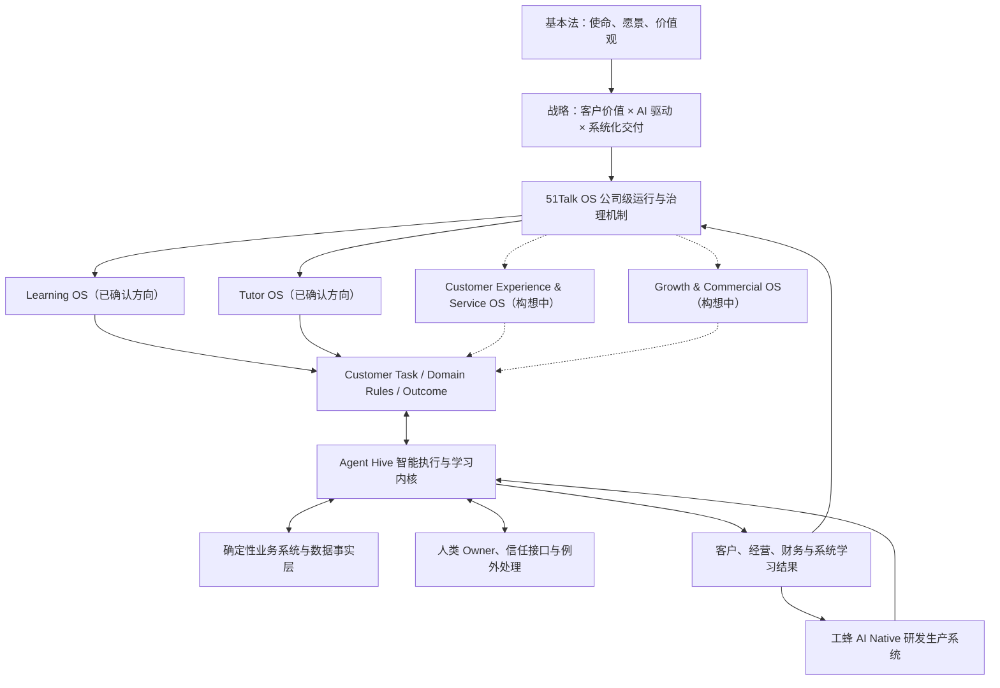

# 51Talk OS：公司级操作系统定义

> 版本：Version 1.0 Authoritative Full Text  
> 文档状态：已确认生效  
> 确认人：Jack（CEO）  
> 适用范围：51Talk 公司级战略、经营、组织、产品、系统与 AI Native 建设  
> 权威 Owner：CEO / 公司治理 Owner  
> 生效日期：2026-09-15  
> 说明：本文定义 51Talk OS 的正式含义、边界与运行原则，不记录概念形成过程，不代替各领域业务制度与技术实施规范。

---

## 一、总定义

**51Talk OS 是 51Talk 的公司级操作系统。**

它以使命、愿景和价值观为最高约束，以客户价值为北极星，以客户任务为组织运行的基本颗粒度，把战略、业务、组织、人才、数据、系统、AI、治理和反馈连接成一套能够持续运行、持续学习和持续进化的公司机制。

51Talk OS 不是某一个软件系统，也不是 IT 系统的总称。它回答的是一个更根本的问题：

> 51Talk 如何在全球不同市场中，持续创造客户价值、完成经营目标、降低组织复杂度，并把成功经验沉淀为可复制、可放大、可进化的公司能力？

最简表达：

> **使命和战略定义方向，领域 OS 定义业务，蜂巢系统组织智能执行，确定性系统保障事务，人类掌舵负责，工蜂系统持续建设，真实结果推动整个公司学习。**

---

## 二、建设 51Talk OS 要解决的根本问题

51Talk 当前阶段的主要矛盾是：

> **客户价值急需升级，与客户价值链系统化交付能力不足之间的矛盾。**

过去支撑公司发展的创业精神、核心人才、经验判断、会议协调和现场救火仍然重要，但如果关键能力长期停留在少数人的头脑、关系和临场发挥中，就难以稳定复制，难以全球扩张，也无法形成智能复利。

51Talk OS 的任务，不是消除人，而是改变组织承载复杂度的方式：

- 从依赖强人，转向人和系统共同承担；
- 从部门与岗位出发，转向客户任务与客户结果；
- 从会议传递信息，转向事实、语义、记忆和状态实时流动；
- 从一次性交付项目，转向可持续运行和迭代的系统资产；
- 从 AI 辅助个人，转向 AI 参与公司的感知、判断、执行与学习；
- 从旧路径长期并存，转向新路径验证后有计划地退役旧路径。

---

## 三、51Talk OS 的战略终点

### 3.1 使命、愿景与价值观

51Talk OS 必须服从《51Talk 基本法》：

- **使命**：让每一个人都有能力对话世界；
- **愿景**：成为一家受人尊敬、AI 驱动、面向全球的百年教育企业；
- **价值观**：成就客户、激情人生、拥抱变化、团队协作。

使命、愿景和价值观不是系统外的口号，而是所有目标、规则、模型、Agent 行动和人类决策的最高约束。

### 3.2 第四个五年的方向

51Talk 第四个五年的战略主线是：

> **以升级客户价值为目标，以 AI 驱动为核心，完成系统化交付革命。**

面向产品与市场的目标形态是：

> **成为全球 AI-first Hybrid 个性化学习领导者。**

这里的 AI-first，是把 AI 作为默认智能底座和生产力底座；Hybrid，是根据学习者、学习任务、年龄、地区和风险，动态组合 AI 学习、真人教师关键节点、持续 Agent 陪伴，以及必要的人类服务、信任与责任。

战略对象由“销售更多课时”升级为“持续经营学习结果和长期客户关系”。学习效果、学习动机、客户信任和价值可见是原因；续费、转介绍、LTV、增长和现金贡献是结果。

---

## 四、51Talk OS 的北极星

51Talk OS 的第一北极星是：

> **持续为客户创造可感知、可验证、可积累的学习价值。**

这一北极星必须同时接受四类结果检验：

| 结果维度 | 核心问题 |
| --- | --- |
| 客户结果 | 学习效果、学习动机、满意度、信任和长期学习关系是否改善？ |
| 经营结果 | 客户任务是否更稳定、更及时、更一致地完成？ |
| 财务质量 | 增长、毛利、现金贡献、LTV 与单位任务成本是否健康？ |
| 系统学习 | 数据、Memory、Skill、Eval、规则和系统资产是否因真实运行而变强？ |

任何只改善局部效率、却损害客户价值、财务质量或长期系统能力的方案，都不能被视为 51Talk OS 的成功。

---

## 五、51Talk OS 的总体架构

以下架构图代表我们在 Version 1.0 阶段对 51Talk OS 的当前理解，供建设和协作参考。它具有指导价值，但仍需通过实践检验，并随客户需求、业务经验和 AI 能力的发展持续迭代。正式确认本文，意味着确认这一有生命力、可修订的运行框架，并不意味着图中的每一层、每一条关系都已被证明完全正确。

其中，Learning OS 和 Tutor OS 的领域方向已明确确认；客户体验与服务、增长与商业两个 OS 仍处于构想阶段。领域方向的确认也不代表其具体架构或生产能力已经完备。



当前可从以下七个相互关联的方面理解 51Talk OS。层次划分和实现方式可以随实践调整。

### 5.1 宪法与战略层

定义公司为什么存在、要去哪里、什么不能被牺牲，以及当前阶段要解决的主要矛盾。它包括《51Talk 基本法》、公司战略、经营原则和重大风险边界。

### 5.2 客户价值与领域 OS 层

围绕客户生命周期定义业务世界。V1.0 明确确认两个领域方向：

1. **Learning OS**：定义学习目标、学习证据、诊断、干预与学习结果；
2. **Tutor OS（全球教师领域）**：定义教师供给、能力、匹配、履约、训练、评价与发展。

另外两个领域 OS 保留为待验证的构想：

- **Customer Experience & Service OS**：拟覆盖客户体验、服务、信任、风险、问题解决和长期关系；
- **Growth & Commercial OS**：拟覆盖获客、转化、定价、支付、续费、升舱、转介绍和健康增长。

这两个构想尚缺乏足够扎实的业务与架构验证，其命名、范围、独立设置的必要性以及与其他领域的关系，均可继续调整。当前不将“四个 OS”作为必须完整建设的固定清单。相关客户任务仍由现有明确的责任人和系统承接。

各领域 OS 必须定义自己的核心对象、状态、事件、规则、指标、权限、人类边界和成功标准。领域之间共同服务一条客户价值链，不得各自形成新的部门墙或数据孤岛。

### 5.3 Agent Hive 智能执行与学习层

蜂巢系统把业务事件转化为 Customer Task，组织 Agent、Skill、工具、确定性系统和人完成感知、判断、执行、人工确认和结果回流。

蜂巢不自行发明业务目标和业务语义；它依据领域 OS 运行，并把真实结果反馈给领域 OS 和公司治理层。

### 5.4 确定性业务系统层

订单、合同、支付、排课、课堂、权益、身份、财务、审计等必须准确、可追溯的事务，由确定性系统保存和执行。

概率模型可以理解、建议和编排，但不得替代必须确定的交易规则、账务事实、法定记录和最终授权。

### 5.5 数据、知识与 Context 层

公司必须把原始数据转化为可被人和 Agent 共同理解的可信事实、业务语义和授权 Context：

- 数据事实有来源、时间、Owner、口径和权限；
- 业务术语有统一定义，避免各团队自行解释；
- Knowledge、Memory、Data、Trace 与 Document 保持边界；
- Agent 按身份、任务、地域和风险加载最小充分 Context；
- 纠错、冲突、过期和撤销均可追踪。

没有数据治理和语义治理，就没有可靠的 AI Native 公司。

### 5.6 组织、Owner 与治理层

51Talk OS 不是无人负责的自动系统。每个重要领域、系统资产和客户任务至少要明确：

- Business Owner：对客户与经营结果负责；
- Product Owner：对业务能力、使用路径和产品结果负责；
- Technical Owner：对技术实现、稳定性、安全和演进负责；
- Data Owner：对事实、口径、质量、权限和数据生命周期负责；
- System Asset Owner：对跨版本价值、复用、投资、维护和退役负责。

一个人可以兼任多个 Owner，但责任不能缺失，也不能以“Agent 做的”为由转移最终责任。

### 5.7 工蜂研发生产与持续进化层

工蜂系统是建设和进化 51Talk OS、蜂巢系统与具体任务蜂群的 AI Native 研发生产系统。它以 Context 和 Spec 为控制基础，由架构、Coding、测试、检查、发布和学习 Agent 完成系统变更，人类负责目标、边界、审核、批准和最终责任。

工蜂系统追求代码由 AI 执行，但不把业务价值判断、重大风险批准和责任归属交给 AI。

---

## 六、51Talk OS 的运行单位

### 6.1 客户任务是基本颗粒度

51Talk OS 的第一层设计对象不是部门、岗位或功能菜单，而是客户在特定状态下需要完成的任务。

一个完整客户任务必须说明：

- 服务谁，处于什么状态；
- 发生了什么事件；
- 客户需要获得什么结果；
- 当前的事实与证据是什么；
- 应由 Agent、系统还是人执行；
- 哪些动作可自动完成，哪些必须确认；
- 如何判断完成、失败、暂停或终止；
- 结果如何更新事实、记忆、规则和后续任务。

### 6.2 对象—状态—事件—决策

每个领域必须把业务经验沉淀为四类可执行语义：

```text
核心对象：谁或什么被管理
→ 状态：对象现在处于什么阶段
→ 事件：发生了什么变化
→ 决策：下一步应做什么、由谁做、在什么边界内做
```

只有写进对象、状态、事件、规则、权限和反馈的业务能力，才真正进入 51Talk OS。

---

## 七、公司的默认运行原则

### 原则一：客户价值优先

所有系统、组织和 AI 方案都必须说明改善哪一个客户结果。不能把 Agent 数量、自动化率、功能数量或替代人数当作最高目标。

### 原则二：客户任务优先于部门边界

先画完整客户任务链，再决定由哪个 Agent、系统、人或组织单元承担。旧岗位只用于迁移映射，不作为未来架构的第一层。

### 原则三：AI 是默认执行单元，人类承担掌舵责任

可被清晰定义、授权、验证和审计的工作，默认由 Agent 执行。人类负责使命、目标、业务语义、价值判断、复杂例外、客户信任、风险批准和最终责任。

### 原则四：先定义，再自动化

任何术语、指标、规则和状态，如果没有唯一业务定义、事实源、Owner、权限和审计方式，不得直接交给 AI 自动执行。

### 原则五：确定性与智能性分层

必须准确的交易、权益和状态由确定性系统负责；需要理解、推理、生成和跨域协同的任务由 Agent 承担。两者通过明确契约协作。

### 原则六：共享记忆优先于孤立工具

系统和 Agent 必须在授权范围内共享客户事实、组织知识和任务状态。任何能力如果只能依赖个人聊天记录、临时文件或口头传递，就还不是公司能力。

### 原则七：反馈闭环优先于功能上线

每个系统必须能看到行动结果、客户反馈、人工纠错和失败原因，并将其转化为 Memory、规则、Prompt、Skill、Eval、模型、流程或产品变更。

### 原则八：建议优先通过端到端小船验证

建议在范围适当、端到端完整的真实客户场景中验证关键假设，再逐步扩大建设。小船是优先参考的方法，具体范围、顺序和验证方式由团队结合业务特点与风险选择，不作为所有项目一律适用的刚性门槛。

### 原则九：总部协同，区域自治

总部统一使命、核心对象、身份、协议、数据治理、权限、审计和公共底座；区域对本地客户、语言、文化、渠道、法规、创新速度和经营结果负责。

### 原则十：系统资产必须有生命周期

系统资产必须有 Owner、消费者、版本、Eval、运行证据和维护机制。建议在新路径验证成立后，结合客户连续性、迁移成本和业务风险，逐步减少重复的旧流程、旧报表、旧群聊和人工协调。旧路径退役的节奏、范围及必要的并行期由具体场景决定。

### 原则十一：建议用真实场景验证复用价值

建议以多个真实场景的使用证据判断公共能力的复用价值。两个差异化场景可以作为有用参考，但不设统一数量门槛；团队可结合能力性质、建设成本和实际需求决定何时共享。身份、安全、审计等公共要求仍按其适用规则执行。

### 原则十二：增长必须接受财务与长期价值约束

系统不仅要提高速度和规模，还要关注毛利、现金贡献、LTV、风险和单位任务成本。不得以短期增长牺牲教育质量、客户信任和组织健康。

---

## 八、人、Agent 与系统的责任边界

### 8.1 Agent 可以成为默认执行者

在目标、Context、权限、Eval 和失败保护明确的前提下，Agent 可以承担：

- 信息发现、分析和方案生成；
- 客户任务识别、分解和路由；
- 低风险、可逆、可审计动作；
- 内容、代码、测试、配置和报告生产；
- 异常发现、提醒、检查和复盘；
- 对下一步行动提出建议。

### 8.2 人类必须保留的责任

以下责任不得因 AI 能力提升而消失：

- 使命、价值观和战略选择；
- 客户价值和业务成功标准的定义；
- 高风险、不易逆转或重大外部承诺的批准；
- 复杂例外、冲突和伦理判断；
- 客户信任沟通和关键关系承担；
- 权限授予、责任签收和最终问责。

### 8.3 确定性系统必须守住的边界

订单、支付、合同、排课、权益、财务与法定记录等，不得由模型输出直接替代。Agent 的建议只有通过确定性规则、权限校验和审计后，才能改变真实业务状态。

---

## 九、从战略到运行的闭环

```text
使命、基本法与战略
→ 客户价值目标
→ 领域 OS 与客户任务
→ 对象、状态、事件、规则和指标
→ Agent / Skill / Tool / Human / 确定性系统协同
→ 客户、经营、财务和系统学习结果
→ Trace、反馈与人工纠错
→ 更新规则、Memory、Skill、Eval、产品和组织机制
→ 新版本验证
→ 根据业务条件逐步迁移或退役旧路径
```

系统上线后，仍需持续验证结果并形成学习回流。旧路径迁移与退役作为优化方向，根据业务条件推进，不以是否立即退役作为系统建设完成的统一判定条件。

---

## 十、建设与迁移建议

### 10.1 优先考虑端到端小船

小船验证可参考以下要点，并按场景调整：

- 面向真实客户和真实任务；
- 范围足够小，可以看清每一个失败；
- 链条足够完整，不把关键环节留在系统外；
- 有明确的客户、经营、财务和系统学习指标；
- 有业务、产品、技术、数据和系统资产责任人；
- 有人工接管、降级和回滚能力；
- 评估旧路径的迁移或退役条件与时机。

本章提供方法建议，不设置统一的小船规模、实施顺序、复用次数或退役时限；客户价值、人类责任及适用的权限和安全边界仍需遵守。

### 10.2 从局部能力进入公司资产

建议从契约稳定性、真实消费者、运行证据、Eval、维护成本和复用价值等方面判断局部创新是否适合成为公司共同能力，并随实践逐步完善。权限、安全和责任归属按相应治理要求落实。

### 10.3 不围绕旧组织复制系统

现有 CC、SS、LP、客服、运营、产品和技术岗位可以作为现状映射，但未来系统应围绕客户任务重新分配工作。岗位会变化，客户任务、责任和系统能力必须持续存在。

---

## 十一、51Talk OS 的成功标准

### 11.1 客户结果

- 学习效果和学习动机可被持续观察；
- 客户获得更稳定、更及时、更个性化的体验；
- 客户信任、满意度、续费意愿和转介绍意愿改善；
- 关键客户问题不再反复发生。

### 11.2 运营结果

- 客户任务的完成率、及时率和一致性提高；
- 例外能够被发现、升级、处理并闭环；
- 组织对会议、Excel、群聊和人肉协调的依赖下降；
- 区域创新能够被总部识别、验证并工业化。

### 11.3 财务结果

- 增长、毛利、现金贡献和 LTV 健康；
- 单位客户任务的交付成本和协同成本下降；
- 系统投入与客户和经营结果之间可追踪；
- 规模增长不再要求组织复杂度同比例增长。

### 11.4 系统学习结果

- 真实运行持续形成高质量 Trace 与 Eval；
- 人工纠错能够沉淀为规则、Memory、Skill、Prompt 或系统改进；
- 能力可以跨场景、跨区域复用；
- 更换模型、框架或个别人员后，公司核心知识和运行能力仍可保留；
- 新路径验证后，按业务条件减少重复旧路径，并在适当时机完成迁移或退役。

---

## 十二、51Talk OS 不是什么

51Talk OS 不是：

- 一个超级 App 或单一技术平台；
- 一次组织架构调整；
- 一套静态制度和 SOP；
- 若干 AI 工具或“AI 员工”的集合；
- 用自动化率或替代人数衡量的降本项目；
- 总部控制所有区域动作的大中台；
- 可以脱离客户结果长期建设的技术蓝图。

---

## 十三、版本治理

本文已由 CEO 于 2026-09-15 确认，作为《51Talk 公司治理 Context Pack》的 Version 1.0 Authoritative Full Text，优先于针对本文的摘要、解释稿和机器可读派生规则，并服从《51Talk 基本法》。

权威全文明确当前共同依据，同时保留迭代空间：总体架构是可修订的当前理解；Learning OS 与 Tutor OS 是已确认的领域方向；另两个领域 OS 保持构想状态；小船验证、复用晋级和旧路径退役属于建议性建设原则。派生规则不得把这些构想或建议擅自升级为刚性要求。

后续可由 Agent 或人类提出修订建议，但不得静默修改。重大修订必须：

1. 说明触发原因与真实证据；
2. 标明影响的领域 OS、系统、数据、组织和客户任务；
3. 由相应 Owner 审阅；
4. 由 CEO 或授权公司治理批准人确认；
5. 发布新版本并保留旧版本、变更记录和生效日期；
6. 同步更新摘要、机器规则、Eval 和 Context Profile。

当本文与派生摘要、Prompt、Skill、规则或 Eval 冲突时，以本文最新有效版本为准，并触发治理纠偏。

---

## 依据文件（不构成正文）

- 《51Talk 基本法》15 周年发布版；
- 《51Talk 第四个五年战略：AI 驱动的系统化交付革命》；
- 《51Talk 当前主要矛盾》；
- 《51Talk OS v1.0 架构》知识库综合页；
- 《AI-first Hybrid 第四个五年战略与 51Talk OS 对话沉淀》；
- 蜂巢系统、四化、数据治理、AI Native 组织与工蜂研发生产系统相关内部材料。
