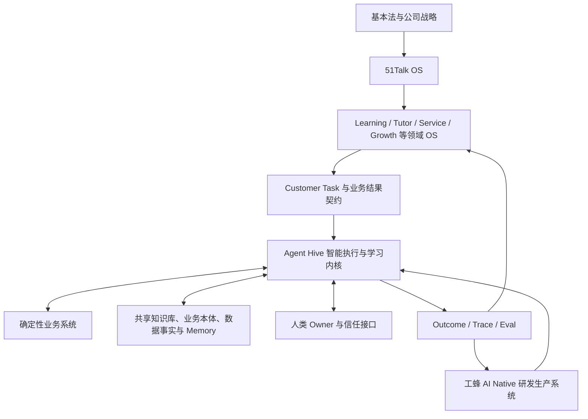

# 蜂巢系统：目标、定位与核心架构原则

> 英文名称：Agent Hive System  
> 版本：Version 1.0 Authoritative Full Text  
> 文档状态：已确认生效  
> 确认人：Jack（CEO）  
> 适用范围：公司级蜂巢底座、领域 Agent 群、业务原子小队、工蜂研发生产系统及相关 Owner  
> 权威 Owner：Agent Hive System Asset Owner；公司治理边界由 CEO / 公司治理 Owner 批准  
> 生效日期：2026-09-15  
> 版本说明：按 CEO 确认，将知识库、本体与未来构想补充内容纳入最新版 V1.0，覆盖此前同名正式版本  
> 说明：本文定义蜂巢系统的长期目标、系统边界和核心架构原则，不规定某一模型、Agent 框架或当前代码实现。

---

## 一、总定义

**蜂巢系统是 51Talk OS 的 AI Native 智能执行与学习内核。**

它以客户任务为运行单位，以 Agent 为默认智能执行单元，以可信事实、业务语义和共享记忆为 Context，以 Skill、工具和确定性业务系统为行动能力，以人类承担使命、信任、复杂例外和最终责任，通过 Trace、Eval 和真实结果持续学习。

蜂巢系统的职责不是模拟一个传统部门，也不是生成一批“AI 员工”，而是：

> **围绕客户当前需要完成的任务，动态组织最合适的 Agent、系统和人，完成端到端行动，并把每一次结果转化为公司可积累的智能资产。**

最简表达：

> **领域 OS 定义业务，蜂巢组织执行；人掌舵，Agent 执行，系统学习。**

---

## 二、蜂巢系统要解决的问题

在传统组织和传统系统中，一项客户任务往往被切割在多个部门、岗位、群聊、表格和系统之间。事实无法连续流动，客户需要反复解释，管理者依赖人工追问和协调，成功经验也很难被系统复用。

蜂巢系统要解决五个根问题：

1. **客户任务被部门切碎**：每个局部完成了动作，客户的完整问题却未必解决；
2. **事实和记忆不连续**：数据散落在交易系统、通话、IM、课堂和个人经验中；
3. **智能无法协同**：不同 Agent、系统和人各自输出，却没有共同任务状态和统一结果；
4. **责任边界不清**：AI 能做什么、何时要人确认、失败由谁兜底没有统一规则；
5. **组织不能从运行中学习**：错误、纠正和客户反馈没有持续进入 Eval、Memory、Skill、规则和系统。

蜂巢系统把这些割裂点连接为客户任务闭环，使组织复杂度从人脑、岗位和会议，逐步迁移到可观察、可验证、可治理的系统中。

---

## 三、蜂巢系统的战略定位

### 3.1 在 51Talk OS 中的位置



- 51Talk OS 定义公司如何经营、组织、治理和学习；
- 领域 OS 定义业务对象、生命周期、规则、指标和什么叫成功；
- 蜂巢系统组织智能执行，并将结果反馈给领域和公司；
- 确定性系统保存事实并执行不可含糊的事务；
- 人类负责目标、价值、信任、例外和最终责任；
- 工蜂系统负责设计、生产、验证、发布和进化蜂巢。

### 3.2 一个蜂巢，多个领域 Agent 群

公司采用 `One Hive + Many Domain Swarms`：

- 公司级统一 Identity、Customer Task 协议、Agent Runtime、权限、审计、Trace、Eval、Memory 和 Skill 的基本契约；
- Learning、Tutor、Service、Growth 等领域可以拥有自己的 Agent、Mother Agent、Skill、Memory、Policy 和 Eval；
- 各领域不得重复建设彼此不兼容的身份、任务、权限、审计和运行底座；
- 公共底座不得借“统一”之名吞掉领域业务语义和区域自治。

### 3.3 蜂巢是可重构的执行网络

蜂巢不是一张永久固定的 Agent 组织架构图。模型能力、客户任务和业务规则会持续变化，Agent 可以被合并、拆分、替换或退役。

长期需要保留的不是某个 Agent 的名字，而是：

- 客户任务与业务结果；
- 对象、状态、事件和规则；
- 可信事实与共享记忆；
- Skill、Tool 与 Action 契约；
- 权限、审批和审计；
- Trace、Eval、反馈和错误经验；
- 系统接口、Owner 和版本关系。

---

## 四、蜂巢系统的北极星

蜂巢系统的北极星是：

> **让 51Talk 能够以更好的质量、速度和一致性完成客户任务，并使公司在每一次真实运行后变得更聪明。**

蜂巢系统不以 Agent 数量、模型调用次数、自动化率或替代人数作为最高目标。它必须同时改善：

| 维度 | 核心结果 |
| --- | --- |
| 客户结果 | 学习效果、体验、信任、满意度、续费意愿和问题解决 |
| 运营结果 | 任务完成率、响应速度、一致性、人工介入质量和例外闭环 |
| 财务质量 | LTV、毛利、现金贡献、风险损失和单位任务成本 |
| 系统学习 | Trace、Eval、Memory、Skill、规则和复用能力持续增强 |

---

## 五、蜂巢系统的最小运行闭环

```text
客户或业务现实
→ 感知到事件
→ 识别客户、对象和当前状态
→ 创建或更新 Customer Task
→ 编译最小充分 Context
→ 选择 Agent / Skill / Workflow / Tool / Human
→ 判断、执行或请求人工确认
→ 确定性系统改变真实业务状态
→ 验证客户任务是否完成
→ 记录 Trace、Outcome 与人工纠正
→ 更新事实、Memory、Eval、Skill、规则或形成变更提案
```

缺少客户结果验证和反馈回流的流程，只能称为自动化，不能称为完整的蜂巢闭环。

---

## 六、蜂巢系统的核心生产对象

### 6.1 Customer Task

Customer Task 是蜂巢的核心运行对象。它至少包含：

- 服务对象与当前身份；
- 触发事件与业务来源；
- 当前状态和可信事实；
- 客户希望完成的结果；
- 任务优先级、时限和停止条件；
- 可用 Agent、Skill、工具与确定性系统；
- 权限、风险和人工确认点；
- Done、Failed、Paused、Escalated 等状态；
- Outcome、Trace 与后续任务。

### 6.2 Context Package

Context Package 是某个 Agent 在某项任务中被允许看到的最小充分上下文，包括公司治理、领域语义、客户事实、连续记忆、当前任务、可用能力、权限和历史经验。

Context 不是把所有文档塞进提示词。它必须按任务、身份、地域、状态、时效和权限动态编译，并保留来源和版本。

### 6.3 Agent

Agent 是承担目标和判断责任的智能执行单元。每个 Agent 必须有：

- 单一清晰使命；
- 输入、输出和状态契约；
- 可读 Context 与可写 Memory；
- 可调用 Skill、Tool 和 Action；
- 权限、成本、延迟和失败边界；
- Eval、上岗等级和升级规则；
- Owner、版本和退役机制。

### 6.4 Skill 与 Tool

- **Skill**：稳定、可复用、可版本化的做事方法与能力契约；
- **Tool**：执行查询或动作的确定性接口；
- **Action**：具有业务影响的具体行为，必须经过权限、风险和审计控制。

稳定能力优先沉淀为 Skill、规则或确定性 Workflow，不应为了形式而增加 Agent 数量。

### 6.5 Memory

Memory 保存跨任务仍然有价值、且被授权保留的连续信息。它必须区分：

- 客户或学习者事实；
- Agent 的推断与置信度；
- 人工确认和纠错；
- 组织知识与经验；
- 任务状态和决策历史。

Memory 必须可溯源、可纠正、可过期、可撤销、可限制传播。模型输出不能未经验证直接升级为永久事实。

### 6.6 Trace、Eval 与 Outcome

- **Trace** 记录系统看到了什么、如何判断、调用了什么、谁批准了什么以及结果如何；
- **Eval** 用真实案例、业务不变量和失败场景判断系统是否达到上岗与发布标准；
- **Outcome** 记录客户、经营、财务和系统学习结果。

三者必须连接。只有 Trace 而没有 Outcome，无法证明价值；只有 Outcome 而没有 Trace，无法解释和改进；只有离线 Eval 而没有真实运行，无法证明系统在生产中成立。

---

## 七、知识库：蜂巢与工蜂共同的知识基础

### 7.1 为什么知识库是核心能力

蜂巢要持续理解公司、客户和业务，工蜂要持续建设符合公司方向的系统，两者都需要稳定、可信、可更新的知识基础。知识库决定 Agent 基于什么做判断，也决定公司的经验能否跨人员、跨任务、跨模型保留下来。

没有这一基础，业务 Agent 每次处理任务都可能重新猜测业务含义；研发 Agent 则需要人反复解释公司目标、业务规则和已有能力。即使代码全部由 AI 编写，研发仍会受制于人工传递上下文。

因此，蜂巢知识库应被视为业务运行与 AI Native 研发共同依赖的生产基础设施。公司治理 Context Pack 是其中的公司方向与责任依据，整个知识体系还需要连接领域知识、业务本体、系统能力和运行经验。

### 7.2 知识库应承载什么

| 知识类别 | 核心内容 | 对 Agent 的作用 |
| --- | --- | --- |
| 公司治理与战略 | 基本法、五年战略、51Talk OS、蜂巢定位和责任边界 | 知道公司去哪里、什么不能牺牲 |
| 领域与客户任务 | Learning OS、Tutor OS、客户任务、规则、结果标准及其他待验证构想 | 理解客户需要什么、怎样才算做好 |
| 业务本体 | 对象、关系、状态、事件、指标、决策、动作与权限 | 用一致的业务语言理解事实和组织行动 |
| 公司能力与工程知识 | 系统、Agent、Skill、工具、接口、架构、Spec 和版本状态 | 知道已有能力、可调用范围和建设约束 |
| 经验与验证依据 | 案例、决策理由、事故、人工纠错、Eval 及 Trace 索引 | 避免重复错误，验证新判断与新实现 |

其中，已批准全文、工作定义、未来构想和 Agent 推断应明确区分。正式全文保留原意和出处，摘要负责导航，不能覆盖原文权威。

### 7.3 连接事实源，按任务提供 Context

知识库形成统一知识入口，各类事实继续由相应系统负责：交易系统持有订单和支付，数据服务提供业务事实，代码仓库管理实现版本，Memory 保存授权的连续记忆，Trace 系统保存执行轨迹。知识库维护它们的含义、来源、关系、版本和使用方式。

Context 是知识体系面向一次具体任务的供给结果。例如，同一套知识体系可以分别为架构师 Agent 提供业务目标和能力地图，为 Coding Agent 提供批准的 Spec 和接口，为服务 Agent 提供当前客户事实、适用规则和允许执行的动作。

这也明确了知识库与工蜂系统的边界：知识库供给知识、契约与经验；工蜂执行架构、开发、验证和发布。知识库可以登记这些生产过程的输入输出，但不承担整个研发执行系统。

### 7.4 知识如何持续更新

知识的运行闭环是：

```text
来源与证据
→ 整理知识、标记权威和适用范围
→ 按任务提供 Context
→ Agent 执行与客户结果
→ 发现缺失、冲突和错误
→ 提出修订并由对应 Owner 验证
→ 发布可追踪的新知识版本
```

知识库的价值应体现在错误理解减少、Context 准备时间缩短、能力复用增加和客户任务质量提高。文档数量只能说明积累规模，无法单独说明这些结果。

## 八、本体：让蜂巢理解业务并采取行动

### 8.1 本体的含义

本体（Ontology）是公司对业务世界的共同定义：有哪些对象，它们如何关联，处于什么状态，什么事件意味着什么，以及在相应条件下允许采取哪些动作。

例如，“课堂中断”这个词需要连接具体学员、教师、课次、发生时间、事实证据、判定规则、可采取的恢复动作和结果责任人。这样的业务定义，使不同 Agent 能围绕同一事实协作。

领域 OS 提出业务目标、规则和成功标准；本体把其中需要共同理解和执行的内容表达为明确的业务模型；蜂巢依据这一模型组织行动。

### 8.2 从对象关系走向可行动的业务本体

我们对本体的目标构想包括以下要素：

| 要素 | 要回答的问题 |
| --- | --- |
| 对象与关系 | 学员、家长、教师、课程、课次、订单和任务如何关联？ |
| 状态与事件 | 当前处于什么状态，发生了什么变化？ |
| 事实与证据 | 判断来自哪里，哪些已验证，哪些仍有不确定性？ |
| 指标与决策规则 | 如何衡量结果，满足什么条件应采取干预？ |
| 动作与状态变化 | 可以调用什么能力，执行成功后改变什么状态？ |
| 权限与适用范围 | 谁可以执行，适用于哪个地区和版本，何时需要人工确认？ |
| Owner 与反馈 | 谁承担结果，如何验证完成并修正后续判断？ |

本体负责定义动作含义及其契约，实际权限校验和交易执行仍由权限服务及确定性系统落实。仅在文档中写明权限，不会自动获得执行权限。

### 8.3 示例：一节课出现中断

以下是说明本体作用的示例，不是已批准的课堂处置政策：

```text
对象：某学员与某教师的一节课
→ 事件：检测到连接异常
→ 证据：课堂记录、连接日志、通话或客户反馈
→ 判断：依据适用规则判断是否中断，原因是否充分确认
→ 任务：恢复学习并处理受影响的客户体验
→ 动作：授权范围内重连、通知、转人工或申请补课
→ 结果：是否恢复，权益是否按批准规则落实，客户是否得到解释
→ 反馈：记录实际原因、处理效果和人工纠错
```

检测异常不自动等于教师责任，发送通知也不自动等于问题解决。本体使这些区别成为多个 Agent 共享的业务语义。

### 8.4 本体应持续演进

公司的业务理解会变化，本体也需要版本、证据和修订机制。Learning OS 与 Tutor OS 可以逐步形成各自的领域本体，并对共同对象保持一致；其他尚在构想中的领域可按业务需要探索扩展。

业务 Owner 负责业务含义和结果，数据 Owner 负责事实口径，产品与技术 Owner 负责把定义连接到任务和系统行为。AI 可以从资料和运行轨迹中提出对象、规则或关系的候选，但不能把候选自动提升为正式业务定义。

本体可先用清晰的文档、结构化定义和接口契约表达。是否采用图数据库或其他技术，由查询、协作与规模需求决定。我们要持续掌握的是业务定义及其与行动的联系。

## 九、面向未来：让公司能力持续积累

### 9.1 以成熟的 AI Native 研发为终点思考

我们的未来构想是：随着 AI Native 研发成熟，工蜂能够根据客户任务、公司知识、本体、Spec 和 Eval，持续设计、生成和重构蜂巢的具体实现。今天某一组 Agent、某段代码或某种编排方式，都可能被新的实现替换。

这是指导建设的目标情景，具体能够自主到什么程度，需要由实际能力、验证结果和授权范围决定。

### 9.2 哪些资产最值得积累

| 资产 | 对未来的价值 |
| --- | --- |
| 客户关系与学习证据 | 告诉系统客户真正需要什么、行动是否有效 |
| 治理知识与业务本体 | 保留公司方向、业务含义、规则和责任 |
| Memory、Skill、接口与权限契约 | 让新实现继续使用已有经验和行动能力 |
| 私有 Eval、Trace 与人工纠错 | 检验替代方案，并把历史错误转化为改进依据 |
| 工蜂研发生产能力 | 将这些资产持续转化为可运行、可验证的新蜂巢 |

这些资产能否跨模型和实现保留，需要通过迁移与实际复用检验，并不意味着替换技术没有成本。

### 9.3 运行与建设形成两个相互促进的闭环

业务运行不断产生客户事实、结果和纠错；这些证据改善知识库、本体和 Eval；工蜂据此提出并验证系统变更；更好的蜂巢再回到客户任务中运行。

知识库、本体和工蜂因此共同决定蜂巢的长期生命力：公司积累的业务理解能够进入下一代实现，系统变更也能接受历史证据和真实结果的检验。

上述未来构想允许在实践中调整架构。持续积累客户价值、共同业务语言和可验证的学习能力，是各代实现共同服务的方向。

---

## 十、核心架构

### 10.1 感知与事件层

从课堂、产品、CRM、SCRM、AICC、IM、工单、支付、排课、教师和人工输入中获取事件。每个事件必须有来源、时间、主体、对象、可信度和权限。

### 10.2 数据事实与业务本体层

蜂巢只能在可理解的数据上行动：

- **L3 可信事实层**回答“发生了什么”；
- **L3.5 业务语义层**回答“这意味着什么、谁负责、下一步允许做什么、如何判断完成”。

业务 Owner 是业务语义的一号位；数据和技术团队负责把语义可靠地实现、服务化和监控。

### 10.3 Customer Task Runtime

负责创建、更新、暂停、恢复、升级和关闭任务，管理任务之间的依赖、优先级、时限、重试和幂等，并保存完整状态。

### 10.4 Agent 与编排层

负责根据任务选择单 Agent、多个 Agent、确定性 Workflow 或人类协作方式。Mother Agent 可以综合多个专业判断、处理冲突和路由下一步，但不得成为无边界、不可解释的万能大脑。

### 10.5 Skill、MCP、Tool 与 Action 层

把知识、方法和系统能力暴露为有输入输出、权限、错误处理、版本和审计的可调用契约。读权限与执行权限必须分离。

### 10.6 确定性业务系统层

订单、支付、排课、权益、合同、身份和财务等真实状态，由确定性系统持有。蜂巢通过受控接口读取和改变状态，不复制第二套权威事实。

### 10.7 Knowledge、Context 与 Memory 层

共享知识库与业务本体共同支撑业务运行和工蜂研发，具体定位见第七、八章。公司 Canon、领域知识、能力清单、工程事实、客户记忆和历史经验保持各自 SSOT。Context Compiler 针对具体任务装配内容，避免信息过载、来源丢失、过期规则和越权访问。

### 10.8 Identity、权限、安全与审计层

每一次读取、判断和行动必须能够回答：谁以什么身份、为哪个任务、基于什么权限、读取了什么、执行了什么、造成什么结果。

### 10.9 Trace、Eval、Outcome 与学习层

系统从真实任务中捕获成功、失败、人工接管、客户反馈、成本和延迟，并形成受控的变更建议。反馈可以更新 Memory、规则、Prompt、Skill、Eval、模型、流程和代码，但重大业务规则不得绕过 Owner 自动改变。

---

## 十一、Agent 网络设计原则

### 原则一：先判断是否需要 Agent

默认选择顺序是：

1. 简单规则或确定性系统能否完成；
2. 一个 Agent 加若干 Skill 是否足够；
3. 是否需要状态机或确定性 Workflow；
4. 是否确实存在多主体、跨领域或并行判断，才使用多 Agent。

多 Agent 不是目标，可靠完成客户任务才是目标。

### 原则二：少量稳定 Agent，大量可复用 Skill

Agent 承担目标、判断和上下文协同；稳定方法沉淀为 Skill；准确事务交给 Tool 和确定性系统；强规则交给 Workflow 和 Policy。

### 原则三：每个 Agent 都必须可评估、可观察、可停止

没有明确任务、Eval、权限、Trace、失败边界、升级规则和 Owner 的 Agent，不得进入生产。

### 原则四：Agent 不能自我扩大权限

Agent 不得自行改变权限、删除审计、修改公司治理红线、绕过发布门禁或把推断伪装成事实。

### 原则五：共享任务状态，不共享无边界信息

Agent 之间通过任务、对象、事件、Memory 和契约协作，不通过无限制互读上下文来模拟协同。

### 原则六：Builder 不能独立证明自己正确

任何蜂巢能力的实现者不能独立宣布发布成功。关键能力必须经过独立 Checker、业务 Eval、权限检查和人类 Owner 签收。

---

## 十二、人类责任与自动化边界

### 12.1 可默认自动执行

在 Context、权限、Eval 和审计完整的前提下，可优先自动化：

- 读取和整理授权信息；
- 识别事件、创建任务和提出建议；
- 低风险、可逆、内部且结果可校验的动作；
- 状态同步、提醒、检查、报告和异常发现；
- 已批准规则内的流程执行。

### 12.2 必须人工确认或签收

以下动作原则上必须由具备权限的人类确认：

- 对客户作出重大承诺或改变关键服务权益；
- 高金额支付、退款、价格、合同和财务动作；
- 影响人身、未成年人、教育质量或重大客户信任的决定；
- 不可逆或难以回滚的外部动作；
- 敏感数据访问、跨区域数据流动和高风险权限变更；
- 重大例外、政策冲突和系统无法解释的判断；
- 生产发布、重大规则变更和旧路径正式退役。

具体阈值由领域 Policy、地区法规和风险等级定义。

### 12.3 永远禁止

Agent 不得：

- 为自己或其他 Agent 授予未经批准的权限；
- 隐藏、删除或伪造关键 Trace 和审计证据；
- 把未经验证的推断写成权威事实；
- 绕过确定性交易、财务和合规系统直接改变真实状态；
- 私自改变使命、基本法、公司级治理红线或最终责任归属。

---

## 十三、蜂巢系统与工蜂研发生产系统

蜂巢系统运行客户任务；工蜂系统生产和进化蜂巢。

工蜂系统的完整主链是：

```text
业务意图与客户任务
→ 可信 Context
→ Architecture / Spec
→ AI Coding
→ 独立 Test / Eval / Security Check
→ 人工审核
→ 灰度发布
→ 生产 Trace 与业务结果
→ Memory / Skill / Eval / Spec / 代码进化
→ 旧路径退役
```

100% AI Coding 可以成为工蜂系统的目标，即进入主干的生产代码、测试、配置、Schema、基础设施和文档变更由 AI 完成；人类通过目标、Spec、Review、Approval 和问责来控制质量。

这不等于 100% 无人研发。客户价值、业务语义、架构边界、风险承担和最终批准仍由人类 Owner 负责。

蜂巢的某一代代码和固定 Agent 网络未来可能被更强 AI 重写。工蜂系统因此必须优先保护和积累可跨实现保留的资产：业务语义、Context、权限、Memory、Skill、Eval、Trace、接口契约和真实客户结果。

---

## 十四、Owner 与签收

每个生产蜂群和公司级公共能力必须明确：

| Owner | 必须签收的内容 |
| --- | --- |
| Business Owner | 客户任务、业务结果、业务规则和经营影响 |
| Product Owner | 产品能力、使用路径、客户体验和发布范围 |
| Technical Owner | 架构、实现、稳定性、安全、成本与回滚 |
| Data Owner | 事实源、口径、质量、权限和数据生命周期 |
| System Asset Owner | 复用价值、版本、维护、投资、晋级和退役 |

高风险场景还必须有风险、合规或公司治理批准人。Agent 可以准备证据和建议，不能替 Owner 完成责任签收。

---

## 十五、蜂巢系统的成功标准

### 15.1 客户结果

- 客户任务真正完成，而非仅完成内部动作；
- 学习效果、体验、满意度、信任和续费意愿改善；
- 客户无需在多个渠道重复解释同一问题；
- 异常能够被更早发现、更快恢复，并减少复发。

### 15.2 运营结果

- 任务完成率、及时率、一致性和端到端可见性提高；
- 人工介入集中在价值判断、信任和复杂例外；
- 跨领域协作由共享状态和契约驱动，而不是依赖人肉催办；
- 运行成本、延迟、失败和升级原因可度量。

### 15.3 财务质量

- 系统对续费、转介绍、LTV、毛利和现金贡献的影响可追踪；
- 单位客户任务成本下降，同时客户价值不恶化；
- Token、模型、基础设施和人工审核成本受控；
- 风险损失和重复返工减少。

### 15.4 系统学习

- 每一次失败都能被回放和归因；
- 人工纠错持续进入 Eval、Memory、Skill、规则或产品；
- 新版本的提升由同一组真实案例和业务结果验证；
- 能力可跨场景、区域和模型复用；
- 无价值 Agent、Prompt、Skill、组件和旧流程能够被识别并退役。

---

## 十六、蜂巢系统不是什么

蜂巢系统不是：

- 一个聊天机器人入口；
- 一批按旧岗位命名的 AI 员工；
- Prompt、工作流或 RPA 的集合；
- 一个只展示数据、不采取行动的看板；
- 一个绕开订单、支付、排课和权益系统的概率大脑；
- 一个 Agent 越多越先进的技术平台；
- 一个用替代人数证明价值的降本工具；
- 一个脱离客户任务、长期预建所有公共能力的大中台；
- 一个可以没有 Owner、Eval、反馈和退役机制的项目。

---

## 十七、版本治理

本文及知识库、本体与未来构想补充内容已由 CEO 于 2026-09-15 确认，合并作为《51Talk 公司治理 Context Pack》中关于蜂巢系统的最新版 Version 1.0 Authoritative Full Text，覆盖此前同名版本。领域规范、架构说明、Prompt、Skill、Policy 和 Eval 均应引用本文版本，并不得与其核心边界冲突。

对本文的重大修订必须：

1. 提供真实业务、技术或风险证据；
2. 说明对客户任务、领域 OS、公共底座和人类责任的影响；
3. 由 Agent Hive System Asset Owner 组织评审；
4. 由相关 Business、Product、Technical、Data Owner 签收；
5. 涉及公司级目标和治理边界时，由 CEO 或授权公司治理批准人确认；
6. 发布新版本并同步更新机器规则、Eval、Context Profile 和变更记录。

当本文与派生摘要或实现说明冲突时，以本文最新有效版本为准；当真实运行证据挑战本文假设时，应发起正式修订，而不是让实现静默偏离。

---

## 依据文件（不构成正文）

- 《51Talk 基本法》15 周年发布版；
- 《51Talk OS：公司级操作系统定义》Version 1.0 Authoritative Full Text；
- 《Agent Hive / 蜂巢系统》知识库概念页；
- 《蜂巢系统 AI Native 建设总纲》；
- 《工蜂 AI Native 研发生产系统》；
- [《Agent Hive 共享知识与 Context 系统架构》](../../../architecture/08-agent-hive-shared-knowledge-and-context-system.md)；
- [《蜂巢系统公司级 Wiki 综合架构》](../../../architecture/09-agent-hive-company-wiki-integrated-architecture.md)；
- FSD 多智能体学习服务平台、蜂巢系统奠基战役、数据治理与共享 Context 相关内部材料。
