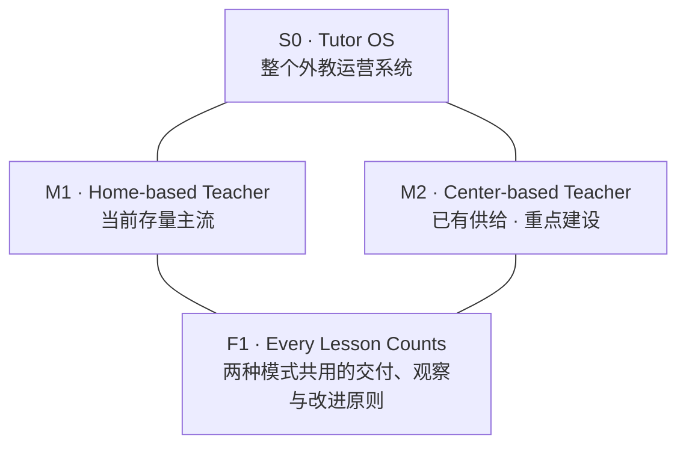

# Tutor OS 知识总图

**这是 Leon 与 Agent 共同理解、讨论和升级外教经营的主入口。** v1.1 保留已认领的第一层框架，并增加[[TutorOS第二层经营地图|第二层经营地图：15 个可持续讨论的问题]]。后续共识直接更新对应层，旧判断保留在演进记录中。（确认范围：[[2026-09-14-TutorOS知识骨架认领与共建分工]]。）

## 我们在经营什么

把全球教师的潜力，持续转化为适合学生、能够兑现的好课；让学生获得学习价值，让教师获得成长与合理收益，让交付长期持续，并把验证有效的做法积累成组织能力。

一节课是交付单元；教师能力、可用产能和师生关系需要跨课经营。Tutor OS 位于 51Talk OS 之内，与 Learning、Service、Growth 协同。（依据：[[TutorOS设计宪法全文]] §1–4。）

## 总体骨架

**两种模式处在同一架构层级。** HBT 的存量主流地位与 Center 的建设重点分别表达；两边都完整经营招募、成长、交付、支持、收入与留存。此处存量判断对应 2026-09-14 Leon 的明确说明，不附带未经核实的比例。（原话：[[2026-09-14-TutorOS知识骨架认领与共建分工#模式纠正原话]]。）

| 讨论位置 | 我们共同理解的含义 | 展开 |
|---|---|---|
| S0 Tutor OS | 全球真人教学供给与持续交付经营的总体框架 | [[TutorOS骨架节点与证据导航#S0|总体范围与公司接口]] |
| M1 Home-based | 经营分散环境中的居家教师，持续改善主流供给 | [[TutorOS骨架节点与证据导航#M1|居家模式的完整经营链]] |
| M2 Center-based | 经营中心教师供给，补强组织、训练与现场能力 | [[TutorOS骨架节点与证据导航#M2|中心模式的完整经营链]] |
| F1 Every Lesson Counts | 每课兑现价值、留下证据，并成为后续课改善的起点 | [[TutorOS骨架节点与证据导航#F1|逐课原则与跨课积累]] |

## 七个共同经营问题

每个问题都在 HBT 与 Center 中分别回答，保留各自条件，再形成全局判断。

| 位置 | 经营问题 | 展开 |
|---|---|---|
| N1 学习需要与承诺 | 哪些学生，在什么任务、课程与时段，需要怎样的交付？ | [[TutorOS骨架节点与证据导航#N1|需要与承诺]] |
| N2 形成并经营供给 | 怎样形成有资格、有能力、在需要时真正可用的教师供给？ | [[TutorOS骨架节点与证据导航#N2|供给经营]] |
| N3 师生适配与关系 | 怎样让合适师生相遇、兑现承诺，并延续有效关系？ | [[TutorOS骨架节点与证据导航#N3|适配与关系]] |
| N4 每课的真实交付 | 承诺是否兑现、学习是否发生，异常是否得到处理？ | [[TutorOS骨架节点与证据导航#N4|真实交付]] |
| N5 教师成长与支持 | 哪种训练、环境或帮助，可以改善后续真实授课？ | [[TutorOS骨架节点与证据导航#N5|成长与支持]] |
| N6 收入与供给可持续 | 学生价值、教师收益、供给稳定和平台全成本怎样共同成立？ | [[TutorOS骨架节点与证据导航#N6|收入与可持续]] |
| N7 有效方法与系统能力 | 怎样把一次做对，变成可验证、可复用、可修正的方法？ | [[TutorOS骨架节点与证据导航#N7|方法与系统能力]] |

**主要关系：** 需要指导供给与适配 → 进入真实课堂 → 证据反馈到成长、支持与关系 → 后续课堂验证；合理收益支持持续供给，验证有效的方法改善下一轮经营。事实与标准、业务服务、Hive 和人类责任共同支撑这条回路。（依据：[[TutorOS设计宪法全文]] §4–12、§16；本图关系承接已认领框架。）

XYZ 用来观察战场、能力与客户价值；三大战场用来组织重点；4＋2＋3 用来理解责任与协同。它们接在骨架上，具体项目也可同时关联多个节点。详见[[TutorOS骨架节点与证据导航#其他框架与十五个建设模块]]。

## 我们以后怎样在这里共建

**参与有两层：在本页看全局；在[[TutorOS第二层经营地图]]展开具体经营理解。** 第二层按需要、供给、关系、交付、成长、所得和方法组织，原有 concept / entity / project 等继续表示文档角色。一份原页可以支持多个经营域；不复制多份正本。

您可以直接说：“讨论 N5”“HBT 的收入逻辑需要重想”“这条关系不成立”，也可以不用编号直接说问题。Agent 负责定位、回读证据、提出具体改稿，说明理由、反例及影响到哪些下层页面。

**您主要参与第一、第二层的目标、核心认识、关系和重要取舍；Agent 持续维护域正文及蒸馏后的具体页面。** 您可以在日常碰撞发生时进入对应域。常规补证、归类、链接和明确纠正的传播由 Agent 完成；重要发现带着具体改稿与影响返回这两层。页面保留自己的来源与状态，挂入总图不会自动获得人类认领。（依据：[[2026-09-14-TutorOS知识骨架认领与共建分工]]。）

当前版本：两层建设方向已认可；十五域是经独立比较后的 Agent 初版，新增主张按来源分别标明。真实讨论中若边界重叠、漏掉重要事实或发现反例，继续合并、拆分或修正；不把每一页变成等待您签字的任务。

[[TutorOS骨架节点与证据导航|节点与证据]] · [[TutorOS知识骨架落点索引|全部页面的落点]] · [[2026-09-14-TutorOS知识骨架认领与共建分工|认领与演进记录]] · [[TutorOS知识骨架维护约定|Agent 维护约定]]

### 钉钉阅读导航

下表进入对应知识库中的同版配套页面。

| 骨架页面 | 【A】Tutor OS | Teacher battle · Leon wiki |
|---|---|---|
| 节点与证据 | [打开](https://alidocs.dingtalk.com/i/nodes/Exel2BLV5znlv6Y3fpbb7n1EJgk9rpMq?utm_scene=team_space) | [打开](https://alidocs.dingtalk.com/i/nodes/vNG4YZ7JnPDjwzGdsARRAE1bW2LD0oRE?utm_scene=team_space) |
| 全部页面落点 | [打开](https://alidocs.dingtalk.com/i/nodes/pYLaezmVNejqr3vQtKaaAe33WrMqPxX6?utm_scene=team_space) | [打开](https://alidocs.dingtalk.com/i/nodes/GZLxjv9VGqKl0mPvHZooYMGw86EDybno?utm_scene=team_space) |
| 认领与演进 | [打开](https://alidocs.dingtalk.com/i/nodes/9bN7RYPWdM5q79o4HjQQEvZjVZd1wyK0?utm_scene=team_space) | [打开](https://alidocs.dingtalk.com/i/nodes/1OQX0akWmxrMP2G1sjEEO3pZ8GlDd3mE?utm_scene=team_space) |
| 维护与同步约定 | [打开](https://alidocs.dingtalk.com/i/nodes/b9Y4gmKWrPNpBnG0se99kaA2JGXn6lpz?utm_scene=team_space) | [打开](https://alidocs.dingtalk.com/i/nodes/1R7q3QmWeerQRDdvt6xxMQmjWxkXOEP2?utm_scene=team_space) |

<!-- meaning-cloud-navigation:start -->
## 钉钉阅读入口

| 页面 | A 知识库 | Leon 知识库 |
|---|---|---|
| TutorOS第二层经营地图 | [A 库](https://alidocs.dingtalk.com/i/nodes/np9zOoBVBYq1apP5IerEveo3W1DK0g6l?utm_scene=team_space) | [Leon 库](https://alidocs.dingtalk.com/i/nodes/G53mjyd80p2oeG7PcejQRwD686zbX04v?utm_scene=team_space) |

<!-- meaning-cloud-navigation:end -->
