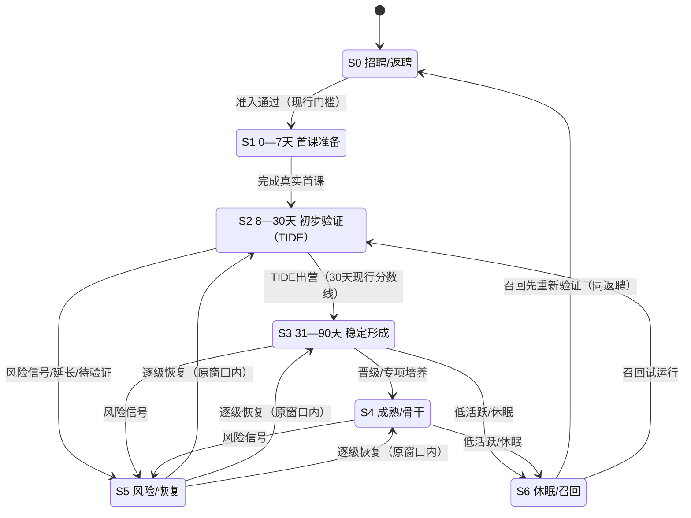

# 教师生命周期状态机

本页是**外教业务薄本体的第一块交付物**：把库里已有的散件（慧茹七阶段表、X2 执行时点、战略会 Lesson 单位与 TIDE 出营路径）对齐成一张可互操作的状态机图，作为「思考 → 数据验证」闭环的路网锚点。**纪律：对齐既有散件、拒绝完美建模、够用即停；本体层只做互操作锚点，不替代骨架与 schema**——每个状态的判断仍以对应域页与来源为准。[E1][][E3][]

跨域位置：主要横跨 [D03 新师成材与早期经营](../骨架/TutorOS%E7%BB%8F%E8%90%A5%E5%9F%9F-D03-%E6%96%B0%E5%B8%88%E6%88%90%E6%9D%90%E4%B8%8E%E6%97%A9%E6%9C%9F%E7%BB%8F%E8%90%A5.md)、[D09 履约恢复与问题治理](../骨架/TutorOS%E7%BB%8F%E8%90%A5%E5%9F%9F-D09-%E5%B1%A5%E7%BA%A6%E6%81%A2%E5%A4%8D%E4%B8%8E%E9%97%AE%E9%A2%98%E6%B2%BB%E7%90%86.md)、[D11 教师体验与公平治理](../骨架/TutorOS%E7%BB%8F%E8%90%A5%E5%9F%9F-D11-%E6%95%99%E5%B8%88%E4%BD%93%E9%AA%8C%E4%B8%8E%E5%85%AC%E5%B9%B3%E6%B2%BB%E7%90%86.md)、[D12 教师所得与激励](../骨架/TutorOS%E7%BB%8F%E8%90%A5%E5%9F%9F-D12-%E6%95%99%E5%B8%88%E6%89%80%E5%BE%97%E4%B8%8E%E6%BF%80%E5%8A%B1.md)。本页不签发处罚、薪酬、资格或退出动作。

## 状态图

淘汰/退出**不在本图建模**：处罚、收入、合同和退出另需正式来源（慧茹页冲突与待确认节原话）；本图不把任何状态画成终态。

## 节点表

骨架=慧茹七阶段表（阶段名、窗口、"允许判断/禁止捷径"照录，不增删）；迁移条件与证据锚点为本库挂接。

| 状态 | 迁移条件（进入） | 允许动作 | 禁止捷径 | 证据锚点 | E编号 |
|---|---|---|---|---|---|
| **S0 招聘/返聘** | 进入漏斗；召回者重新验证后视同返聘 | 准入、补测、条件性验证 | 用历史等级替代新证据 | 慧茹表；CE 只覆盖入门尺 | [E1][] [E4][] |
| **S1 0—7天** | 准入通过 | 首课资格、补训 | 未上真实课即认定好老师 | 慧茹表；蜜月期前 10 节窗口 | [E1][] [E4][] |
| **S2 8—30天** | 完成真实首课 | 出营、延长、待验证、风险治理 | 高课量直接等同高价值 | TIDE 连接准入→演练→真实试教→出营；现行 100 毕业/200+ 金牌（2026-09-05，弃 660） | [E1][] [E3][] [E5][] |
| **S3 31—90天** | TIDE 出营 | 晋级、专项培养 | 只看累计得分 | 慧茹表；试用期（前 2~3 个月）定义承接 | [E1][] [E4][] |
| **S4 成熟/骨干** | 形成稳定客户与课型能力 | 推荐、重点维护、能力拓展 | 不设窗口地永久累分 | 慧茹表；成熟老师用单位课量质量与滚动趋势 | [E1][] |
| **S5 风险/恢复** | 缺席/坏课/投诉等风险信号（缺席执行时点见时点公理） | 任务、复测、观察、逐级恢复 | 同一事件重复处罚 | 慧茹表；D09 恢复语义（客户恢复≠动作完成） | [E1][] [E2][] |
| **S6 休眠/召回** | 低活跃 | 重新验证、试运行 | 用旧成绩直接恢复全部权益 | 慧茹表；召回先回 S0 同返聘 | [E1][] |

样本可信度规则（慧茹表，随状态使用）：低课量/低反馈只说明证据不足，不自动说明质量差；高供给低反馈进"待验证"路径，不自动归为问题教师；新师与成熟老师不用同一累计口径横向排名。[E1][]

## 时点公理（X2 执行时点，D09 E14）

状态迁移之外，两个**执行时点**已入库为公理级锚点：老师未按时出现，**第 4 分钟判定缺席**（触发 S5 风险事件）；判定缺席后，**代课老师第 5–6 分钟进入课堂**（履约恢复动作）。[E2][]

限度（E14 原文）：时效截至 2026-08-23（Leon 确认），不覆盖其后本地记录——9 月 15 日代课误杀与 9 月 16 日"双方可知"确认按日期对账、不默认外来源权威；请假/缺席拆分、上线日期、处罚与权益动作不在吸收范围，不得由时点外推。

## 建设路径锚点（战略会 2026-09-09）

- **Lesson 成为基础单位**（Leon 明确确认的本次最重要认知突破）：以每一次教学承诺及其实际交付连接老师行动、学生体验、支持条件、改进动作与下一次课；逐课评价 → 个性化任务 → 后续课验证。Lesson 是**基本完整交付单元**，不是公司所有任务的最小颗粒；"能评价一节课"不等于已证明客户满意或长期学习结果；不能从逐课评价推出取消教师画像、资格、等级或长期关系。[E3][]
- **TIDE 出营路径**：准入 → 演练 → 受支持的真实试教 → TIDE 出营 → 后续稳定教学与持续成长；日历 30 天、适配机会、有效证据与支持是否到位**分别计量**，资格通过不等于已得到足够订课、合理收入或熟练稳定。[E3][][E4][] 现行出营分数线以 [2026-09-05 决策](../decisions/2026-09-05-%E6%96%B0%E5%B8%8830%E5%A4%A9%E5%87%BA%E8%90%A5%E7%8E%B0%E8%A1%8C%E5%88%86%E6%95%B0%E7%BA%BF.md)为准（100 毕业/200+ 金牌，660 弃置）。[E5][]

## 本体定位与边界

- **这是互操作锚点，不是新判断**：状态名是慧茹表阶段、D 域页、（后续）Jenny 招聘漏斗状态机与统一 ID 锚点映射表之间的对齐层；本页不新增任何经营主张。
- **不是因果模型**：迁移条件是散件中已有的窗口/资格语义，不是已验证的因果规律；本库"零因果级证据"审计结论不因本图改变。
- **审级**：慧茹表为 SRC-03 同事蒸馏页（原页自标待审），本页引用按补证语义使用；本页整体 review 待审，等 Leon 人审。
- **够用即停**：分层/积分方案参数在散件中直接冲突且均无批准证据，本图一律不采；后续构件（招聘漏斗状态机、统一 ID 锚点映射、指标→本体属性映射、answer_policy 语义对齐）做完第一块再议。

## 证据

| 编号 | 内容 | 来源性质 |
|---|---|---|
| [E1][] | 好老师全生命周期与客户价值治理（脱敏版）：七阶段表、五维证据、样本可信度、冲突处理 | SRC-03 同事蒸馏 wiki（慧茹，2026-09-08，原页待审；镜像 `_ops/jev-upgrade/G-团队库喂养/SRC03-同事蒸馏wiki/正文/`，本地资料，钉钉／GitHub未提供） |
| [E2][] | X2 缺席判定与代课进入执行时点（第 4 分钟/第 5–6 分钟） | D09 认知依据 E14（SRC-01 补证，Leon 2026-08-23 确认；[D09-认知依据与演化](../queries/D09-%E8%AE%A4%E7%9F%A5%E4%BE%9D%E6%8D%AE%E4%B8%8E%E6%BC%94%E5%8C%96.md)） |
| [E3][] | 战略会正式产出：Lesson 基础单位、逐课闭环、TIDE 路径、2＋2 建设资产 | 本库 source 页（2026-09-09 战略会，[正本](../sources/2026-09-09%E6%88%98%E7%95%A5%E4%BC%9A%E6%AD%A3%E5%BC%8F%E4%BA%A7%E5%87%BA%E4%B8%8ETutorOS%E5%BB%BA%E8%AE%BE%E8%A7%84%E5%88%92.md)，review: 记录） |
| [E4][] | 好老师生命周期：三段定义、CE 入门尺定位、H2 换尺、建设路径展开 | 本库 concept 页（已审；批量认可语义，[正本](%E5%A5%BD%E8%80%81%E5%B8%88%E7%94%9F%E5%91%BD%E5%91%A8%E6%9C%9F.md)） |
| [E5][] | 新师 30 天出营现行分数线（100/200，弃 660） | 本库 decision 页（2026-09-05 拍板，[正本](../decisions/2026-09-05-%E6%96%B0%E5%B8%8830%E5%A4%A9%E5%87%BA%E8%90%A5%E7%8E%B0%E8%A1%8C%E5%88%86%E6%95%B0%E7%BA%BF.md)） |

[E1]: ../../_ops/jev-upgrade/G-团队库喂养/SRC03-同事蒸馏wiki/正文/慧茹%20wiki_50-客户价值与留存_好老师全生命周期与客户价值治理_脱敏版_P0MALyR8.md
[E2]: ../queries/D09-%E8%AE%A4%E7%9F%A5%E4%BE%9D%E6%8D%AE%E4%B8%8E%E6%BC%94%E5%8C%96.md#e14
[E3]: ../sources/2026-09-09%E6%88%98%E7%95%A5%E4%BC%9A%E6%AD%A3%E5%BC%8F%E4%BA%A7%E5%87%BA%E4%B8%8ETutorOS%E5%BB%BA%E8%AE%BE%E8%A7%84%E5%88%92.md
[E4]: %E5%A5%BD%E8%80%81%E5%B8%88%E7%94%9F%E5%91%BD%E5%91%A8%E6%9C%9F.md
[E5]: ../decisions/2026-09-05-%E6%96%B0%E5%B8%8830%E5%A4%A9%E5%87%BA%E8%90%A5%E7%8E%B0%E8%A1%8C%E5%88%86%E6%95%B0%E7%BA%BF.md

## 演化记录

- **2026-09-21 首块交付**：按《数据资产类目与薄本体-立项正本》第二节建成（骨架=慧茹七阶段表、时点公理=X2 E14、建设路径=Lesson 单位+TIDE 出营）。对齐散件、够用即停；分层/积分冲突参数不采；退出不建模。
- **2026-09-21 人审通过**：Leon review 通过（review 置已审，scope 见 frontmatter）；三出口同步于同日执行（钉钉 A／Leon concepts 夹 + 私有 GitHub；SRC-03 镜像证据不随行）。
